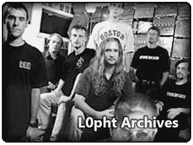

# 本周安全:阿根廷，神秘的钉子，和 L0phtcrack

> 原文：<https://hackaday.com/2021/10/22/this-week-in-security-argentina-mysterysnail-and-l0phtcrack/>

阿根廷政府有一个全国身份证系统，因此有一个包含该国每个公民数据的数据库。会出什么问题呢？可以预见的是，[攻击者已经设法获得了对数据库](https://therecord.media/hacker-steals-government-id-database-for-argentinas-entire-population/)的访问权，并且正在出售整个数据集。阿根廷政府声称[这不是大规模入侵](https://www.argentina.gob.ar/noticias/el-renaper-detecto-el-uso-indebido-de-una-clave-otorgada-un-organismo-publico-y-formalizo)，只有少数凭证被访问。这似乎是不正确的，因为卖家能够向调查这个故事的记者提供任意一个公民的详细信息。

## 星期二补丁

微软已经发布了 10 月份的月度补丁，还有几个令人惊讶的消息。CVE-2021-40486 是 Microsoft Word 中的 RCE，该缺陷可以通过预览窗格触发。CVE-2021-38672 和 CVE-2021-40461 都是 Hyper-V 中的 RCE 漏洞。最后，CVE-2021-40449 是一个正在广泛使用的特权升级，稍后将详细介绍。哦，你以为印刷的噩梦结束了？CVE-2021-36970 是另一个打印假脱机程序漏洞。不幸的是，微软的漏洞列表中几乎没有任何关于它们的信息。

另一方面，苹果刚刚修补了 CVE-2021-30883，这是一个正在 iOS 中积极利用的 0 天。随着补丁的发布，[Saar Amar]用 PoC 整理了一个非常好的 bug 解释。这是分配缓冲区时的一个简单的整数溢出，会导致任意的内存写操作。这种情况尤其危险，因为它没有任何权限，可以从应用程序沙箱中触发。它已经在野外使用了，所以现在就去更新你的 iOS 设备吧。

## 神秘的钉子

“[Snail](https://www.flickr.com/photos/96584021@N05/8996280560)” by Ilweranta, CC BY 2.0

卡巴斯基带给我们一份关于 CVE-2021-40449 在野外使用的报告。这是他们称为神秘之钉的攻击的一部分，似乎来自中国以外的 IronHusky。该漏洞是一个释放后使用的漏洞，通过调用 ResetDC API 调用自己的回调来触发。这一层递归执行导致对象在外部执行完成之前被释放。

由于对象现在可以被攻击者代码重新分配和控制，因此畸形的对象允许攻击者在内核空间中运行他们的代码，从而实现权限提升。然后，该活动会收集一些数据并安装远程访问特洛伊木马。几个妥协的指标被列为报告的一部分。

## 去参加比赛

谷歌的 Project Zero 带着一个聪明的 Linux 内核黑客回来了，这是一个由伪终端设备中的竞争条件触发的特权升级。通常缩写为 PTY，这个内核设备可以连接到两端的用户空间应用程序，产生一些有趣的交互。每一端都有一个反映连接状态的结构。问题是用于设置应该与终端关联的进程组的`TIOCSPGRP`，没有正确锁定终端的内部状态。

因此，在两端同时调用此函数是一种竞争情况，引用计数可能会被破坏。一旦引用计数不可信，就可以释放整个对象，在内核中留下一个悬空指针。从那里，这是一个典型的免费后使用的错误。这篇文章提出了一些有用的想法来强化系统，以应对这种类型的攻击，该漏洞已于 2020 年 12 月修复。

## 人工智能 vs 伪随机数

NCC 集团的 Mostafa Hassan 正在进行一些特别有趣的研究，使用机器学习来测试伪随机数发生器。在第一部中，他成功破解了非常简单的 xorshift128 算法。[第二部分解决梅森龙卷风](https://research.nccgroup.com/2021/10/18/cracking-random-number-generators-using-machine-learning-part-2-mersenne-twister/)，它也落在了神经网络上。请注意，这两者都不被认为是密码数字生成器，所以 ML 模型可以确定它们的内部状态并不令人惊讶。最有趣的是接下来的文章，当他处理其他被认为是安全的算法时。请在以后的文章中关注这一点。

## L0phtcrack 成为开源

出乎我意料的是，[L0phtcrack 工具已经开源发布](https://l0phtcrack.gitlab.io/)。L0phtcrack 是大约十亿年前由 L0pht Heavy Industries 的[Mudge]和公司创建的密码破解/审计工具。所有权转给了@stake，后者于 2004 年被赛门铁克收购。由于出口法规，赛门铁克停止销售该程序，并由最初的 L0pht 团队重新获得。

2020 年 4 月，Terahash 宣布他们已经购买了该程序的权利，并开始将其作为其产品的一部分进行销售和支持。Terahash 主要构建基于 GPU 的破解硬件，[受到芯片短缺](https://terahash.com/letter-from-ceo/)的沉重打击。由于 Terahash 进入破产保护，L0phtcrack 的所有权已经恢复到 L0pht，7.2.0 版本已经作为开源发布。