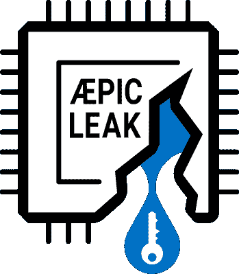

# 本周安全:违规、PIC、SQUIP 和符号

> 原文：<https://hackaday.com/2022/08/12/this-week-in-security-breaches-aepic-squip-and-symbols/>

所以你可能得到了[一个宽松的密码重置提示](https://slack.com/intl/en-gb/blog/news/notice-about-slack-password-resets)。由于一个奇怪的错误，Slack 的用户群中大约有 0.5%的人的密码散列可能被暴露。发送共享邀请链接时，密码哈希会发送给工作区的其他成员。很难弄清楚这个问题是如何发生的，因为密码散列不应该像这样发送给用户。我的猜测是，当创建链接时，其他用户收到了状态更新包，代码中的逻辑错误导致发送了太多的状态信息。

证据表明，第一个感染这种病毒的人是一名研究人员，他在 7 月中旬披露了这一问题。Slack 似乎使用了一个合理的密码策略，只存储散列的加盐密码。这听起来可能像是早餐食谱，但这仅仅意味着当您输入密码登录 slack 时，密码会经过单向加密哈希，哈希的结果会被存储。加盐是添加额外的数据，使[预计算攻击](https://en.wikipedia.org/wiki/Rainbow_table)不切实际。Slack 表示，即使这个漏洞被用来捕获这些哈希，它们也不能用来直接验证受影响的用户。关于启用双因素身份验证的一般建议仍然适用，作为防止滥用泄露信息的额外措施。

## 你呢 Twilio

为了不被超越， [Twilio 刚刚披露了一个正在进行的问题](https://www.twilio.com/blog/august-2022-social-engineering-attack)，但这是一个主动的社会工程攻击。它最初是针对 Twilio 员工的有针对性的网络钓鱼活动，当员工被虚假登录页面欺骗时，攻击者使用捕获的凭据访问内部工具并访问最终用户数据。特别值得注意的是，这些网络钓鱼企图之所以成功，是因为它们以已知的 Twilio 员工为目标，使用正确的电话号码，并包含姓名或用户名。据报道，其他公司，即 Cloudflare 和 Cicso，正在经历类似的攻击。共享提供程序中可能存在漏洞，这使得有针对性的钓鱼成为可能。

## 更多来自 CPU 漏洞噩梦前线

领头的是英特尔的[PIC 泄露](https://aepicleak.com/)，一种新的处理器漏洞。这不是一个推测性的执行错误——我们没有欺骗 CPU 对将要回滚的内存进行操作。这更像是从未初始化的内存中读取，并在那里找到另一个进程的秘密。这实际上是研究人员正在寻找的一种错误，因为他们故意用已知模式填充缓冲区和缓存，然后试图从无意义的内存位置读取这些模式。如果内存读取返回他们的金丝雀数据，那么一些有趣的事情正在发生。

这正是从分配给高级可编程中断控制器(APIC)的 I/O 地址读取数据时发生的情况。APIC 范围内的某些字节是保留的，试图读取它们会调用未定义的行为。在许多 CPU 型号上，这意味着系统挂起和/或 CPU 完全崩溃。在某些处理器上，读取可以工作，但是因为 APIC 实际上并不在这些地址上发送数据，所以会返回过时的缓存内容。这是一个非常有趣的结果，但是请注意，实际上成功实施攻击需要对系统的根级别访问。这使得它基本上没有意义，因为内核已经可以读取任意内存，对吗？

内核无所不知的规则有一个重要的例外。英特尔的 SGX 飞地技术是专为保护内存区域免受内核攻击而设计的。实际上，这意味着 DRM 密钥和 SGX 保护的虚拟机。DRM 密钥泄漏对最终用户并不构成威胁，因此无需担心。运行受 SGX 保护的虚拟机的人数可能非常少。

## 压扁

AMD 不会错过这个有趣的机会，本周[公开了 SQUIP](https://www.amd.com/en/corporate/product-security/bulletin/amd-sb-1039)([白皮书](https://stefangast.eu/papers/squip.pdf))。这是一个新的侧通道，它从调度器队列中导出进程状态。同步多线程(SMT)是现代处理器用来将两个指令线程送入单个处理核心的技术。因为不同的指令使用不同的 CPU 组件，所以 SMT 比传统的每个内核一个线程的安排产生了更高的吞吐量。一个缺点是一个线程的活动会影响另一个线程的性能。例如，对于现场音频处理，建议之一是禁用 SMT 以避免数据欠载。对于关心安全的人来说，有一个明显的副作用，即一个进程可以了解一些关于它的兄弟线程在 CPU 内核上做什么的信息。已经有一些方法来检测和利用这种效果，SQUIP 带来的是一种新的方法来监视兄弟线程。

在 AMD Zen 处理器中，每个 CPU 内核有多个算术逻辑单元(alu ),但其中只有一个单元可以执行乘法、除法和循环冗余校验(CRC)操作。SQUIP 将许多乘法运算请求排成一行，然后发出一条`rdpru`指令，读取处理器寄存器。它专门寻找实际性能频率时钟计数器(APERF)的值。这里有一个古怪的行为是这次攻击的关键。每个 alu 都有单独的队列，内核也有主队列。主队列将指令推入各个子队列，但是如果下一个目标队列已满，则主队列停止，直到下一条指令可以被发送到正确的组件。实际上，如果 ALU1 队列满了+1，那么`rdpru`调用就会被延迟。一旦该指令到达主 CPU 队列的末尾，它就可以立即在其他 alu 上执行。实质上，这允许一个底层进程监视它的兄弟进程正在执行多少乘法指令，例如，即使兄弟进程碰巧在不同的 VM 中。

所以我们可以确定乘法指令。这到底给我们带来了什么？研究人员找到的例子是 RSA 的平方与乘法，其中密钥的每一位将触发两次或三次乘法，这取决于给定位的值。通过多次运行(超过 50，000 次)使用 SQUIP 技术，可以推断出密钥的值。这是一项出色的工作，但可能在现实世界中用途有限。至少这是 AMD 的做法，因为他们的指导方针是使用最佳实践编码技术来缓解这个问题。

## Microsoft Office 和符号

又是那种“地狱结冰了吗？”随着[微软宣布发布微软 Office](https://msrc-blog.microsoft.com/2022/08/08/microsoft-office-to-publish-symbols-starting-august-2022/) 的调试符号。你问的调试符号到底是什么？也许可以把它们看作是二进制文件中内容的路线图。当程序崩溃时，调试符号会告诉你崩溃发生时正在执行什么函数，甚至可能告诉你导致崩溃的变量的名称。现在，虽然这不像一个完整的源代码版本那么多信息，但它确实给一个给定的程序内部发生的事情带来了很多透明度。想象一下 GHI DRA Office 的反编译可能会出现什么。这就是问题的关键。微软希望研究人员找到可利用的漏洞并报告它们。最重要的是，第三方为 Office 制作插件和集成，更好的调试使这两项工作变得更容易。

## VMWare

Source initiate[的[Steven Seeley]在 5 月](https://srcincite.io/blog/2022/08/09/from-shared-dash-to-root-bash-pre-authenticated-rce-in-vmware-vrealize-operations-manager.html)发现了一组 VMWare 漏洞，当它们放在一起时，它们构成了一个令人印象深刻的 rce 到根漏洞链。首先是一个怪癖，这可能是一个特征。当管理员在 vRealize Manager 应用程序中创建控制面板链接时，该链接中嵌入的令牌允许任何人在没有有效帐户的情况下访问控制面板。虽然它本质上是只读访问，但还有第二个问题，创建新用户的 API 调用绕过了正常的身份验证检查。

下一个问题恰好是日志中的敏感信息，在这种情况下，系统允许特权用户访问日志，或者根本不允许用户访问日志！有问题的日志行包含一个基本的授权字符串。基本身份验证只是通过 Base64 编码运行的密码和 ID。正如这个攻击链所展示的，使用它真的不是一个好主意。无论如何，这允许管理员用户重置密码，从而获得攻击者对系统的管理员访问权限。管理员可以启用 SSH 端口并登录。因此，攻击者拥有 admin 和 SSH，但这仍然不是 root。

接下来是一条`sudo`规则，允许任何用户使用 sudo 运行特定的 Python 脚本——这意味着脚本以 root 用户身份运行。该脚本通过一个环境变量来查找它的二进制文件，这个变量的设置很简单。设置变量，这样作为 root 运行的脚本将运行你写的脚本，你可以做任何事情，比如给你的帐户完全的 sudo 权限。完整的利用链被称为 [DashOverride](https://github.com/sourceincite/DashOverride) ，目前有针对这三个漏洞的补丁。干得好，史蒂文。

## SELinux

如果你在 RedHat land 玩，你可能对 SELinux 很熟悉，如果只是作为一个讨厌的东西，你可以关掉它让软件工作。我们许多在 RHEL 及其克隆上工作的系统管理员习惯于将暂时禁用它作为故障诊断的第一步。好吧，[esp0x31] [希望你重新考虑一下那个习惯](https://blog.esp0x31.io/zathura-selinux-confined/)，让 SELinux 成为系统加固的有用工具。这篇文章描述了如何为一个给定的程序设置一个文件上下文，然后严格限制它只能访问具有该上下文的文件。这个应用程序应该能够通过 UDP 通话吗？如果没有，请添加一条规则来阻止创建任何 UDP 套接字。一个致命的技巧是`newrole`命令，它将您带入您刚刚定义的 SELinux 域——非常适合攻击您的新规则以寻找漏洞。

## 比特和字节

Windows 中的点对点协议有一个缺陷， [CVE-2022-30133](https://msrc.microsoft.com/update-guide/en-US/vulnerability/CVE-2022-30133) ，在该缺陷中，向端口 1723 发送流量会导致任意代码执行。这个问题的可怕之处在于，它可能会被蠕虫感染，而且端口可能会被故意暴露在互联网上，因为这是 Windows 中早期的 VPN 解决方案。约克斯。

X-as-a-Service 是最热门的赚钱方式之一，犯罪分子也加入了进来。我们已经有了勒索软件即服务，现在有了[命令&控制即服务](https://blog.talosintelligence.com/2022/08/dark-utilities.html)。在你的僵尸网络中管理大量的机器是否太麻烦了？只要每月支付很低的费用，这些人就会为你做这件事，它还配有一个光滑的仪表盘和一切。我们真正生活在现代。

Rsync 有一个缺陷，[恶意服务器可以在连接的客户端](https://www.openwall.com/lists/oss-security/2022/08/02/1)上写任意文件。这也可能以中间人攻击的形式被利用。期待[在未来几天](https://download.samba.org/pub/rsync/NEWS)发布 3.2.5，其中将包含修复。

540 万 Twitter 账户的私人数据被抓取并出售，这要感谢 Twitter 的网络代码零日(T1)。敏感部分是用来验证账户的电子邮件或电话号码。对我们大多数人来说，这种逃避只是一种烦恼。只是另一个使它成为另一对夫妇垃圾邮件发送者的名单。有几个 Twitter 账户是出于良好的理由匿名运行的，如果这种泄漏允许坏人将这些点联系起来，这可能是一个相当大的问题。感谢[app-le-bees]为我们指出了[的不和](https://discord.gg/j8C7U8de)！