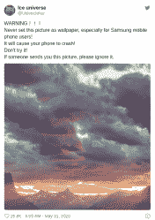

# 本周安全:进出口银行，苹果登录，被诅咒的壁纸，和核秘密

> 原文：<https://hackaday.com/2020/06/05/this-week-in-security-exim-apple-sign-in-cursed-wallpaper-and-nuclear-secrets/>

首先，记得上周的 Unc0ver 漏洞/越狱吗？在 13.5.1 iOS 版本中，修复了底层缺陷，关闭了越狱。如果您打算越狱您的 iOS 设备，请确保不要安装此更新。也就是说，正常的警告是适用的:运行过期软件时要非常小心。

### 苹果登录

苹果网络认证协议中的一个漏洞在上周被修复。使用 Apple 登录类似于 OAuth，允许使用 Apple 帐户登录其他网站和服务。在幕后，生成并传递一个 JSON Web 令牌(JWT ),以确认用户的身份。理论上，该方案甚至允许在不公开用户电子邮件地址的情况下进行身份验证。

那么什么会出错呢？显然，一个简单的用苹果公钥签名的 JWT 请求会被自动批准。是啊，有那么糟。任何与苹果 ID 关联的账户都可能被轻易攻破。在被[Bhavuk Jain]发现并报告后，它在过去的一周被修复。

### 被诅咒的壁纸

 那么当有人在 twitter 上发布一张图片，并警告所有人*永远不要*用它作为你的手机壁纸时，符合逻辑的做法是什么？显然，只有立即将它设置为手机的壁纸，然后抱怨它使你的手机无法使用才是合适的。这是怎么回事？

有问题的图像使用了一种特殊的颜色空间，Android 用户界面无法处理这种颜色空间。这张图片的颜色值超过了 255，超出了界限，导致 UI 崩溃。一旦 Android UI 崩溃，就无法更改壁纸，导致崩溃循环。一些用户能够在崩溃之间的几分钟内换掉他们的壁纸，但是清理混乱的最可靠的方法是使用像 TWRP 这样的东西手动删除图像。

### 进出口银行和 CVE-2019-10149

这种脆弱是一种持续不断的付出。大约一年前，我们[谈到了 CVE-2019-10149](https://hackaday.com/2019/06/14/this-week-in-security-use-emacs-crash-a-windows-server-and-a-cryptocurrency-heist/) 。本周，美国国家安全局发布了一份警告( [PDF](https://www.heise.de/downloads/18/2/9/0/2/9/9/9/nsa.pdf) )，称某些国家行为者正在积极利用这个 Exim 漏洞。

快速回顾一下，Exim 邮件服务器是网上最流行的邮件服务器。CVE-2019-10149 是一个聪明的漏洞，它诱骗易受攻击的服务器试图向恶意邮件服务器托管的特制地址发送电子邮件。当目标机器试图发送 bounceback 消息时，恶意服务器每四分钟发送一个字节，迫使连接保持打开一周。这种策略确保易受攻击的代码被命中。当消息最终被发送时，嵌入在电子邮件地址中的有效负载被评估和执行。

美国国家安全局的警告指出，俄罗斯的 GRU 是罪魁祸首，他以沙虫的名义行事。目前的攻击是如何被发现来自俄罗斯的，这背后可能有相当多的故事。由于没有一个妥协的指标与 GRU 直接相关，我们只能相信国家安全局的话，但当然他们也不会公开他们是如何获得反情报的。

在进一步的 GRU 新闻中，[英国已经正式将佐治亚州的一系列袭击归咎于他们。这些攻击关闭了格鲁吉亚电网、加密硬盘(勒索软件)，并直接破坏了金融系统。就在上个月，](https://www.gov.uk/government/news/uk-condemns-russias-gru-over-georgia-cyber-attacks)[德国政府将他们议会的黑客攻击归咎于一个特殊的 GRU 官员:Dmitriy Badin。](https://wtop.com/europe/2020/05/merkel-evidence-of-russian-role-in-german-parliament-hack/)

将网络攻击归咎于某个特定的行为者总是很棘手，尤其是当精明的外国情报机构不想被抓到是幕后黑手时，但多个政府机构得出相同结论的事实更有说服力。德国的证据，收集了五年多，并指向一个特定的代理人，尤其如此。

### 被盗的核导弹机密？

我们的最后一个故事来自天空新闻，该新闻报道了 [Westech International 遭到勒索软件攻击](https://news.sky.com/story/hackers-steal-secrets-from-us-nuclear-missile-contractor-11999442)。你可能已经猜到了，这一部分的标题是[贝特里奇定律](https://en.wikipedia.org/wiki/Betteridge%27s_law_of_headlines)在起作用，尽管有点讽刺。

那么到底发生了什么，为什么“核秘密”的角度几乎肯定是废话？首先，Westech 不是一家大型工程公司，他们也没有设计过任何核武器系统。去他们的网站，看看他们的合同和他们提供的服务。电信、维护和物流规划。

第二，我们知道勒索软件攻击攻击的是支付工资的机器。在美国，机密信息受到一系列严格规则的约束。它只能在敏感的隔离信息设施中保存和使用(SCIF)。包含机密信息的计算机绝不能连接到不安全的网络。甚至还有一个专用的保密互联网协议路由器网络(SIPRNet ),它只用于安全通信，并且只能通过 SCIF 访问。所有这些都是说，如果勒索软件攻击可以将数据过滤回攻击者，那么有人就会以一种经常导致坐牢的方式严重出错。从薪水册到核机密还有很长的路要走。

### 扎根你的美国电话电报公司门户

[Andrew Dupuis]有一个由美国电话电报公司提供的 Arris 光纤网关，像许多黑客一样，他并不满意。在我们一头扎进兔子洞之前，我们应该指出，美国电话电报公司对这种设备每月收费 10 美元，并且拒绝让他们的客户使用他们自己的硬件。[Andrew]认为这可能违反了 FCC 规则。无论如何，他想经营自己的门户，而不是被美国电话电报公司的门户所束缚。光纤连接在物理连接上使用 802.1x 安全性，这也有助于将客户锁定在官方硬件上。如果用户可以提取 802.1x 证书，他们可以用自己的硬件替换官方的美国电话电报公司网关，这就是本文的重点。

利用本身从固件降级开始，回到仍然包含漏洞的版本。漏洞？用于故障排除和调试的 REST 服务器。稍加努力之后，硬件就已经安装好了，telnet 服务器正等着您。这并不奇怪，这个操作系统是一个标准的嵌入式 Linux。首先要做的是禁用自动更新功能，以避免被锁定在设备之外。

[Andrew]解释了如何正确保护网关，并重新调整它以获得更好的性能，如果您打算继续在您的网络中使用它，这是个好主意。这里真正的目标是提取证书。我不知道这应该有多令人惊讶，但似乎每个设备都使用相同的安全证书，并且[Andrew]非常友好地分享了他提取的副本。

[Andrew]在黑客日热线上发了这个。如果你有研究要分享，或者发现了一些你认为我们应该报道的东西，一定要让我们知道！