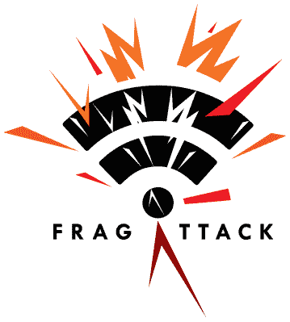

# 本周安全:碎片攻击、管道、Codecov 和 IPv6

> 原文：<https://hackaday.com/2021/05/14/this-week-in-security-fragattacks-the-pipeline-codecov-and-ipv6/>

一些星期是缓慢的，当讨论最新的安全新闻时，选择是渺茫的。这是不寻常的一周。

首先是 [Fragattacks](https://www.fragattacks.com/) ，这是无线安全协议中的一组缺陷，允许未经认证的设备将数据包注入网络，在某些情况下，还可以读取数据。这些缺陷围绕着 802.11 对数据包聚合和帧分段的支持。[白皮书出来了](https://papers.mathyvanhoef.com/usenix2021.pdf)，让我们来看看。

分段和聚合是优化无线连接的技术。数据包聚合是指在单个无线帧中包含多个 IP 数据包。当设备发送许多小数据包时，在单个无线帧中一次性发送更有效。另一方面，如果无线信噪比不理想，较短的帧更有可能完好无损地到达。为了在这样的环境中更好地操作，长帧可以被分割成片段，并在接收时重新组合。

 无线协议本身内置了三种漏洞。首先是 CVE-2020-24588，聚合攻击。简而言之，无线帧头的聚合部分未经身份验证和加密。如何利用这一弱点还不是很明显，但作者已经做了一些聪明的事情。

首先，出于解释的目的，我们假设在受害者和攻击者控制的服务器之间已经建立了 TCP 连接。这可能是简单的广告，显示在被访问的网页上，或链接到电子邮件中的图像。我们还假设攻击者正在对目标的无线连接进行中间人攻击。如果没有密码，这只允许攻击者不加修改地来回传递无线帧，除了聚合报头数据，如上所述。实际的攻击是在已建立的 TCP 连接中发送一个特殊的 IP 数据包，然后修改包含该数据包的无线帧上的报头数据。

当受害者试图拆开它认为是聚合帧的内容时，TCP 有效负载被解释为离散的数据包，该数据包可以发往攻击者选择的任何 IP 和端口。更简单地说，它是包中的包，帧聚合报头被滥用来将内部包弹出到受保护的网络上。

第二个协议级漏洞是 CVE-2020-24587，即混合密钥攻击。这是一个边缘理论，因为恒星必须对齐才能实现它。这可以称为[剪切粘贴](https://tvtropes.org/pmwiki/pmwiki.php/Main/CutAndPasteNote)攻击。或者如果你喜欢，“我的声音是我的护照，验证我。”同样，本地攻击者可以将加密的数据包片段混合在一起，以实现意想不到的组合，例如向攻击者控制的服务器重新发送登录信息。

最后一个协议漏洞是 CVE-2020-24586，即碎片缓存攻击。这个有点不同，因为它需要提前完全访问加密的无线网络。简单的解释是，攻击者发送分段帧的第一个片段，指定目的 IP 地址，然后断开连接。当受害者发送分段消息时，攻击者会确保丢弃第一个分段，然后从不同的客户端重新组装帧。这是又一次难以得手的攻击。

除了这三个协议缺陷，还有一些供应商相关的漏洞，如 CVE-2020-26144，其中一个无线帧包含多个聚合的数据包，但似乎是在发起连接握手。这个握手应该是未加密的，所以它被处理，错误的逻辑导致聚合的数据包也被接受。具有这种缺陷的网络很容易被端口扫描，并发起恶意连接，因为攻击者可以用他控制的外部 IP 欺骗这些连接的源 IP。

## 像 XcodeGhost 一样沉默

还记得 XcodeGhost 吗？快速复习一下，它是 Xcode 的重新打包，但包含恶意代码，因此它编译的任何 iOS 应用程序也会包含恶意软件。它是通过在开发者论坛之类的地方放置下载链接来传播的，最大的卖点是它在中国的下载速度要快得多。当时，据报道，它负责 40 个恶意应用程序。然后奇虎 360 提出他们发现了 344 个受影响的 app，最后火眼检测到了 4000 多个。苹果对此的回应是无线电静默。现在，由于 Epic Games 的诉讼，[我们对事件](https://arstechnica.com/gadgets/2021/05/apple-brass-discussed-disclosing-128-million-iphone-hack-then-decided-not-to/)有了一些了解。

在发布的电子邮件撰写之时，苹果知道他们的应用商店上有 2500 个恶意应用程序，大约有 1.28 亿用户受到影响。他们显然开始了通过电子邮件联系用户的过程，但选择了放弃，而是在他们网站的中文版上发布了一个通知。获得关于这个问题和其他一些安全问题的内幕消息是很有趣的。诉讼证据开示有一种方式来揭露脏的和其他的。

## 不要用塑料袋装汽油

勒索软件显然是相当一段时间以来计算机犯罪中最热门的东西。然而，勒索软件攻击同时影响这么多人的情况有点罕见，就像针对 Colonial Pipeline 的勒索软件攻击一样。消息来源向多个渠道证实，显然在发现勒索软件的几个小时内, [Colonial 支付了 75 个比特币的赎金](https://www.zdnet.com/article/colonial-pipeline-paid-close-to-5-million-in-ransomware-blackmail-payment/),即 500 万美元。尽管恢复工作马上开始，但美国东南部的汽油供应受到了足够的影响，引发了短缺和一些恐慌性购买。关于这次攻击还有很多未知，但每个人似乎都同意，这次攻击是由位于俄罗斯的勒索软件服务集团 DarkSide 推动的。目前还不清楚到底是谁发动了这次攻击，也不清楚他们最初是如何入侵该公司的。

## 可工作的窗口

本周二，四个严重的 Windows 漏洞得到了修补，其中 [CVE-2021-31166 是最严重的](https://threatpost.com/wormable-windows-bug-dos-rce/166057/)。那一个是 Windows 10 中 HTTP provider 的问题，一组未知的 Windows Server 版本。因为这是一个经常暴露的服务中的 0-click 漏洞，所以这被认为是可蠕虫病毒，非常重要。你可能认为你的 Windows 机器都在防火墙后面，所以也许你可以任其发展，对吗？别走开，我们会在文章底部讨论你的防火墙可能不像你想的那样被锁住。

CVE-2021-26419 是 Internet Explorer 9 和 11 中的一个缺陷。似乎只要查看一个恶意网站就能启动。最重要的是，这个问题可能是由 office 文档触发的。如果你没有一个很好的理由让 IE 继续存在，也许是时候卸载它了。

## Codecov

Codecov 系统的一部分，Bash Uploader 脚本被恶意修改为向远程服务器发送环境变量。该漏洞是由于无意中包含在 Codecov docker 映像中的凭据导致的，这使得攻击者能够对脚本进行更改。令人欣慰的是，修改后的脚本中似乎没有任何进一步的恶意操作，但是在 Codecov 构建过程中作为环境变量导出的任何秘密都应该被视为受到了威胁。

## 聪明的 Airtag 黑客

苹果公司最近宣布并发布了他们的新 Airtag 设备，这让 Tile 等公司感到沮丧。这个社区已经为这些小玩意找到了一些有趣的用途，比如用它们以大约每秒 3 字节的速度发送信息。是的，[Fabian brun lein]发明了一种 Airtag 供电的 24 波特调制解调器。实际上，它是一个微控制器，用几个公钥中的一个向 Apple Find My network 发送蓝牙低能量包。好处是，你可以搭载在其他人的 iPhones 上，从某个没有 Wifi 或手机连接的地方的传感器传输数据。

另一方面，你可能想知道如果你使用一个空中标签作为跟踪设备会发生什么。好吧，好奇的读者，自然有人已经通过邮件发送了一个航空标签。它的每一点都像你希望的(或害怕的)一样好，不断更新包的位置。我不禁想到了其他可能的用途。送一个孩子去实地考察？在他们的口袋里扔一个航空标签，知道他们在哪里。

## IPv6 安全性

作为 Starlink 的新客户(评论即将发布)，也是第一次使用 IPv6，我对 IPv6 既兴奋又有点担心。兴奋应该是显而易见的，但我很担心，因为我们的许多安全习惯和假设不一定会转化为 IPv6。例如，您可能确切地知道在您的公共 IPv4 地址上暴露了哪些端口(如果有的话)。你有没有停下来想一想[你的 IPv6 地址](https://grimminck.medium.com/the-implications-of-neglecting-ipv6-on-your-internet-facing-services-538ebe3506fa)上暴露了哪些端口？还记得上面那个 Windows HTTP 黑客吗？我完全期待最终能看到一个通过 IPv6 复制的蠕虫，尽管方式多种多样。

谢天谢地，[已经有一些 IPv6 端口扫描服务](https://www64.chappell-family.co.uk/cgi-bin6/ipscanfastjs.cgi)。如果您有 IPv6 服务，花一分钟时间仔细检查一下您的 IPv6 防火墙是否正常工作可能是值得的。IPv6 工作得足够无缝，以至于您的 ISP 可能已经在您没有注意到的情况下推出了支持，但是如果您关心安全性，您应该注意到—我们都有点松懈，认为 IPv4 NAT 路由是理所当然的。