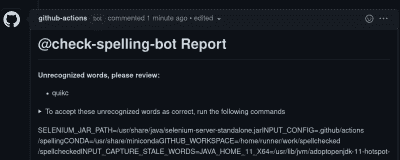

# 本周安全:Office 0-day、ForcedEntry、ProtonMail 和 OMIGOD

> 原文：<https://hackaday.com/2021/09/17/this-week-in-security-office-0-day-forcedentry-protonmail-and-omigod/>

在野外发现了一个特别讨厌的 0-day， [CVE-2021-40444](https://www.huntress.com/blog/cybersecurity-advisory-hackers-are-exploiting-cve-2021-40444) ，这是微软的 MSHTML 引擎处理 Office 文档的一个缺陷。还不清楚所有的细节，但结果是打开 office 文档可以触发远程代码执行。然而，情况变得更糟，因为这种利用可以在浏览器中简单地预览文件时工作，使这成为一种潜在的 0-click 利用。到目前为止，这种攻击已经被用于特定的目标，但是[已经发布了一个概念证明](https://github.com/lockedbyte/CVE-2021-40444)。

看起来漏洞背后有许多应该是独立 CVEs 的诡计。首先，在 Office 文档中简单调用`mshtml:http`,通过 Trident 引擎(也就是我们的老朋友 IE)触发下载和处理该 URL。真正有趣的问题是，在 Trident 中，iframe 可以用指向一个`inf`或`dll`文件的`.cpl` URI 来构造，并且在没有任何提示的情况下执行。这是【威尔·多尔曼】在这里展示的[。本月的补丁星期二摘要中包含了一个补丁，所以一定要更新。](https://twitter.com/wdormann/status/1437438522726703112)

## 强迫劳动

然而，另一个 0-click 0-day，这一次是在苹果产品中，CVE-2021-30860 被发现是 NSO 集团利用工具包的一部分。[公民实验室将该漏洞称为 FORCEDENTRY](https://citizenlab.ca/2021/09/forcedentry-nso-group-imessage-zero-click-exploit-captured-in-the-wild/) 。这是苹果图像渲染代码中的一个问题，允许恶意 PDF 触发 RCE。因为苹果在不同设备间共享这个库，所以在补丁之前，这个漏洞可以在 iOS，MacOS，甚至 watchOS 上工作。基本上所有的技术细节都来自苹果的补丁说明，他们称之为整数溢出。

## 质子邮件日志 IPs

在[将一个用户的 IP 地址交给瑞士当局](https://techcrunch.com/2021/09/06/protonmail-logged-ip-address-of-french-activist-after-order-by-swiss-authorities/)之后，ProtonMail 陷入了一场小混乱。一个可以理解的反应是失望，他们甚至有能力这样做，鉴于他们的无日志的立场。

事实是，ProtonMail 是一家瑞士公司，他们受瑞士法律约束。当收到信息绑定请求时，ProtonMail 的管理员会打开请求中指定的特定帐户的日志。他们指出，如果目标用户使用他们的 VPN 产品或 TOR，他们就可以保护自己的 IP 隐私。ProtonMail 还指出，他们的加密没有被破解，所以执法部门仍然无法访问该服务上的附件或电子邮件。

## 拼写检查加符号链接

GitHub 有真正有用的动作特性，其中某些工作流程步骤可以自动化。一个这样的工作流程是拼写检查，它完全按照 tin 上显示的内容进行操作。[一个奇怪的交互存在](https://github.com/justinsteven/advisories/blob/master/2021_github_actions_checkspelling_token_leak_via_advice_symlink.md)，当一个拉请求包含一个拼写错误，以及从`.github/actions/advice.md`到`/proc/self/environ`的符号链接。`Advice.md`旨在包含当发现拼写错误时如何处理的指令，并作为拉请求的自动注释的一部分发布。pull 请求中的符号链接意味着实际得到注释的是流程运行者的环境信息，包括一个秘密的 GitHub 认证令牌。

该令牌在工作流完成后很快就会失效，所以关键是要赢得及时使用令牌的竞赛。概念验证演示了如何轮询评论，找到令牌，并进行“紧急发布”，这实际上是攻击者提供的二进制文件。该修复已经实施，只需在运行工作流时禁止此类符号链接即可。

不过，这实际上是一个更大的问题，因为工作流配置设置包含在与拉请求相同的代码库中。简而言之，任何由 pull 请求触发的 GitHub 动作都是潜在不安全的，需要非常小心地针对类似问题进行加固。

## 路由器泄露 IP

Fidus 的研究人员设计了一个非常聪明的攻击来揭露一些 VPN 用户的真实 IP。这种攻击依赖于简单网络管理协议(SNMP) web 包装器的存在，该包装器存在于一些消费者路由器上。SNMP 是一种有用的协议，可以通过编程从网络设备获取统计数据和其他状态信息。这项研究是在 Virgin Media 路由器上进行的，该路由器碰巧允许对 SNMP 包装器的未经验证的请求。可访问的数据点之一是分配给路由器的公共 IP 地址。

因此，攻击者所要做的就是让受害者加载他们的网页，并使用一些 JS 代码从路由器的 IP 发出 get 请求，对吗？只不过浏览器增加了安全功能来防止这种滥用。这里使用的技巧是 DNS 重新绑定，恶意站点的 DNS 记录被设置为非常低的生存时间(TTL ),一旦页面被加载，记录就会被更改。这允许页面 JS 向同一个域名发出另一个请求，而这个请求实际上是发送到一个任意的 IP。路由器的 web 接口对这种技术没有任何保护措施，所以它很乐意放弃 IP 地址。

这并不适用于每一个 VPN。一些客户端阻止对本地 IP 地址的访问，可能正是为了防止这种攻击。值得注意的是，TOR 就是这样工作的。然而，对于没有这样做的 VPN，这可能会泄漏公共 IP。这个故事的另一个有趣之处是，这是在 2019 年 10 月首次发现的。维珍媒体的所有者 Liberty Global 要求用一整年的时间来解决这个漏洞。从那以后，Liberty 不再致力于协同披露，而是“幽灵般”地跟踪研究人员。似乎没有推出任何修复，所以这应该被视为 0 天，直到证明不是这样。如果您担心不会向您访问的网站泄露身份信息，解决方法是只使用阻止访问本地 IP 的 VPN 客户端。

## 微软的 Azure Linux — OMIGOD

你在微软的 Azure 上运行 Linux 虚拟机吗？[你可能有易受攻击的服务正在虚拟机上运行](https://www.wiz.io/blog/secret-agent-exposes-azure-customers-to-unauthorized-code-execution)。有问题的服务是开放管理基础设施(OMI)，它是作为几个 Azure 服务的一部分自动安装的。最严重的漏洞是 CVE-2021-38647，这是一个预授权的 RCE 超级用户，只需要访问暴露的 HTTPS 端口。这是一个简单的身份验证逻辑缺陷，没有授权头的请求默认以 root 用户身份运行。有更新，但不清楚补丁是否会自动推出。检查`omi`包。如果存在，版本 1.6.8.1 是包含修复程序的发行版。

## 比特和字节

我最近知道了 Gluu 服务器，这是一个提供你自己的 OpenID 认证服务的一站式解决方案。如果你曾经面临需要推出单点登录解决方案，Gluu 似乎是一个强有力的竞争者。如果你想了解更多，我们甚至[在 FLOSS Weekly](https://twit.tv/shows/floss-weekly/episodes/647?autostart=false) 上采访了 Gluu 的创始人。

Firefox 已经受够了微软的恶作剧。你可能已经注意到在 Windows 10 中改变程序默认设置是多么困难。有一个文件类型列表，你必须把它们都设置成你喜欢的应用程序——当然，除非你想默认使用微软的产品。然后就是轻轻一点。Mozilla 的一些非常聪明的工程师已经逆向工程了 Edge 将自己设置为默认的方式，现在 [Firefox 也有同样的能力](https://www.theverge.com/2021/9/13/22671182/mozilla-default-browser-windows-protections-firefox)。