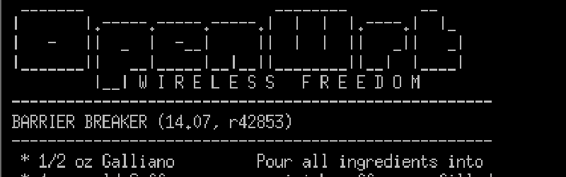

# 本周安全:OpenWrt、ZOOM 和 Systemd

> 原文：<https://hackaday.com/2020/04/03/this-week-in-security-openwrt-zoom-and-systemd/>

OpenWrt [公布了他们的超轻量包管理器 opkg](https://openwrt.org/advisory/2020-01-31-1) 的一个问题。OpenWrt 的目标硬件路由器带来了一个有趣的安全挑战。一个安装在 4 MB 闪存中的 Linux 本身就是一个小小的奇迹，必须做出许多妥协。在这种情况下，我们对 SSL 的缺乏感兴趣:一个 4 MB 的安装不能包含 SSL 支持。因此，软件包管理器不能依靠 HTTPS 进行安全下载。相反， [opkg 首先下载两个文件](https://openwrt.org/docs/guide-user/security/release_signatures):一个包列表，其中包含每个包的 SHA256，然后第二个文件包含一个 Ed25519 签名。安装单个软件包时，可以将下载软件包的 SHA256 哈希与软件包列表中提供的哈希进行比较。

这是一个有效的方法，但是[发现了一个错误，由【Guido Vranken】](https://blog.forallsecure.com/uncovering-openwrt-remote-code-execution-cve-2020-7982)发现，在 opkg 如何从包列表中读取哈希值。前导空格触发了一些有问题的指针算法，因此，opkg 认为 SHA256 散列只是空白。与其让安装失败，不如跳过哈希验证。结果呢？Opkg 在中路攻击时容易被一个相当简单的人攻击。

OpenWrt 不进行任何自动安装或自动更新，因此该漏洞可能不会被广泛滥用，但它可能被用于有针对性的攻击。在安装软件时，攻击者需要能够阻断路由器的互联网连接。无论如何，请确保您运行的是最新的 OpenWrt 版本来缓解这个问题。通过 Ars 技术公司。

### Wireguard V1.0 版

随着 Linux 内核版本 5.6 的最终发布， [Wireguard 终于被命名为稳定版](https://www.phoronix.com/scan.php?page=news_item&px=WireGuard-1.0.0-Released)。有趣的是，谷歌已经[在其通用内核映像(GKI)](https://www.phoronix.com/scan.php?page=news_item&px=WireGuard-Android-GKI-Enabled) 中启用了 Wireguard，这可能标志着 Android 对 Wireguard VPNs 的更多官方支持。我还听说一个较大的 Android ROM 开发社区也在研究更好的系统级 Wireguard 支持。

### 伪装的 Javascript

Javascript 让网络工作——并且一直是良好安全性的绊脚石。举个例子，还记得 05 年接管 Myspace 的蠕虫病毒 Samy T1 吗？那次跨站脚本(XSS)攻击使用了一系列技术将 Javascript 代码嵌入到用户的个人资料中。无论何时查看该个人资料页面，嵌入的 JS 代码都会运行，然后在不幸落入陷阱的人的页面上复制自己。

今天，我们对 XSS 的攻击有了更好的保护，类似的事情永远不会再发生了，对吗？事情是这样的，对于每一个像内容安全政策这样的缓解措施，都有一个像[theMiddle]这样的人想出新的方法来打破它。在这种情况下，他意识到可以通过在. png 中编码 Javascript，并对其进行解码以交付有效载荷来击败[不太完美的 CSP。](https://www.secjuice.com/hiding-javascript-in-png-csp-bypass/)

### 系统

啊，系统 d。似乎没有什么比关于它的故事更能带来激情的观点了。在这种情况下，[是【塔维斯·奥曼迪】](https://www.openwall.com/lists/oss-security/2020/02/05/1)从谷歌零计划中发现的漏洞。这个 bug 是一个竞争条件，缓存的数据结构在被释放后可以被调用。有趣的是，该漏洞可通过 DBus 访问，并有可能被用于获得根级别的访问权限。[用 systemd v220](https://bugzilla.redhat.com/show_bug.cgi?id=CVE-2020-1712) 固定。

### Mac 固件

对于那些在苹果硬件上运行 MacOS 的人来说，你可能需要检查你的固件版本。不是因为有一个特别严重的漏洞，而是因为在操作系统更新期间固件更新会无声无息地失败。更糟糕的是，苹果没有发布发行说明，甚至没有承认最新的固件版本。[最新固件版本的众包列表](https://eclecticlight.co/2019/10/08/which-efi-firmware-should-your-mac-be-using-version-4/)已经发布，你可以试着说服你的机器再试一次，希望这次固件更新能起作用。

### 防橡皮鸭

Google [最近公布了一款新的安全工具](https://opensource.googleblog.com/2020/03/usb-keystroke-injection-protection.html)，USB 击键注入保护。我想 UKIP 这个昵称并不是有意指英国政治。无论如何，这个项目旨在帮助抵御臭名昭著的 [USB 橡皮鸭攻击](https://hackaday.com/2019/07/24/an-open-hardware-rubber-ducky/)，试图区分真实用户的打字节奏，而不是快速打字的恶意设备。

虽然这个项目很有趣，但是已经有了如何打败它的[例子](https://translate.google.com/translate?sl=auto&tl=en&js=y&prev=_t&hl=en&ie=UTF-8&u=https://pentestit.de/googles-keystroke-injection-schutz-test-mit-p4wnp1/&edit-text=&act=url)，也就是简单地运行脚本，在击键之间稍微停顿一下。时间会证明 UKIP 是否会成为一个有用的缓解工具。(懂了吗？)

### SMBGhost

还记得 SMBGhost 新的蠕虫病毒 SMB 漏洞吗？嗯，已经有了[的详细解释和 PoC](https://blog.zecops.com/vulnerabilities/exploiting-smbghost-cve-2020-0796-for-a-local-privilege-escalation-writeup-and-poc/) 。这种特殊的 PoC 是仅限于本地的权限提升，但是远程代码执行攻击似乎是不可避免的，所以要确保您已经安装了补丁！