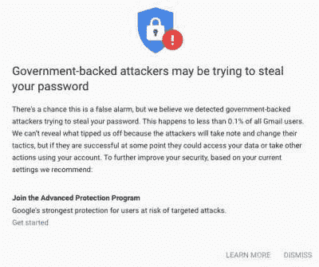

# 本周安全:信号，WhatsApp，Oauth 钓鱼，和更多国家支持的攻击

> 原文：<https://hackaday.com/2019/10/11/this-week-in-security-signal-whatsapp-oauth-fishing-and-more-state-sponsored-attacks/>

最近修正了一个错误，即[允许呼叫者在没有任何用户交互](https://bugs.chromium.org/p/project-zero/issues/detail?id=1943)的情况下在接收端强行建立呼叫连接。我们在其他聊天应用中也看到过这种问题，最近的例子是[缩放崩溃](https://hackaday.com/2019/07/12/this-week-in-security-censoring-researchers-the-death-of-openpgp-dereferencing-nulls-and-zoom-is-watching-you/)。

信号客户端使用相同的功能来连接呼出呼叫和呼入呼叫。这种代码重用允许恶意客户端发起呼叫，然后发送“接受呼叫”消息。由于代码重复使用，此消息触发的代码与接收方的 accept call 按钮相同。就好像攻击者利用逆反心理，诱骗对方客户端连接。

似乎这个错误只影响了 Android 客户端，并没有触发视频通话。目前还不清楚该漏洞在修复之前是否被发现和利用，但既然已经宣布，请确保 Signal 是最新的。

### 死亡的 WhatsApp Gif

WhatsApp 被发现容易受到恶意 GIF 图片的攻击。这是一个双自由漏洞，在 GIF 处理库中触发。该库为图像帧分配一个缓冲区，并为相同大小的帧重复使用该缓冲区。如果 GIF 帧的大小不同，库会将缓冲区重新分配到合适的大小。如果一个帧的大小设置为零，则用新的大小零调用 reallocarray()，这是未定义的行为。在 Android 上，它的作用是释放内存块，并返回一个指向现在释放的内存的指针。再次调用它会导致双释放条件，也是未定义的行为，这会破坏内存管理数据。

一旦执行了这个双重释放操作，下两个匹配大小的内存分配将指向同一个位置。这意味着程序好像有两个独立的缓冲区，但它们实际上是同一个缓冲区，允许来自 GIF 帧的数据覆盖 GIF 数据结构中的函数指针。通过另一个函数的巧妙反弹，GIF 突然运行任意代码。

### OAuth 捕鱼

你知道这将是一个有趣的日子，当谷歌警告你，你的帐户正受到政府实体的攻击。大赦国际本周一开始就描述了针对几个埃及组织的协同攻击。这种特殊的攻击不是普通的凭据窃取攻击，而是试图说服用户授权 OAuth 应用程序访问该帐户。

这可能不是一个特别复杂的攻击，但事实上，整个过程是在使用适当的 HTTPS 证书连接到 Google.com 域时发生的，这使得它更难被发现。它确实绕过了双因素身份验证，因为一旦恶意应用程序获得了访问帐户的权限，就不需要再登录了。

### 针对总统竞选

微软宣布美国总统竞选中的一场[在一次电子邮件妥协尝试中成为目标](https://arstechnica.com/tech-policy/2019/10/microsoft-says-iranian-hackers-tried-to-hack-a-us-presidential-campaign/)。绰号“磷”的该组织的攻击非常简单，利用个人数据试图重置密码和恢复账户。这次袭击包括居住在该国境外的伊朗国民，这一事实使人怀疑伊朗是发起方。

我们过去曾简要讨论过攻击归因，但这是一个很好的例子，说明了确定此类攻击背后的人有多困难。微软有哪些数据？目标帐户列表、原始 IP 地址，可能还有一些其他元数据，如浏览器用户代理字符串。简单地看一下这些数据就能清楚地揭示攻击者的身份，但是安全和历史应该告诉我们不要轻信任何表面现象。攻击者将伊朗目标纳入攻击范围、从与伊朗相关的 IP 地址发起攻击以及欺骗用户代理的难度有多大？这不太可能，因为这将是一个比攻击本身更复杂的努力，但这种可能性很难排除。

最后两个故事还涉及到我觉得有趣的其他事情。显然，谷歌和微软都有应对国家支持的攻击的特殊程序。这是一个有趣的新世界，为了用户安全，大公司正在与国家竞争，反之亦然。