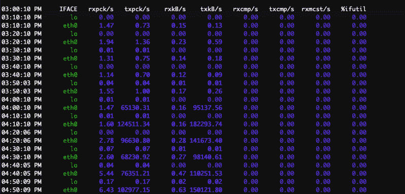

# 本周安全:共生体、智能锁和宇宙

> 原文：<https://hackaday.com/2022/07/29/this-week-in-security-symbiote-smart-locks-and-cosmicstrand/>

Symbiote 是一个特别令人讨厌的 Linux rootkit，本周我们有两个独立分析发布的有趣案例。首先是[【cyber masterv】拆开一个非常早期的恶意软件样本。](https://cybergeeks.tech/how-to-analyze-linux-malware-a-case-study-of-symbiote/)Symbiote 的主要目的似乎是捕获 SSH 登录，这个版本通过挂钩可插拔认证模块(PAM)系统来捕获登录到它所在机器的用户。它还监视 SSH 和 SCP 二进制文件，并嗅探这些二进制文件使用的终端，从而捕获传出的凭证。

所有这些数据都被打包成 DNS 查询，然后发送到命令和控制服务器。“简单”，我听到你说，“只是阻止 DNS 流量到任何地方，除了一个可信的 DNS 提供商。”它比那更聪明。数据采用有效 DNS 子域的形式。完整地说，这是一个对`PacketNumber.MachineID.Data.px32.nss.atendimento-estilo[.]com`的 DNS 请求，所有这些都被适当地编码为有效。每个请求都是针对一个唯一的主机名的，所以每个请求都被转发到 C & C 控制器，它作为该域的权威 DNS 解析器执行双重任务。您可能会从阻止(或至少记录)非常长的 DNS 查询中获得一些好处。

Symbiote 还取代了典型的文件和设备，您可以通过查看这些文件和设备来发现潜在的问题。例如，`/proc/net/tcp`是内核报告打开 TCP 连接的地方。在受感染的机器上，该文件的副本由恶意软件维护，方便地省略了由感染导致的连接。Symbiote 在`fopen`中有一个钩子，所以每当一个进程试图读取这个位置时，这个读取都会被重定向到熟版本，巧妙地隐藏了 rootkit。这种隐藏功能显然也用于隐藏可能在同一台机器上的相同攻击者的其他恶意软件。

现在让我们来看看[的第二个分析，这是黑莓和 Intezer](https://blogs.blackberry.com/en/2022/06/symbiote-a-new-nearly-impossible-to-detect-linux-threat) 的共同努力。这是后来的共生体样本，已经有了一些有趣的进化。最值得注意的是，它使用 BPF 来隐藏数据包捕获的流量。由于 BPF 过滤器运行在内核中，这是一个非常强大的隐形技术。Symbiote 甚至可以检测到`ldd`的运行，这会将其列为运行库。这也是经过消毒的，使得共生体很难被发现。应该可以使用共生体的 rootkit 功能来检测它。例如，其中一个隐藏的文件名是`apache2start`。应该可以`touch`这个文件名，然后在应该包含它的目录上运行`ls`。如果列出了新文件，您可能就没事了。如果它不见了，那么很有可能你的 rootkit 正在运行。我们已经向研究人员寻求帮助，以确认这种简单的检测技术，所以请继续关注最终的更新。

## “智能”锁

再一次，谈到物联网，[S 代表安全](https://research.nccgroup.com/2022/07/25/technical-advisory-multiple-vulnerabilities-in-nuki-smart-locks-cve-2022-32509-cve-2022-32504-cve-2022-32502-cve-2022-32507-cve-2022-32503-cve-2022-32510-cve-2022-32506-cve-2022-32508-cve-2/)。有趣的是从一个经典错误开始，而不是实际进行 SSL 验证。因此，固件会联系 HTTPS 服务器进行操作，但会接受该连接的任何证书。在这种情况下，中间人要容易得多。MitM 的立场与 NCC 集团的研究人员发现的下一个问题 JSON 解析中的缓冲区溢出——结合得很好。把这两个放在一起，和锁放在同一个网络上让你的代码在上面运行。

对于我们大多数人来说，内部，甚至物联网专用网络上的攻击者，已经是一场灾难。又发现了一个攻击链。这种锁的安装方式通常是在门上安装“钥匙转动器”,除非门被解锁和打开，否则无法实际接触到。第二部分是“键盘”，这是面向公众的部分，用来输入密码。理论上，这个键盘不应该被键控器硬件信任，而应该只通过 BLE 链接传递击键。实际上，小键盘可以在没有密码的情况下发送解锁请求，并打开门。

这就引出了最后一个元素，键盘上可访问的 JTAG 端口。JTAG 是一个嵌入式设备的调试接口，对于将固件刷新到其他模块设备以及进行实时调试非常有用。这是最后一个完成任务的人。连接到键盘的 JTAG 端口，从内存中获取认证数据。然后使用不同的设备和授权数据来欺骗键盘，并通过 BLE 链路发送任意命令。礼貌地请求钥匙匠开锁，它就会打开。有了专用的钻机和一点实践，整个过程可能会减少到几秒钟。哦！

令人欣慰的是，这把锁的制造商 Nuki 在处理漏洞报告方面做得非常出色。在问题被报告后不到两个月，补丁就退出了。活跃的客户被发送通知，然后在一段适当的时间后，漏洞被公开披露。

## 你的服务器被入侵了

你从你的托管公司，在这种情况下是 Linode，接到电话或电子邮件，说你的托管服务器正在参与 DoS 攻击。你很有可能。

 接下来是什么？来自 Trunc 的研究人员有一些建议。首先，运行像`sysstat`这样的系统统计数据收集守护程序是很有帮助的。接下来是连接到机器，并运行一些工具。`last`显示机器的登录历史，`top`列出按进程排序的 CPU 和内存使用，`df`显示空闲磁盘空间，`ps`列出正在运行的进程，`lsof`显示打开的文件列表。除非你正在处理一个非常讨厌的 rootkit，就像上面讨论的 Symbiote，否则这些工具应该会发现一些不寻常的东西。如果 sysstat 一直在运行，`sar -n DEV`会给出一些关于网络使用情况的数据。如果这台机器正在发送大量流量，它应该会显示在这里，让您知道事情是何时开始的。

有问题的系统显示了一个很大的流量峰值，并且`apache`二进制文件正在运行非常高的 CPU 使用率。这似乎很奇怪。日志中有几个条目表示调用了`POST //xmlrpc.php HTTP/1.1`。虽然这个端点可能被滥用于 DDoS 反射，但是没有足够的日志条目来提示这个问题。所以下一步是寻找修改过的文件。有这样的选项，比如`OSSEC`，但是它们需要在已知良好的状态下在机器上运行。那么，如果没有这种方法，如何检查被篡改的文件呢？如果你运行的是 WordPress，你可以下载并解压一个与你安装的版本相匹配的安装压缩包。将其解压缩，并使用`diff`查找任何差异。其中一个不同之处可能是在 WordPress PHP 文件中注入了一个 webshell。

## restringir 去泡沫 javascript

作为一名黑客，更令人恼火的问题之一是混乱的代码。Javascript 天生是开放的，但是混淆技术使得源代码完全不可读。[Ben Baryo]正在研究一种解决方案，一种他称之为[REstringer](https://www.perimeterx.com/tech-blog/2022/defeating-javascript-obfuscation/)的去泡沫器。它尝试匹配正在使用的模糊处理类型，然后通过安全的去模糊处理方法进行循环。这里有一个重要的警告。很难在不意外运行部分代码的情况下消除代码的模糊。这仍然是一个正在进行的工作，所以[检查代码](https://github.com/PerimeterX/restringer)，或者[尝试现场演示](https://restringer.tech/)。

## uefi rootkits

计算机安全中有一个恶魔，一种神秘的恶意软件，它嵌入计算机的固件中，使清除变得不可能。虽然从理论上讲，主板的固件可能会以这种方式被篡改，但这肯定只是一个神话，可能会被国家行为者用于他们最重要的目标。

这个理论受到了打击，因为一个完全使用这种技术的 rootkit 已经出现了。卡巴斯基的研究人员将其命名为宇宙和 T4，并指出在中国、越南、伊朗和俄国都发现了感染。代码中的一些提示表明来自中国，并可能与来自该地区的其他恶意软件有关联。

从技术上来说，使用恶意固件来引导重新感染是一个相当大的壮举。首先，请记住，这段代码是在机器初始化时运行的，远远早于 Windows 操作系统开始运行。当 rootkit 代码在 Windows 内核开始执行之前很久就结束执行时，它是如何设法执行复杂的感染的？

它在 Windows 启动管理器中植入代码，这反过来又把钩子放到 Windows OS 加载程序中。该加载程序是 Windows 引导过程的一部分，允许针对 Windows 内核本身进行更多的操作。最后，一旦内核启动，这个有效负载就会部署实际的外壳代码。这种恶意软件的复杂程度令人惊讶。