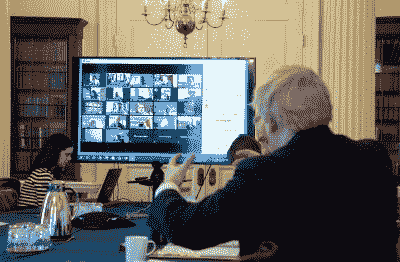

# 本周的安全:缩放(这次是真的)、指纹和膨胀软件

> 原文：<https://hackaday.com/2020/04/10/this-week-in-security-zoom-really-this-time-fingerprints-and-bloatware/>

上周你被许诺 Zoom 新闻，但是由于熬夜写作，那个故事被延迟到这个星期。Zoom 是怎么回事？谷歌、SpaceX，甚至台湾政府、T2 和美国参议院都禁止了 Zoom。你可能还记得[我们在近一年前对 Zoom](https://hackaday.com/2019/07/12/this-week-in-security-censoring-researchers-the-death-of-openpgp-dereferencing-nulls-and-zoom-is-watching-you/) 的报道，当时苹果强行从无数机器上移除了 Zoom 服务。新冠肺炎的现实让 Zoom 大受欢迎，但也让人们重新审视该平台的安全性。

“Zoombombing”，不请自来地参加一个 Zoom 会议，由于一些高调的事件而成为全国头条新闻。美国 DOJ 甚至就此发表了一份声明。这些事件似乎是缩放默认设置的结果:没有会议密码，没有“等候室”，会议 id 无限期存在。一个巨魔可以简单地在谷歌搜索缩放链接，并尝试连接到他们，直到找到一个活跃的会议。Ars 发表了[一篇关于如何避免被 zoombed](https://arstechnica.com/information-technology/2020/04/security-tips-every-work-from-homer-needs-to-know-about-zoom-right-now/)的精彩文章(感谢谢尔顿上周指出这一点)。

变焦故事还有另一个问题。从技术上来说，Zoom 是一家美国公司，但它的中国根基使其处境岌岌可危。最近有报道称[加密密钥通过中国](https://citizenlab.ca/2020/04/move-fast-roll-your-own-crypto-a-quick-look-at-the-confidentiality-of-zoom-meetings/)的基础设施传送，即使呼叫方在别处。在某些情况下，[呼叫数据本身通过中国的基础设施](https://www.businessinsider.com/china-zoom-data-2020-4)，尽管这被贴上了暂时错误的标签。Zoom 还宣传其会议具有端到端加密功能。那项声明经过调查，发现是假的。所有的会议都在 Zoom 服务器上解密，理论上 Zoom 的工作人员可以看到。

为什么重要？这只是反华言论吗？嗯，不。当一个像 Zoom 这样的服务被托管在一个特定国家的服务器上时，该服务受该国法律的约束。中国有着滥用通信基础设施监视和迫害本国公民的不光彩历史。(我知道美国在这方面也有不光彩的历史。我也不喜欢我的对话在美国服务器上公开。)虽然对于一所进行远程教育的学校来说，这不一定是个大问题，但政府领导人或许应该避免就这项服务召开内阁会议。

### 指纹扫描仪有多安全？

这是好莱坞的比喻。我们的英雄必须潜入超级秘密组织，要想进去，他必须打败一个指纹扫描仪。没问题，在电影的早些时候，英雄已经提取了一个指纹，并且用一点聪明才智，骗过了指纹扫描仪。那只是电影，真正的指纹识别器更安全吧？好吧，思科公司的塔罗斯集团对这个流言进行了检验。他们使用 25 微米的 UV 3d 打印机制作了一系列模具，然后尝试不同的材料来铸造假的印刷品。织物胶水似乎是最好的，因为它能够欺骗电容传感器以及视觉传感器。

一个模具可以在一小时内以 25 微米的分辨率被计算和打印出来。有一些额外的时间让演员自己设定，他们得出结论，攻击不是可以很快执行的事情。

电话似乎表现最差，成功率约为 80%。特别令人感兴趣的是难以妥协的设备。有趣的是，Windows 10 的一部分 Windows Hello 完全可以抵御他们的攻击。Talos 的研究人员认为，这里的关键是用于比较扫描指纹的比较算法。另一个赢家是一对 USB 钥匙，它使用指纹扫描仪来解锁存储的数据。那些钥匙也对这种攻击不屑一顾。Talos 的研究人员肯定地指出，这并不意味着这些设备可以安全地抵御这种类型的攻击。他们的工作是故意低预算的，很可能一个更有决心、资金充足的攻击者可以战胜其余的设备。

但是，即使你只是想在家里玩玩这个，只要稍加努力，你就可以自己骗过[人脸](https://hackaday.com/2017/11/14/face-id-defeated-with-3d-printed-mask-maybe/)和[虹膜识别](https://hackaday.com/2017/05/24/fooling-samsung-galaxy-s8-iris-recognition/)。撇开这些不谈，[无论如何你都不应该用生物特征信息来代替密码](https://hackaday.com/2015/11/10/your-unhashable-fingerprints-secure-nothing/)。

 [https://www.youtube.com/embed/CF0D-h7KZqY?version=3&rel=1&showsearch=0&showinfo=1&iv_load_policy=1&fs=1&hl=en-US&autohide=2&wmode=transparent](https://www.youtube.com/embed/CF0D-h7KZqY?version=3&rel=1&showsearch=0&showinfo=1&iv_load_policy=1&fs=1&hl=en-US&autohide=2&wmode=transparent)

### 浏览器新闻

在任何地方运行 Firefox 或 Tor 浏览器？请立即更新，确保您使用的是 74.0.1 或更高版本(如果您使用的是 Firefox ESR，则为 68.6.1)。有一对释放后使用的 bug 正在被积极利用。目前没有更多的细节，可能是因为相关的 bug 仍然需要修复。[据发现漏洞](https://twitter.com/revskills/status/1246145858107838464)的研究人员称:“还有很多工作要做，更多细节要公布(包括其他浏览器)。敬请期待。”

在谷歌这边，大新闻是新的同网站 cookies 政策正在被取消。Chrome 博客有一个[链接，链接到一个很棒的解释者](https://web.dev/samesite-cookies-explained/)关于第三方 cookies 的潜在问题，以及 samesite 政策的改变如何能有所帮助。

### 移动应用和输入验证

本周，我的电子桌上出现了一篇新奇的论文，介绍了一种新的方式来问一个老问题:这个闭源应用程序隐藏着什么秘密？我们过去讨论过后门、硬编码密码和隐藏的管理员菜单。很多时候，这些都是无意的；被遗忘且从未删除的调试代码。在链接的论文中，开发了一种技术来检查应用程序的输入验证代码，寻找隐藏的硬编码选项。

例如，第三方屏幕锁定将接受用户输入，然后进行系统调用，将该输入与系统密码进行比较。如果有一个字符串比较发生在预期的系统调用之前，那么可能有一个秘密的后门密码硬编码到应用程序中。在另一个例子中，一个翻译应用程序有一个秘密菜单，通过输入硬编码的键来解锁，在那里可以完成调试任务，比如禁用广告。

在扫描了 150，000 个 Android 应用程序后，发现大约有 12，000 个应用程序有硬编码的后门、密码或调试菜单。换句话说，超过 8%的最受欢迎的 Android 应用程序内置了一些可疑行为。

通过平成在线

### 移除膨胀软件的另一个原因

啊，没有多少事情像第一次拆箱新硬件那样令人满意。你终于扣动了新笔记本电脑的扳机，现在它已经准备好第一次启动了。在这种情况下，我们很多人都有类似的策略:启动笔记本电脑，卸载 OEM 膨胀软件。如果这不是你的习惯，那么也许
[【比尔·德米卡帕】对惠普膨胀软件](https://d4stiny.github.io/Several-Critical-Vulnerabilities-on-most-HP-machines-running-Windows/#remote-code-execution-vulnerability)的研究将说服你。

这里有很多，但最有趣的攻击链，RCE，利用了一些看似不相关的问题。第一个是 HPs 站点上的开放重定向。这似乎无关痛痒。[https://ers.rssx.hp.com/ers/redirect?targetUrl = https://Google . com&# 8221](https://ers.rssx.hp.com/ers/redirect?targetUrl=https://google.com&#8221)；会自动把你重定向到谷歌。第二个问题是注册自定义 URL 协议的 HP 服务。该协议下载并运行或打开下载的文件。在开始下载之前，运行检查，以确定该下载来自 HP 域。open redirect 在这里很方便，因为在执行域检查之后会进行重定向。一个官方的链接可以触发惠普的更新下载器，它会自动打开一个下载的 zip 文件。是的，它需要两个交互来妥协，但仍然是一个聪明的链。

### 新冠肺炎诈骗

我们冠状病毒诈骗故事的又一部分。本周我们将看看声称来自美国小企业管理局的电子邮件。

我在 7 号星期二收到了这封邮件，过了一会儿才意识到这是一封假邮件。首先，附件是一个`.img`，而不是 PDF 或其他图像文件。该磁盘映像包含一个“SBA _ Disaster _ Application _ Confirmation _ Documents _ COV _ Relief _ doc . exe”可执行文件。还有一些其他提示，这可能不是一个合法的交流，如“中心”和“奋进”的拼写，使用英国的拼写。最后，也可能是最明显的缺陷是，日期已经过去了。

抓紧你们的帽子，因为我们要推测。你看，这封邮件是在我在 SBA 官方网站上填写了一些经济伤害灾难贷款的在线文件后几个小时收到的。我差一点就上当了，因为时机太准确了。看起来小型企业管理局正在泄露资助申请人的信息，有人正在利用这一漏洞进行网络钓鱼活动。