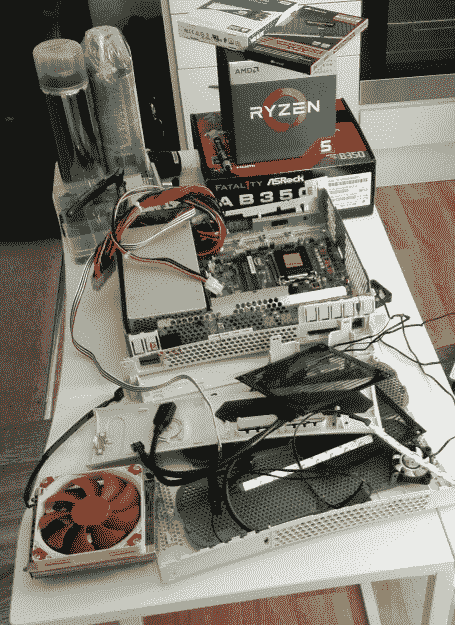

# 这台 Xbox 360 是由蒸汽驱动的

> 原文：<https://hackaday.com/2018/09/16/this-xbox-360-is-powered-by-steam/>

既然我们已经进入了下一代家用游戏机的时代，我们真的不能再这样称呼它们了，庭院销售肯定会充满被搁置的孤独的 Xbox 360s 和 PS3。你甚至可能会发现有人无意中购买了一两个 Wii U。这对于喜欢将新的电子产品塞进过时的消费设备的黑客来说非常好，因此，我们开始看到这种世代转变的成果。

 举个例子，这款 [Xbox 360 被【佩德罗·蜜桃红】](https://linuxgamecast.com/2018/09/hardware-steambox-360/)改造成了一个“蒸汽箱”。他认为 Xbox 360 的大小适合一台完整的 PC 和 PSU，同时看起来足够现代，在娱乐中心不会显得格格不入。在 Fedora 28 上运行 SteamOS，它甚至提供了传统的游戏控制台体验和用户界面，尽管明显是 PC 内部。

在外面，唯一真正透露出这个特殊的 Xbox 的新生命的东西(无论如何，当紫色 led 关闭时)是顶部的激光切割丙烯酸蒸汽标志，作为内部 CPU 冷却器的格栅。具有讽刺意味的是，[佩德罗]确实把 Xbox 喷成了白色，而不是只从黑色开始，但除此之外，没有太多必要的外部修改。当然，里面是一个非常不同的故事。

它配备了 AMD 锐龙 5 2400G 处理器，镭龙 RX Vega 11GPU 和 8GB 海盗船复仇 LPX DDR4 3200MHz RAM。电力由一台 Seasonic SS-300TFX 300W 提供，一台 Noctua NH-L9a-AM4 保持系统冷却。即使所有的设备都在那里，这个东西可能仍然比 Xbox 360 安静。

[Pedro]为那些想知道这个被破解的 Xbox 与更传统的游戏设置相比如何的人提供了一些有益的基准，尽管峰值性能显然不是这里的目标。如果你有 45 分钟左右的空闲时间，你应该看看他在休息后整理的视频，它讲述了机器的构造。

我们已经在最初的 Xbox 和现在的 Xbox 360 上看到了这一点。谁会是第一个把自己的产品植入当前一代 Xbox，并把它变成一台个人电脑，从而在互联网上成名的人呢？

感谢迈克的提示。]

 [https://www.youtube.com/embed/wWHGrhnZUXo?version=3&rel=1&showsearch=0&showinfo=1&iv_load_policy=1&fs=1&hl=en-US&autohide=2&wmode=transparent](https://www.youtube.com/embed/wWHGrhnZUXo?version=3&rel=1&showsearch=0&showinfo=1&iv_load_policy=1&fs=1&hl=en-US&autohide=2&wmode=transparent)

