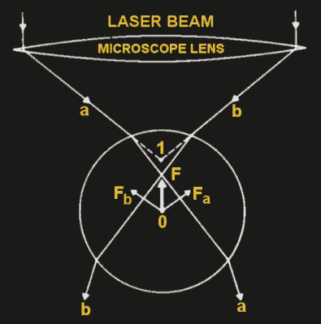
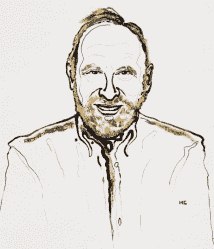
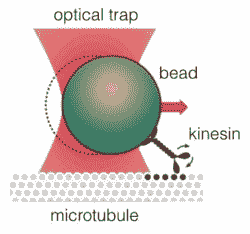
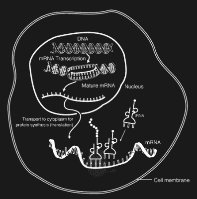
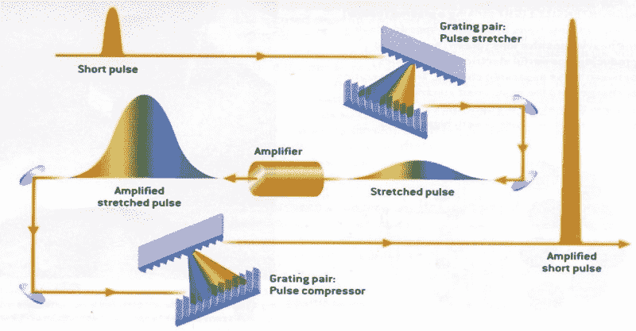
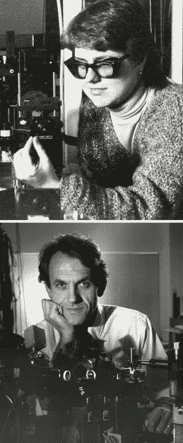
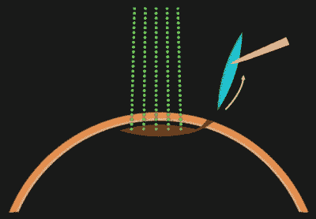

# 今年的诺贝尔奖完全出自科幻小说

> 原文：<https://hackaday.com/2018/10/10/this-years-nobel-prizes-are-straight-out-of-science-fiction/>

在 1966 年的科幻电影《神奇之旅》中，医务人员被缩小到微生物的大小，进入科学家的身体进行脑部手术。由于今年诺贝尔物理学奖获得者的工作，激光工具现在可以在这个规模上工作。

阿瑟·阿什金因其开发的光镊而获奖，光镊使用激光来抓取和操纵小至分子的物体。Gérard Mourou 和 Donna Strickland 因提出一种产生高强度超短激光脉冲的方法而获奖，该方法现在每年用于数百万例矫正性激光眼科手术。

让我们来看看这些发明，它们的发明者，以及让它们获得诺贝尔奖的重要应用。

## 光镊是如何工作的

以下是光镊的工作原理。激光穿过物镜，同时物镜将光聚焦在要被保持的粒子内部的一点上。对接下来发生什么的解释取决于粒子的直径。

[Ray optics explanation](https://www.sciencedirect.com/science/article/pii/S000634959281860X)

如果直径明显大于光的波长，那么射线光学可以用来解释它是如何工作的。由于折射，光线从周围介质(例如水)进入粒子时会改变方向，反之亦然。光携带动量，方向的改变意味着光动量的改变。动量的这种变化在质点上产生一个净力，使它向焦点移动。

相反，如果粒子的直径比光的波长小得多，那么粒子可以被视为电偶极。光的焦点周围的狭窄区域有很强的电场，随着离焦点越远，电场越弱，在两侧形成电场梯度。这些梯度将粒子移向焦点。

然而，在这两种情况下，都要考虑光对粒子本身的作用力，称为散射力。光子具有动量，当光子撞击粒子时，它们将一些动量传递给粒子。这导致粒子的中心稍微在焦点的前面。

其结果类似于科幻小说中的牵引光束，但规模要小得多。

## 亚瑟·阿什金:镊子背后的人

Arthur Ashkin, Source: Nobel Foundation

亚瑟·阿什金生于 1922 年，在哥伦比亚大学获得物理学学士学位，在康奈尔大学获得博士学位。第二次世界大战期间，他为美国军事雷达系统研究磁控管，并通过他从事曼哈顿计划的哥哥朱利叶斯认识了汉斯·贝特和理查德·费曼。

1952 年，他去贝尔实验室工作，并于 1992 年退休。在那里，他从事微波领域的工作，直到 1961 年，他转向激光研究。

早在 20 世纪初，就有实验证明辐射可以施加压力，但效果很弱。然而，激光允许更强大的效果，并且在 1970 年，Ashkin 表明聚焦成窄束的激光可以产生散射力，该力移动空气和水中的小电介质粒子。他还表明，由于周围的强度梯度，粒子可以被横向吸引到光束的中心。这些发现导致他使用两个相反的光束来捕获粒子，然后是单光束效应，其中光束对粒子的作用力被重力抵消。最后，在 1986 年，他展示了现在被称为光镊的全光学单光束阱。

## 使用光镊

Kinesin in optical trap, Source: Nobel Foundation

在他们发明的几年内，Ashkin 和其他研究人员已经使用光镊捕获和操纵中性原子、病毒、细菌、酵母细胞、人类红细胞等。从那以后，它们被广泛用于生物学研究。

操纵分子的一种方法是将微米大小的聚苯乙烯或二氧化硅珠附着到分子上，并操纵容易被捕获的珠。一个很好的例子是理解分子马达的动力学和力学，这种马达将化学能转化为线性或旋转运动。例如，蛋白质[驱动蛋白](https://en.wikipedia.org/wiki/Kinesin)使用这些马达沿着细胞内的微管丝移动，以运输细胞货物。通过将珠子连接到驱动蛋白，可以测量其步长和产生的力。

 有时，双陷阱被用来抓住蛋白质或 DNA 分子的相对两端。早期的 DNA 测试包括测量弹性和松弛度，并诱导尖锐的力转变为 DNA 的延伸形式。

分辨率已经提高，使得马达 RNA 聚合酶沿着 DNA 碱基对的单步运动可以被跟踪。马达 RNA 聚合酶将 DNA 复制成 mRNA，作为细胞内产生蛋白质的一个步骤。还使用光镊跟踪了核糖体对 mRNA 的进一步加工。

正是因为发明了光镊及其在生物系统研究中的应用，阿瑟·阿什金获得了 2018 年诺贝尔物理学奖。

## 高强度超短光脉冲

Chirped pulse amplification, Source: Nobel Foundation

1985 年，杰拉德·穆鲁(Gérard Mourou)和唐娜·斯特里克兰(Donna Strickland)因提出了一种利用激光产生超短光脉冲的方法而分享了该奖。这项技术被称为啁啾脉冲放大(CPA)。在此之前，有可能相对廉价地产生超短脉冲，但增加它们的强度受到这样一个事实的阻碍，即这样做会损坏放大器和光学元件。解决这个问题需要使用大的光束直径，但这增加了成本，并且意味着每天只发射几次，以便给放大器时间冷却。

图中所示的 Mourou 和 Strickland 提出的解决方案是首先将短脉冲在时间上拉长几个数量级。这样就可以在不损坏放大器的情况下进行放大。放大后的宽脉冲又被压缩到原来的持续时间，从而产生更高的太瓦强度。

## 斯特里克兰和穆鲁:激光运动员和老师

Photo: University of Rochester

唐娜·斯特里克兰是自 1963 年玛丽亚·戈珀特-梅耶获得诺贝尔物理学奖以来的第一位女性，另外一位是 1903 年的玛丽·居里。

斯特里克兰很适合这里的黑客读者。在加拿大麦克马斯特大学上学时，她和她的研究生称自己为“激光运动员”。她觉得这是因为他们的手很灵巧。

> 作为一名实验主义者，你需要理解物理学，但你也需要能够让一些东西实际工作，在那个时代，激光是非常挑剔的。

毕业后，她移居美国，在罗切斯特大学获得博士学位。

热拉尔·穆鲁是法国科学家，1973 年从巴黎皮埃尔和玛丽·居里大学获得博士学位。1977 年，他成为罗切斯特大学的教授，在那里他遇到了思特里克兰德。

CPA 的灵感来自雷达的长无线电波，但他们两人花了几年时间才使光发挥作用。当时，他们通过一根长长的光纤电缆来拉伸光线。有一次，当使用一根 2.5 公里(1.55 英里)长的电缆时，电缆的另一端没有光。电缆的某个地方断了。他们选择了 1.4 公里(0.86 英里)。到 1985 年，他们开始工作并发表了他们的论文。在接下来的几年里，光纤被一对衍射光栅取代，放大倍数从纳焦耳增加到焦耳。

## 注册会计师的申请

Femtosecond laser refractive surgery, Source: Nobel Foundation

CPA 有许多用途，包括探测电子的活动。足够强大的飞秒和阿秒激光使这成为可能。

一项仍在进行中但有朝一日将具有医学应用的发展是激光等离子体加速，这是目前射频(RF)加速器的领域。它的工作原理是将电子注入等离子体通道，并使用激光加速电子通过通道。最近，劳伦斯伯克利国家实验室的一台拍瓦级激光器在仅仅 9 厘米的距离内将电子加速到 4.2 GeV。

但是 CPA 最有效的应用是激光眼科手术，每年有数百万例这样的手术。非常短暂的切割将因加热而造成的损坏降至最低，当然，极高的精度也是一大优势。

## 诺贝尔获奖者

根据阿尔弗雷德·诺贝尔发起设立该奖项的遗嘱，该奖项旨在奖励那些为人类服务的人。因此，虽然我们可以异想天开地谈论今年的获奖者如何创造出使科幻小说成为现实的发明，但他们是因为这些发明的应用而被选中的。因为我们对细胞内惊人工作的复杂理解，也因为数百万现在能看得更清楚的人，我们认为今年的奖项是当之无愧的。