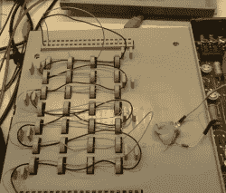
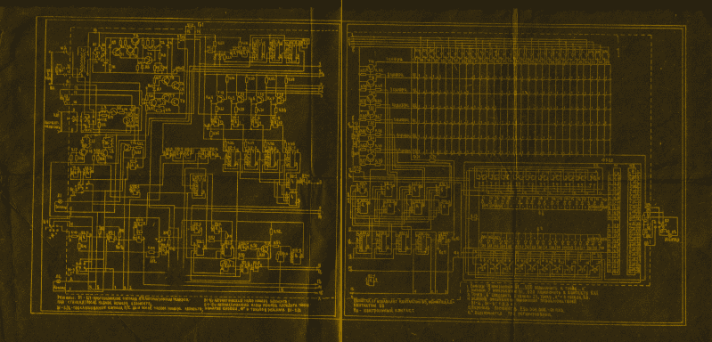

# 螺纹线保存电话号码

> 原文：<https://hackaday.com/2021/12/30/threaded-wires-save-phone-numbers/>

如果你认为为你的 90 年代录像机编程很难，那就等着看这个[俄罗斯电话自动拨号器吧，它是由*Mike electric stuff*YouTube 频道](https://www.youtube.com/watch?v=tPT6nIRFI_I)上的*Mike electric stuff 接手的。[Mike]几年前，我买了一台 80 年代的苏联机器，后来我终于有时间去使用它，了解它的工作原理。自动拨号器插在电话线上，很像老式的电话应答机。它为用户提供了 40 个预设的电话号码，排列成两组，每组 20 个，还提供了一个扬声器来监控连接过程。它使用脉冲拨号——没有按键音。令人惊讶的是你是如何编排数字的。鉴于这是 20 世纪 80 年代苏联制造的，他并不期待微控制器。但他也没想到变压器核心“绳”内存。*

电话通常放在机器左侧的平台上。抬起平台，露出一排环形铁芯，每排四个，共七排。每行对应一个拨号数字，四个核心用于编码一个数字。编程板的顶部和底部是两个 40 针连接器，每个针对应一个预设的电话号码。将提供一束跳线，通过将一根长电线穿过适当的芯线，将其连接在顶部和底部连接器上，就像现代的无焊试验板一样，对每个数字进行编程。看到这个电路板的组件和构造技术也很有趣。例如，二极管的阳极端有金属条，而不是我们今天通常使用的阴极。晶体管外壳像死蜘蛛一样倒挂着。

Scanned Schematics (click to see full size)

迈克试图破译原理图，并四处摸索，以获得其工作原理的要点。这个设计是对那个时代建造自动拨号器问题的一个有趣的解决方案。如果你想了解更多关于核心内存的知识，这里有一篇我们写的关于[破译一个 Apollo rope 内存模块](https://hackaday.com/2016/09/02/decoding-rediscovered-rope-memory-from-the-apollo-guidance-computer/)的文章，这可能是该技术最知名的例子之一。我们还覆盖了几个使用绳子记忆技术的小规模项目，这里是，这里是。

 [https://www.youtube.com/embed/tPT6nIRFI_I?version=3&rel=1&showsearch=0&showinfo=1&iv_load_policy=1&fs=1&hl=en-US&autohide=2&wmode=transparent](https://www.youtube.com/embed/tPT6nIRFI_I?version=3&rel=1&showsearch=0&showinfo=1&iv_load_policy=1&fs=1&hl=en-US&autohide=2&wmode=transparent)

