# 穿 3D 打印零件:如何使用热定形镶件

> 原文：<https://hackaday.com/2019/02/28/threading-3d-printed-parts-how-to-use-heat-set-inserts/>

当我们开始混合一些基本的“机械维生素”时，我们可以让我们的 3D 打印部件变得更加强大通过将打印与螺钉、螺母、紧固件和销钉结合起来，我们获得了一个丰富的机制制造生态系统，其能力超过了我们单独打印的能力。

今天，我想分享一些我最喜欢的功能性 3D 打印技术的技巧:添加热固插入物。作为多年来一直手动将它们安装到塑料部件中的人，我认为许多指南忽略了一些对获得一致结果至关重要的过程细节。

不要犯错误；市面上已经有一些插入导轨了[ [1](https://www.ptonline.com/articles/four-ways-to-tackle-threaded-inserts-for-plastics) ， [2](https://markforged.com/blog/heat-set-inserts/) ]。(事实上，我鼓励你先看看那里，以便有一个好的开端。)然而，这些年来，我加入了自己的收尾动作(没什么特别或困难的)，我称之为平板挤压技术，它给了我一个很大的一致性提升。

下面请和我一起填补知识空白(还有一些字面上的空白),让你回到实验室，这项技术每次都能给你完美的插页。

## 热定形插入“理论”

热定形镶件是向由热塑性塑料制成的零件添加螺纹的常备零件。由于 3D 打印依赖于从喷嘴中渗出塑料，几乎每一种 3D 打印材料都符合热塑性塑料的定义——所以它们都可以工作！就匹配技术而言，这些插页几乎就像是为彼此而做的一样！(唉；本来不是，但谢天谢地，注射成型塑料使这些部件成为了商品。)

热定形嵌件通过在安装时软化周围的材料来工作。安装完成后，移除热源会导致熔融塑料在镶件的滚花特征周围重新固化，从而将其固定在适当的位置。让我们从传热的角度来考虑这个过程。安装孔比插件本身要小(它们*比*小)，所以我们不能用手安装插件。相反，我们首先加热镶件，然后将热量传导到周围的材料中，使得孔变形，以适应镶件的更大形状。

随着时间的推移，热量从插入工具传递，通过表面区域接触的插入件，最终向外传递到我们的 3D 打印零件中，并在那里消散。插入零件花费的时间越长，热量进入零件的时间就越长，热量会使周围的零件区域变形。在大规模制造中，这个过程是由机器来完成的。不过，在我们的例子中，我们是手动安装的，所以我们需要记住我们的时间。最后，不要忘记，当我们安装插件时，我们是在*取代*熔化的塑料，为热定形的插件腾出空间。被替换的塑料需要去某个地方，它通常会在插件的底部变成糊状。

## 有一个工具可以解决这个问题

我们的工具不需要很贵。我使用一个插入的“安装提示”结合亚马逊的[预算 40W 烙铁，没有任何温度控制。这些“安装尖端”并不特别，但是与烙铁尖端不同，它们不是锥形的。使用没有锥度的齿尖使得一旦安装了镶块就很容易移除齿尖。](https://www.amazon.com/gp/product/B00B3SG6UQ/ref=ppx_yo_dt_b_asin_title_o04__o00_s00?ie=UTF8&psc=1)

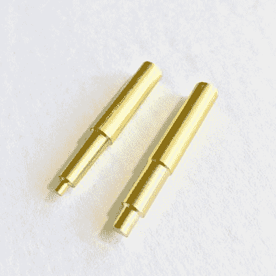

“Inserts” for a soldering iron. Image Source: [Virtjoule on Tindie](https://www.tindie.com/products/11479)

你可以在麦克马斯特-卡尔(pn: [92160a115](https://www.mcmaster.com/92160a115) )或 [Tindie](https://www.tindie.com/products/Virtjoule/heat-set-insert-install-4-40-m3-and-m5/) 上找到插页。(我承认我使用麦克马斯特-卡尔的 4-40 和 M2.5 插入，但也与 M3，M4 和 M5 插入没有任何问题！)

我强烈反对使用香草烙铁头，原因如下。这些尖端大部分是锥形的。如果我们使用锥形烙铁头，我们会有烙铁头卡在插件中的风险。记住:金属加热时膨胀，冷却时收缩。当我们将金属嵌件安装到印刷零件中时，我们将热量从嵌件散发到零件中，使受热的嵌件略微冷却，并在铁尖周围收缩。最终结果是，当我们试图拔出铁尖时，插入物随之而来！我认为这种情况类似于中国的手指陷阱。

尽管如此，当我在这个过程中使用香草烙铁头时，这个问题不会经常发生，但 1/5 的损坏印刷足以让我多赚 10 美元并得到正确的提示。

最后，我这个过程的最后一个工具是一个小正方形的薄金属片，大约 150x150mm 毫米(6 英寸 x6 英寸)。这个工作表变成了一个“平面”引用，我将在后面的过程中讨论它。

## 为插页设计:

说到镶件孔的尺寸，我建议遵循镶件数据表中的尺寸信息。作为一个快速参考，这里是我的一些常用插件及其孔尺寸建议的链接的迷你简编。

*   UD-43030 短 M3x0.5 插件([相关尺寸](http://www.tokai-mmc.co.jp/e/insertnut/seihin_ud4.html)、[厂商](https://us.misumi-ec.com/vona2/detail/221000748262/?HissuCode=UD-43030)
*   94180A331 M3x0.5 锥形嵌件([相关尺寸和供应商](https://www.mcmaster.com/94180a331))
*   93365A120 #4-40 锥形嵌件([相关尺寸和供应商](https://www.mcmaster.com/93365a120)

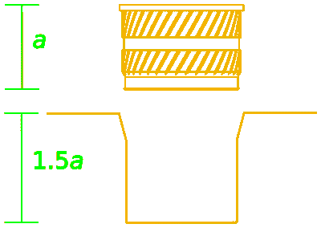

为了容纳移位的材料，我建议将孔的深度增加大约插入长度的 50%。这种变化确保了被替换的塑料有地方可去，而不会填满镶件应该在的型腔。

其他指南建议向孔特征添加一个小锥度。这是一个很好的功能，可以让插件在加热安装之前先固定在孔中。有些镶块本身是锥形的，这与非锥形孔具有相同的密封效果。添加这个锥形特征(或者购买稍微贵一点的锥形插件)不是必须的，但是它确实使安装过程更容易。

## 切片器设置:

有了现成的设计，我建议先调整一个 3D 打印机切片器设置，即周边图层。Slic3r 默认为孔特征的两个周界层。出于两个原因，我建议将这个值提高到至少 4 个周长。

4 perimeter layers for added structure and reduced sink marks

首先，我们要确保我们安装的插件在安装后仍然“抓住”材料。在安装过程中，一个安装好的插件将材料向外移动，所以增加层数可以增加我们在安装时没有熔化的几率。

第二，增加更多的周边层也减少了当插入物靠近部件的外表面时在部件上形成外部凹痕的程度。这些凹痕被称为 [*缩痕*](http://www.dc.engr.scu.edu/cmdoc/dg_doc/develop/trouble/sinkmark/f5000001.htm) ，它们实际上也是注塑件中常见的问题。缩痕的产生是因为零件冷却时会收缩。我发现增加更多的周长可以减少这种影响。我不能肯定地说为什么会这样，但我的最佳猜测是，添加固体材料会减少零件内部的自由空间，使内部几何形状更难改变形状。

[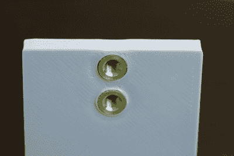](https://hackaday.com/2019/02/28/threading-3d-printed-parts-how-to-use-heat-set-inserts/img_9023/)

Sink marks on the perimeter of the part (view a)

[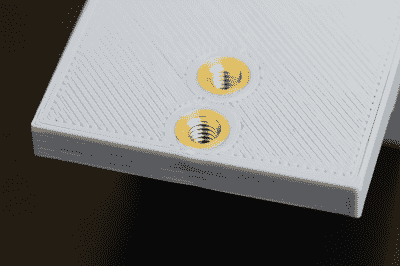](https://hackaday.com/2019/02/28/threading-3d-printed-parts-how-to-use-heat-set-inserts/img_9021/)

Sink marks on the perimeter of the part (view b)

## 安装过程和压板技术:

现在我们已经掌握了设计和准备镶件零件的方法，让我们开始安装程序。

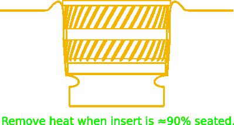

首先，在使用烙铁安装插件之前，确保烙铁已经完全达到设定温度。如果我们试图在熨斗仍然上升到其设定点时安装一个插件，这个过程只会花费更长的时间，来自熨斗的所有热量会花费更多的时间扩散到我们的零件，导致它翘曲。

接下来，将镶件放入孔中，加热镶件。让烙铁工具本身的重量施加将插件推入位置所需的温和力。重力应该在这里做大部分的工作。这个过程大约需要 10-15 秒。继续加热，直到嵌件大约 90%固定在零件中。

好吧，这就是我们偏离常规的地方。当插入物进入零件约 90%时，移除熨斗，然后*快速*将零件翻转到平坦的耐热表面上，并轻轻向下推动零件，直到其与材料齐平。(这一步我用了一小块金属片。)再等 6-10 秒钟，让零件冷却下来，就大功告成了！我把这个动作叫做*压版术*。

这一过程的最后一步看起来很奇怪，但由于两个原因它是至关重要的。首先，它使插页处于垂直位置，并与印刷部分的顶部完全齐平。第二，当我们安装插入物时，它使任何膨胀的材料变平。

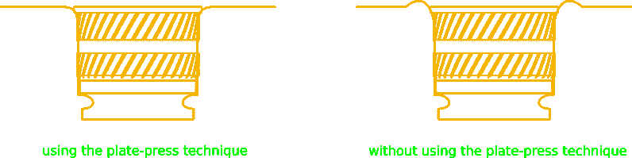

### 结果

如果一切顺利，你应该有一个好看的插件，与零件表面齐平。在下面的图片中，我用熨斗把这些部分固定住，然后用平板挤压技术冷却它们。

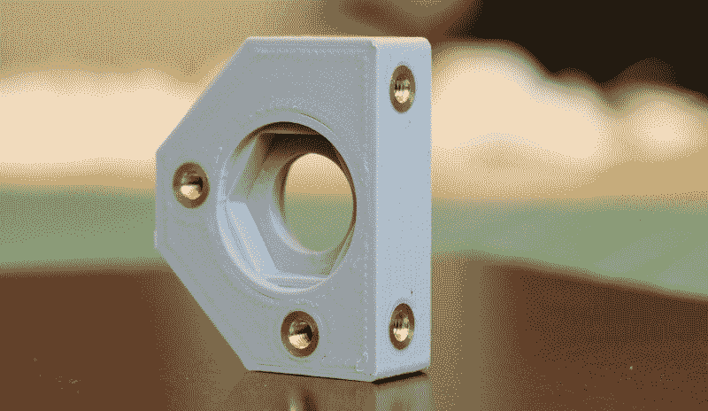

在下面的下一个示例中，该镶件的设置没有使用平板压制技术。请注意镶件周围令人讨厌的多余材料“凸起”。这正是我们在使用最终版压技术时可以去除的凸起。

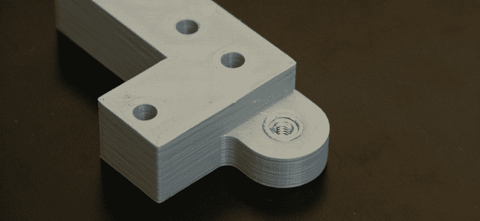

## 反思:

我想，如果我们在各种条件下练习安装这些插件，调整我们的熨斗温度和插入速度可能会减少或消除这种膨胀效应。但是这种假设的练习需求正是平板印刷技术如此有价值的原因。简单地说，平板印刷技术给我们提供了一致的结果，而不需要机器人级别的精度。我们只需简单地将插件“塞进”它的最终位置，然后就完成了。结果是不费吹灰之力、无需练习就能完成齐平插入。不可否认，这种技术不是业内人士在大规模生产中使用的，但它确实是一致的——甚至是一种黑客行为。

## 结论:

就是这样！我希望这个指南能让你每次都钉出漂亮的嵌入式直缝钉，而不会有太多的手工麻烦。这里是我做的其他几个部分的一个快速片段，提供了一些关于预期的观点。

[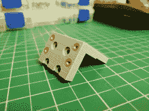](https://hackaday.com/2019/02/28/threading-3d-printed-parts-how-to-use-heat-set-inserts/img_20181121_213528/)[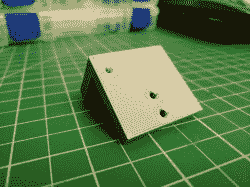](https://hackaday.com/2019/02/28/threading-3d-printed-parts-how-to-use-heat-set-inserts/img_20181121_213513/)[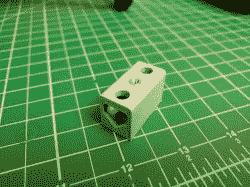](https://hackaday.com/2019/02/28/threading-3d-printed-parts-how-to-use-heat-set-inserts/img_20181124_235605/)[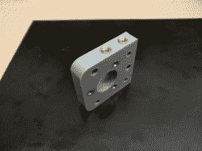](https://hackaday.com/2019/02/28/threading-3d-printed-parts-how-to-use-heat-set-inserts/img_20190104_230031/)[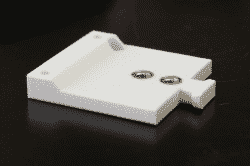](https://hackaday.com/2019/02/28/threading-3d-printed-parts-how-to-use-heat-set-inserts/39826546903_71543e4377_k/)[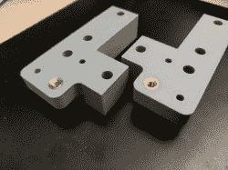](https://hackaday.com/2019/02/28/threading-3d-printed-parts-how-to-use-heat-set-inserts/img_20190110_225801/)

我已经开始用 [#beautifulinserts](https://twitter.com/search?q=%23beautifulinserts&src=typd) 上传我的商品，我很想看看这种技术对你来说效果如何。如果你让任何事情变得有趣，为什么不通过加入对话来激励一些社区成员呢？

## 参考资料:

1.  [https://markforged.com/blog/heat-set-inserts/](https://markforged.com/blog/heat-set-inserts/)
2.  [https://www . ptonline . com/articles/four-way-to-charge-threaded-inserts-for-plastics](https://www.ptonline.com/articles/four-ways-to-tackle-threaded-inserts-for-plastics)