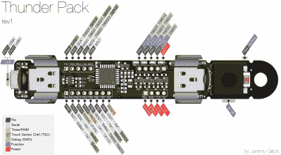

# Thunder Pack 是可穿戴设备的一道闪电

> 原文：<https://hackaday.com/2020/03/25/thunder-pack-is-a-bolt-of-lightning-for-wearables/>

[你需要能装一拳的便携式电源吗？](https://hackaday.io/project/161054-thunder-pack)你当然想，尤其是如果你想用一大堆 LED 灯点亮夜晚。当然，你并不局限于此，但当我们读到[杰里米]的雷霆包时，这就是我们所想象的。有四个 PWM 通道，每个通道的电流为 2.3 A，为什么不疯狂一下呢？[杰里米]已经证明了雷霆包通过测试它的步伐在燃烧的人一周。

Click to embiggen!

经过几次迭代，【Jeremy】已经登陆 STM32 微控制器家族，并且[目前正致力于将](https://github.com/jgillick/ThunderPack/tree/STM32F4)升级到具有足够闪存来运行 CircuitPython 的产品。

最初的版本被设计成在单个 18650 电池上运行，但[Jeremy]现在有三块板支持类似但更小的可充电电池，用于不需要太多电力的项目。

我们喜欢它的小巧和强大，加密狗孔是一个很好的触摸方式，因为它为将其构建为可穿戴设备提供了选择。[Jeremy]制作了一个奇妙的引脚排列图，并在报告中为[提供了大量代码示例](https://github.com/jgillick/ThunderPack)。如果你想涉水进入可穿戴设备领域，[让异想天开的可穿戴设备向导【安吉拉·希恩】带你穿过波浪](https://hackaday.com/2019/12/11/angela-sheehan-is-developing-wearable-tech-with-whimsy/)。