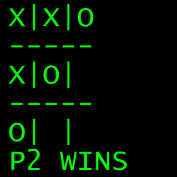

# 在对 Printf()的一次调用中实现了井字游戏

> 原文：<https://hackaday.com/2020/06/05/tic-tac-toe-implemented-in-single-call-to-printf/>

[Nicholas Carlini]编写了一个双人井字游戏的 C 实现，[，他只需调用`printf()`](https://github.com/carlini/printf-tac-toe) 就能完成。那个单一函数调用的参数变得令人难以置信的复杂，所以它是为国际模糊 C 代码竞赛 (IOCCC)而写的也就不足为奇了。

我们中的大多数人都知道`printf()`是一个非常复杂的功能，它比看起来要复杂得多。但是你知道它能够完成图灵完全计算吗？

[Nicholas]很清楚这个理论，所以读一下吧。简而言之，迷宫般的参数处理游戏的逻辑，而嵌入式`scanf()`读取用户输入，打印游戏板之前总是有一个转义码来清除屏幕。

[Nicholas]当然对深入了解并不陌生；我们以前在[中见过他的工作，演示了如何用隐藏命令](https://hackaday.com/2018/01/15/fooling-speech-recognition-with-hidden-voice-commands/)欺骗语音识别，包括一个强大的例子，展示了两个听起来几乎相同的音频文件如何完全不同地转录。