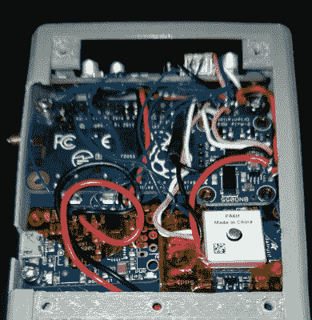

# 紧密包装的树莓 Pi 三录机印象深刻

> 原文：<https://hackaday.com/2021/04/15/tightly-packed-raspberry-pi-tricorder-impresses/>

我们会提前说，我们没有关于这个 3D 打印的*星际迷航:下一代*三录机的太多信息。但是来自图片库的[【希姆伦】发布了](https://imgur.com/a/oIxEVoC)我们知道它运行在树莓派 Zero W 上，除了单色有机发光二极管之外还有一个彩色 LCD，并且它绝对挤满了设备。

到目前为止，[Himmelen]在机箱的上半部分安装了一个 NESDR RTL-SDR 转换器、一个 GPS 接收器、一个加速度计和电池充电电路。称其为紧密贴合有点轻描淡写，尤其是当您考虑到所有缠绕在那里的电线时。[但是正如关于设备](https://www.reddit.com/r/cyberDeck/comments/mp3o7e/tricorder_styled_cyberdeck_oc/)的红迪线程中提到的，某种定制的印刷电路板背板正在开发中，所以所有这些模块都有更整洁的东西可以插入。

 这款车有很多奇妙的小细节，让我们非常兴奋地看到它穿过终点线。嵌入设备顶部的母 USB 端口是一个不错的触摸，因为它将使现场添加存储或附加硬件变得容易。我们也喜欢键盘，它由 30 个单独的触动开关和 3D 打印的盖子组成。很难想象在这样的输入设备上打字会是什么样子，但即使每个按钮只是启动了自己的程序或功能，我们也会很高兴。

根据 LCD 在所有图像中显示 Pi 坐在登录提示符下的事实来判断，我们将冒险假设[Himmelen]还没有为这个小工具编写太多软件。一旦硬件完成，是时候开始推进像素了，[类似 Pygame 的东西可以用来完成 LCARS 风格的用户界面](https://hackaday.com/2020/10/28/pygame-celebrates-20-years-by-releasing-pygame-2-0/)，这将符合*下一代*的视觉风格。事实上，我们可以想出一些交钥匙项目来创建*Trek*ui，尽管 Pi Zero 相对有限的计算能力可能是个问题。

我们已经看到几个项目试图把标志性的三录仪变成一个功能设备。一些人将注意力集中在更容易识别的下一代风格上，比如这款，而另一些人则瞄准了柯克和斯波克时代的[更宽容的砖形单元。Wand 公司甚至正在开发一款官方授权的三录仪，据称这款设备将与现代技术](https://hackaday.com/2017/08/18/picorder-raspberry-pi-stands-in-for-stone-knives-and-bearskins/)和 250 美元的价格标签[非常接近，尽管我们打赌 COVID 已经放慢了这方面的进展。无论如何，不管你是建造它还是购买它，三录仪似乎注定在不久的将来成为现实。](https://hackaday.com/2020/07/22/cbs-announces-functional-tricorder-replica-for-2021/)