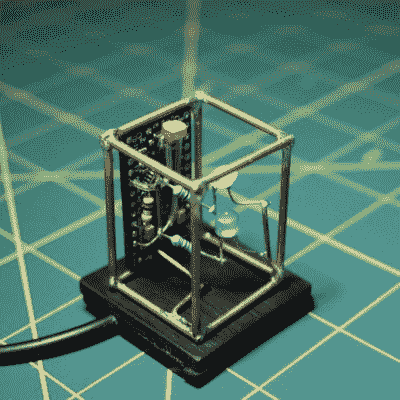

# 微小的电路雕塑让守夜人

> 原文：<https://hackaday.com/2020/07/27/tiny-circuit-sculpture-keeps-the-night-watch/>

如果你打算有一天进入电路雕塑，最好从小而简单的东西开始，而不是一开始就试图制作一个疯狂的发光飞船或有很多曲线的东西。小尺寸并不意味着它就没有用处。为什么不从制作一个小型自动夜灯开始呢？

 电路本身相当简单，尤其是因为它使用了一个 Arduino。你可以用 555 完成同样的事情，但这将使电路雕刻部分变得有点复杂。只要来自光敏电阻器的环境光水平足够低，那么两个 led 将被点亮。

我们喜欢[akshar1101]用看起来像直角插头的东西连接在一起的磨砂丙烯酸面板。如果你想暴露电子设备，用一个套在发光二极管上的小丙烯酸盖来定位光扩散。休息之后看看演示。

打造发光长方体夜灯的方法不止一种。[魔方，比如说](https://hackaday.com/2019/08/24/this-rubiks-cube-lamp-has-some-serious-retro-style/)。

 [https://www.youtube.com/embed/AG-D0I_QOwU?version=3&rel=1&showsearch=0&showinfo=1&iv_load_policy=1&fs=1&hl=en-US&autohide=2&wmode=transparent](https://www.youtube.com/embed/AG-D0I_QOwU?version=3&rel=1&showsearch=0&showinfo=1&iv_load_policy=1&fs=1&hl=en-US&autohide=2&wmode=transparent)

