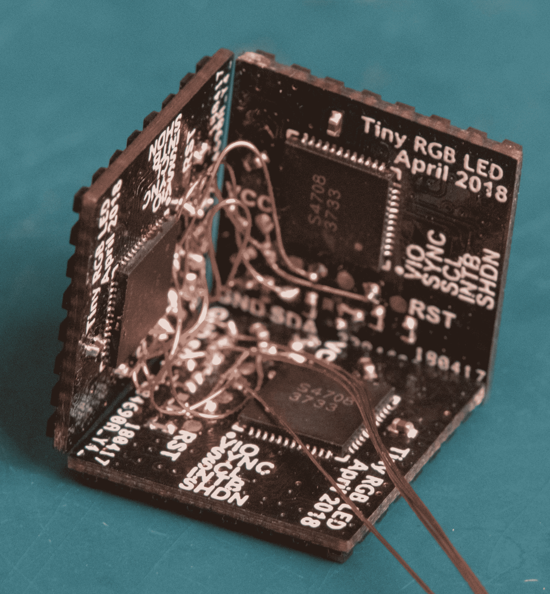
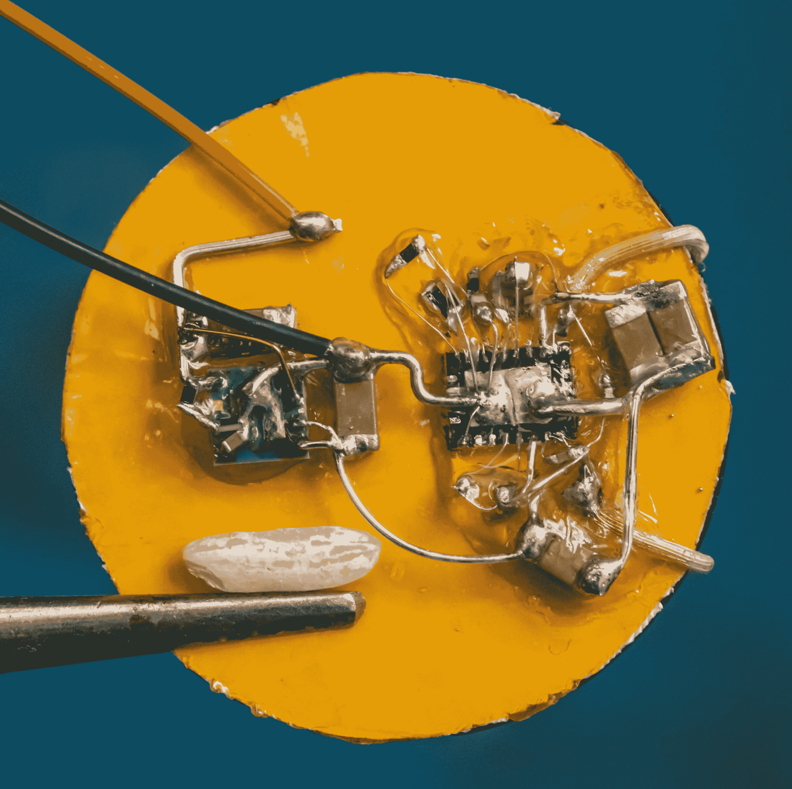

# 微小的 LED 立方体包装六米的疯狂

> 原文：<https://hackaday.com/2019/09/08/tiny-led-cube-packs-a-meter-of-madness/>

当弗雷迪面临为一位热爱领导的同事准备送别礼物的挑战时，他想出了一个计划。他将制作一个立方体，而不是用现有的电视墙 LED 面板来制作显示屏。但不是随便一个立方体，而是一个微型桌子大小的立方体，不缺少功能或性能。如果有人送给我们这个小小的由线圈供电的 RGB 立方体杰作，我们会欣喜若狂。

最近，我们有幸拥有了一群[漂亮的](https://twitter.com/hackaday/status/1159267182267625472)、[动画](https://hackaday.com/2019/04/30/opengl-shaders-and-an-led-cube/)、 [RGB](https://hackaday.com/2019/07/07/epoxy-led-cube-looks-sleek-and-flashes-to-the-beat/) 、[立方体](https://hackaday.com/2019/04/26/resistance-is-futile-you-want-this-led-cube/)，但没有一个达到了尺寸和功能的完美结合。这里的关键成分是[微小但负担得起的 RGB led](https://lcsc.com/product-detail/_1010RGB_C158099.html)，其边长为 1 毫米。但是这么小的 led 与世界上其他微小的“2020”封装 WS2812 和 APA102s 相比就相形见绌了。将他的布局能力发挥到极致[Freddie]将每个封装挤在一个网格中，元素之间的间隔不到 1 毫米，从而产生了一个 64 LED 面板，它只有 16 毫米 x 16 毫米(测试点和控制器安装在背面)。这些构成完整立方体的四层 PCB 中的每一层都包含惊人的 950 毫米的轨迹，这意味着整个立方体有近 6 米的轨迹！

如此小的设备没有明显的连接器位置，如何为其供电？当然是通过将电磁线穿过一个角落并向下延伸到 Qi 线圈。为了不让立方体本身盖过电源，弗雷迪设法在线圈本身的背面安装了一个合适的电源。注意照片左边的米粒！唯一的缺点是处理器——斜挂在微型主板上的立方体中——不能重新编程。希望未来的版本也能运行编程行。

休息后查看立方体的视频，链接相册查看更高分辨率的宏观照片。当你在那里的时候，花一点时间欣赏其中一个面板的布局样本！如果这定下了基调，我们希望在未来看到更多[弗雷迪]的离去！

 <https://hackaday.com/wp-content/uploads/2019/09/cube-vid.mp4?_=1>

[https://hackaday.com/wp-content/uploads/2019/09/cube-vid.mp4](https://hackaday.com/wp-content/uploads/2019/09/cube-vid.mp4)