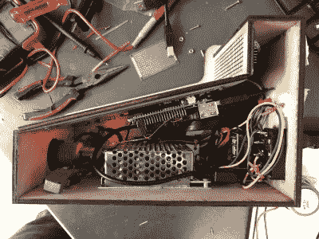

# 小弹球和圆周率一样可爱

> 原文：<https://hackaday.com/2022/03/27/tiny-pinball-is-as-cute-as-pi/>

弹球机是巨大、复杂、沉重的欢乐和喜悦的盒子。然而，当你没有钱或空间买一个的时候，你必须做一个你自己的迷你树莓派驱动的。

利用当地的创客空间和一点额外的空闲时间，[Chris Dalke]计划在一个小包装中捕捉全尺寸弹球机的味道。激光切割的波罗的海桦木形成了围栏，一个屏幕组成了比赛场地，而不是一个实体球。Arduino Uno 处理三个按钮、四个 LED 矩阵和一个用于触觉反馈和通信的螺线管

通过串行与 Pi 连接。不幸的是，即使有一个相对体面的

卷里面，依然是紧紧的挤压着。

与其使用现成的弹球游戏，【Chris】[不如使用](https://github.com/chrisdalke/mini-pinball-machine) [raylib](https://github.com/raysan5/raylib) 和 [raygui](https://github.com/raysan5/raygui) 用 C 编写自己的弹球游戏，这两个方便的库可以很快包含在项目中。SQLLite3 将高分写入磁盘。总而言之，这是一个鼓舞人心的项目，具有很高的水平。

如果你正在寻找一个小弹球机，但想要更多的经典弹球的感觉，为什么不看看这个规模弹球机？

 [https://www.youtube.com/embed/iiBn7FVzlcc?version=3&rel=1&showsearch=0&showinfo=1&iv_load_policy=1&fs=1&hl=en-US&autohide=2&wmode=transparent](https://www.youtube.com/embed/iiBn7FVzlcc?version=3&rel=1&showsearch=0&showinfo=1&iv_load_policy=1&fs=1&hl=en-US&autohide=2&wmode=transparent)

