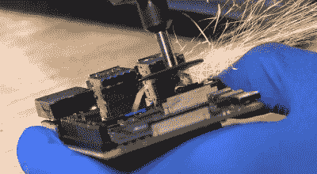

# 小树莓苹果钉苹果审美

> 原文：<https://hackaday.com/2020/08/27/tiny-raspberry-pi-mac-nails-the-apple-aesthetic/>

我们知道，有些观众会反对将 3D 打印外壳的树莓派称为“世界上最小的 iMac”，但你必须承认，[迈克尔·皮克]确实做得很好[重现了真实硬件的光滑外观](https://www.youtube.com/watch?v=wRsn2f6dxCk)。虽然在所有这些计划下可能没有任何 Cupertino 魔法，但它确实有一个适当的主题化用户界面，以及你期望在苹果台式机上看到的对外部端口和电线的普遍厌恶。

这种简洁的线条在很大程度上是由 LCD 本身造成的。它专为 Raspberry Pi 设计，在后部提供安装支架，集成扬声器，专用的 5 V 电源连接，以及取代传统 HDMI 电缆的 FFC。所有这些都使 Pi 可以整齐地放在面板的背面，而没有通常的各种笨拙的电缆和适配器。即使你不打算买一台迷你麦金塔，你也可能想把这款显示器记在心里，以备将来黑客入侵之需。

Well, that’s one way to do it.

尽管安装得很干净，但小巧的树莓派仍然有点太厚，不适合放入[迈克尔]设计的 3D 打印外壳中。因此，他用一种有点非传统，但无可否认是权宜之计的方式来减肥。用一个旋转工具和一只稳定的手，他简单地将双叠 USB 端口切成两半。由于在这个构建中不需要以太网，他也将 RJ-45 连接器一分为二。我们预计在关于这个的评论中会有一些抱怨，但是很难说这在字面和比喻意义上都不是一个黑客。

我们真的很欣赏这个构建的小细节，从重新定位的 USB 连接器到兼作 LCD 控制入口的通气孔。[Michael]全力以赴，甚至在机器正面印上了一个小插页，作为标志性的 Macintosh 标志。尽管考虑到几个月前他在他的微型“游戏电脑”中所做的令人印象深刻的工作，这并不奇怪；显然，这是一个非常重视他的微型电脑的人。

 [https://www.youtube.com/embed/wRsn2f6dxCk?version=3&rel=1&showsearch=0&showinfo=1&iv_load_policy=1&fs=1&hl=en-US&autohide=2&wmode=transparent](https://www.youtube.com/embed/wRsn2f6dxCk?version=3&rel=1&showsearch=0&showinfo=1&iv_load_policy=1&fs=1&hl=en-US&autohide=2&wmode=transparent)

