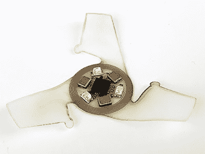

# 小巧的翼电路随着时尚而坠落

> 原文：<https://hackaday.com/2021/10/11/tiny-winged-circuits-fall-with-style/>

西北大学的研究人员正在将制造微小飞行物的目标降低到 0.5 毫米，有效地制造出飞行微芯片。虽然“有格调的堕落”可能是更准确的描述。

A larger “IoT Macroflyer” with more conventional circuitry

像我们之前介绍过的[新加坡科技设计大学](https://hackaday.com/2021/08/07/helicopter-seed-robot-can-also-drop-like-a-rock/#more-490156)的[类似项目](https://hackaday.com/2019/11/02/these-maple-pod-inspired-drones-silently-carry-payloads/)一样，这些微型滑翔机的灵感来自于各种树木产生的“直升机种子”。它们由单个形状记忆聚合物基板组成，电路由硅纳米薄膜晶体管和转移到其上的铬/金互连组成。

查看[研究论文](https://www.researchgate.net/publication/348508642_Three-Dimensional_Electronic_Microfliers_With_Designs_Inspired_by_Wind-Dispersed_Seeds)，似乎现阶段的重点主要是空气动力学和制造工艺，而不是创造功能电路。一个更大的“物联网宏飞行器”包括普通的集成电路，它通过一组在 UV-A 光谱中工作的光电二极管为超级电容器充电，充当累积剂量计。其结果可以在恢复后通过 NFC 读取。

与其他类似项目一样，提议的用例包括环境监测和监督。向地表空投大量的这种设备会造成相当严重的污染，为此，研究人员还创造了一种可生物降解的版本。尽管我们对这些“空投传感器群”抱有相当程度的怀疑和恐惧，但我们怀疑它们可能会在未来的某个时候被使用。我们只是希望那些负责的人会考虑到所有可能的后果。