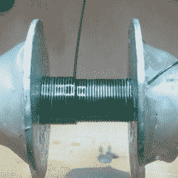

# 缠绕具有漂亮扁平侧面的耐用线圈的技巧

> 原文：<https://hackaday.com/2022/06/19/tips-for-winding-durable-coils-with-nice-flat-sides/>

[Drew Pilcher]需要耐用的定制线圈，没有磁芯，侧面非常平。当然，线圈可以手工缠绕，但是用细导线和许多层可靠地制造完美的线圈需要一些额外的帮助。令人高兴的是，[【Drew】分享了他的方法。也许这并不奇怪，可重复的高质量线圈的关键是良好的准备和工具。](https://www.wolfsprojectfiles.com/guides/windPerfectCoils.php)

最重要的部分是无需将手从工件上拿开就能旋转卷轴进行卷绕的能力。为了实现这一点，一个便宜的无名电钻和脚踏板(由电钻的触发装置制成)构成了[Drew]的 DIY 绕线机的基础。为了精确地制造线圈，还必须计算匝数。谢天谢地，有一个简单的解决方案；[Drew]用了亚马逊便宜的数字计数器。这种经济的设备使用磁铁和传感器，所以[Drew]只需将磁铁粘在钻头卡盘的一侧。

Careful winding and a liberal application of CA glue helps ensure good results.

线轴是金属丝缠绕形成的线圈，之后需要从线圈上取下。为了做到这一点，[德鲁]使用了黄铜轴，金属垫圈，和一些塑料垫片。在线轴表面涂上一层薄薄的油脂，有助于确保东西最终完全分开。

为了真正制作线圈，[Drew]推荐了一些放大的方法，以及 CA 胶的供应。尽可能干净、紧密地缠绕电线，并在缠绕过程中使用 CA 胶来固定物品。这需要一些实践，但如果做得正确，真正干净的绕组是可能的。

对于有很多层的厚线圈，CA 胶可以很好地将它们粘合在一起，但对于较小的线圈，[Drew]喜欢给它们涂上一层由两部分组成的环氧树脂。在事情完全设置好之后，线轴被拆开，内芯被尽可能轻柔地推出。

结果呢？一种紧密缠绕、经久耐用的线圈，侧面非常平整。这正是[德鲁]即将开展的线圈枪项目所需要的东西。你想知道这是怎么回事吗？[你可以在这里看到涵盖的基础知识](https://hackaday.com/2016/08/19/coil-gun-for-newbies-learning-electromagnetic-propulsion/)。