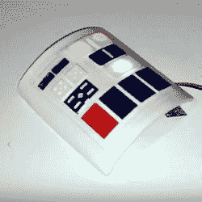

# 来自前利基项目 Etsy 商店的提示

> 原文：<https://hackaday.com/2020/05/04/tips-from-a-former-niche-item-etsy-store/>

Etsy 是一项旨在为手工制品制造商提供在线销售途径的服务。[Bithead]在今年早些时候关闭了店铺，[写了一篇有趣的观点，阐述了](https://bithead942.wordpress.com/2020/01/01/shutting-down-my-etsy-store/)的成功和失败。[Bithead]商店的主要市场是《星球大战》角色扮演者，因为它都是从一些受《星球大战》启发的 com pads 开始的，其中一些如图所示。

【Bithead】总的来说觉得行之有效的一件事是“从大处着眼，从小处着手，快速扩展”从本质上说，通过出售现有库存并仔细监控需求来进行引导，然后如果需求持续，就扩大批量生产，这样效率会更高。可靠的需求抵消了大量订购零件和增加库存的风险。等到可靠需求的可靠数据可用时，意味着错过早期销售，但这是一种低风险的方法，适用于几乎没有或没有真正竞争的利基产品。

有几件事没有成功，那就是努力遵循 Etsy 的建议，增加更多产品以吸引更广泛的受众，并尝试提供折扣和激励的工具，旨在将废弃的购物车转化为销售。两者都不顺利。第一种方式导致增加了销售不佳的商品，分散了商店的注意力，并增加了每次列表的成本。第二个似乎对销售没有任何影响。或许这些努力会有一席之地，但[Bithead]的利基市场并非如此。

这是一本很好的读物，讲述了 Etsy 商店在三年多的时间里是如何为利基受众服务的。这种观点和经历可能对任何想把好主意变成网上销售的东西的人都有用，所以如果你感兴趣，花几分钟去看看。

我们以前看过[Bithead]的作品，[这把受光剑启发的小提琴弓](https://hackaday.com/2017/01/22/a-violin-bow-lightsaber/)是一个项目，后来成为一套出售的工具。