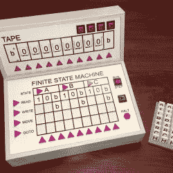
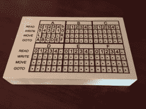

# TMD-2:更大、更好、更协作的图灵机

> 原文：<https://hackaday.com/2020/11/28/tmd-2-a-bigger-better-more-collaborative-turing-machine/>

我们在 Hackaday 上发表的文章最喜欢的一点是黑客和读者之间的互动。在最好的情况下，一篇文章的评论部分可以成为一个协作努力的模型，读者的想法和建议可以进入 2.0 版本。

这种学院式的动态在 [TMD-2、【迈克尔盖迪】的最新版图灵机演示器](https://hackaday.io/project/174667-tmd-2-turing-machine-demonstrator-mark-2)上得到了很好的展示。我们在夏末报道了最初的 [TMD-1](https://hackaday.com/2020/08/27/tmd-1-makes-turing-machine-concepts-easy-to-understand/) ，它的想法是作为图灵机概念的物理体现。简而言之，TMD-1 代表了图灵机的关键“磁带和磁头”概念，它带有一个伺服控制翻转瓦片控制台，其状态由一个三态、三符号有限状态机控制。

TMD-1

TMD-1 能够编写简单的程序，真正展示图灵机的原理，它似乎真的很受读者欢迎。根据一位读者的评论，[记者 5]，[迈克]开始为 TMD-2 做更大更好的思考。他将有限状态机扩展到六种状态和六个符号，这意味着要拿出比 TMD-1 的霍尔效应传感器和磁瓦更具扩展性的东西。

TMD-2 has a camera for computer vision of the state machine tiles

[Mike]选择使用 Raspberry Pi 摄像头以及 Open CV 和 Tesseract OCR 引擎进行光学字符识别。最初的伺服驱动磁带也不能很好地扩展，因此被显示在 7”LCD 显示器上的虚拟磁带所取代。原版中最好的部分，基于瓦片的有限状态机，被扩展了，但保留了触觉编程体验。

向[Mike]脱帽致敬，因为他用这么多以前对他来说是新的技术来处理一个项目，并完成了另一个伟大的构建。以及激励他前进的伟大建议。