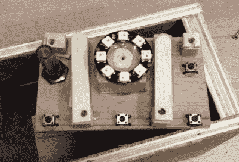

# 适合幼儿使用的 MP3 播放器通过灯光导航

> 原文：<https://hackaday.com/2020/06/18/toddler-friendly-mp3-player-navigates-with-light/>

当[为他的孙子](https://hackaday.io/project/171670-mp3flower)设计这款定制 MP3 播放器时，[Luc Brun]遇到了一个独特的问题。他希望这个男孩能够自己操作播放器，但是他只有 2 岁，用户界面必须非常简单。太多的按钮只会分散注意力，而且在他这个年龄，显示文本毫无意义。

 最后，【Luc】想出了一个非常有趣的方法，用几个按钮和一圈 WS2812 LEDs 在满是 MP3 文件的目录中导航。led 的颜色表示当前选择的目录或类别:口语童谣是红色的，音乐是橙色的，自然声音是黄色的，等等。发光二极管的数量表明哪个文件被选中，所以换句话说，三个橙色的发光二极管将指示第三个音乐曲目。

在他孙子的年龄，我们想象他在这个系统中航行至少有一点只是运气。但是随着年龄的增长，他会开始在他所听到的和发光二极管的颜色和数量之间建立更牢固的联系。因此，这个界面不仅是帮助他自己操作设备的一种方式，而且也可以作为这些成长岁月中一种有价值的学习工具。

另一方面，如果你的目标只是尽可能长时间地分散年轻人的注意力，[大量的发光二极管、按钮和开关可能正是你想要的](https://hackaday.com/2019/12/16/busy-box-beats-babys-boredom/)。