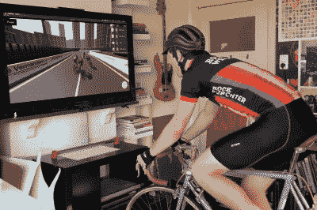

# 用 Unity 和 Arduino 进行卫生纸追逐和室内自行车赛

> 原文：<https://hackaday.com/2020/05/29/toilet-paper-chase-and-indoor-cycling-race-with-unity-and-arduino/>

虽然我们离回到日冕出现前的日常生活还很遥远，但人们似乎已经接受了卫生纸既不会神奇地消失，也不会成为我们新的全球货币。但是回到它最疯狂的时候，像我们大多数人一样，[Jelle Vermandere]发现自己站在空货架前，对他来说解决方案似乎很明显:[创造一个逼真的卫生纸追逐游戏，希望分散竞争对手的注意力](https://github.com/Jellevermandere/ArduinoMotionControls)。

使用 Unity，[Jelle]创造了一个空超市的游戏世界，目标是追逐分配管，并将卫生纸包收集到虚拟购物车中。受 Wii Wheel 的启发，他模仿了一个购物车手柄，它是由一根遮阳杆制成的，在 3D 打印的外壳中装有 Arduino 和加速度计，作为游戏控制器。为了更真实的感受，他在控制器上添加了声音传感器，并在游戏中添加了竞争车，只需大声叫喊就可以将它们推到一边。休息过后，你可以在他的建造视频中见证所有这些令人愉快的荒谬。

From racing shopping carts to racing bicycles

但这还不是全部。解决了卫生纸的问题后，[Jelle]发现自己陷入了一个不同的困境:一朵云挫败了他骑自行车的计划。以同样的方式，[他最终开发了一款自行车比赛游戏](https://github.com/Jellevermandere/TrackGenerator)，再次与 Unity 和 Arduino 合作。从他自己和他的自行车的 3D 扫描模型，到在飞行中自动生成轨迹并教人工智能骑自行车，[Jelle]显然不会在开玩笑的时候开玩笑。

然而，这个游戏最棒的部分是控制器，也就是他真正的自行车。使用一个磁性门传感器来检测速度，并用一个不起眼的乐高结构安装到车把上的电位计，它至少与购物车把手不相上下——但在休息后附上的另一个制作视频中，你可以自己判断。现在唯一缺少的是通过自行车本身为 Arduino 提供动力来提升难度[。](https://hackaday.com/2020/03/02/generate-power-as-you-ride-with-a-bicycle-planar-alternator/)

 [https://www.youtube.com/embed/FSK1Msmau0A?version=3&rel=1&showsearch=0&showinfo=1&iv_load_policy=1&fs=1&hl=en-US&autohide=2&wmode=transparent](https://www.youtube.com/embed/FSK1Msmau0A?version=3&rel=1&showsearch=0&showinfo=1&iv_load_policy=1&fs=1&hl=en-US&autohide=2&wmode=transparent) 
 [https://www.youtube.com/embed/95HjdLhC9jU?version=3&rel=1&showsearch=0&showinfo=1&iv_load_policy=1&fs=1&hl=en-US&autohide=2&wmode=transparent](https://www.youtube.com/embed/95HjdLhC9jU?version=3&rel=1&showsearch=0&showinfo=1&iv_load_policy=1&fs=1&hl=en-US&autohide=2&wmode=transparent)

