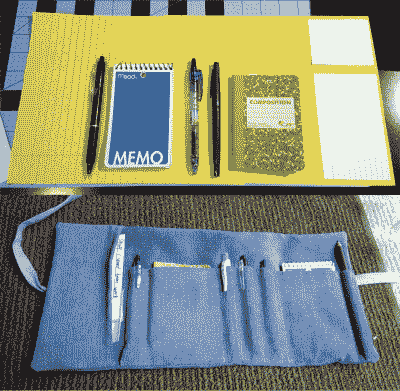
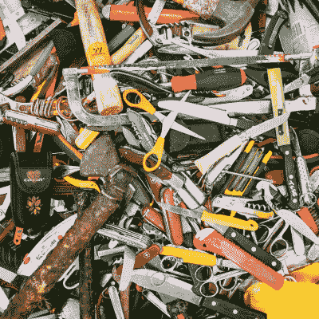
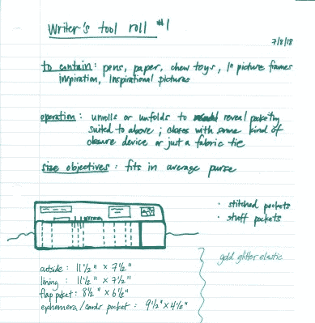
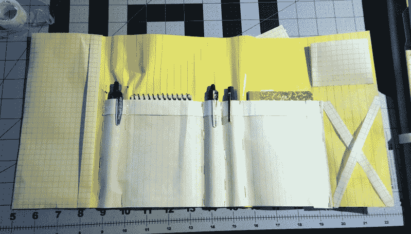
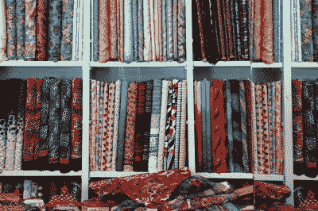
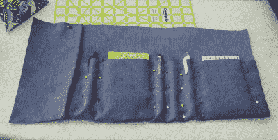
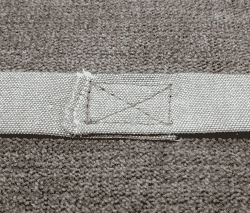

# 工具辊，可以整理任何车间的织物设计挑战

> 原文：<https://hackaday.com/2019/09/18/tool-rolls-the-fabric-design-challenge-that-can-tidy-up-any-workshop/>

你设计过 PCB。你已经切割、钻孔、挖掘和爆破了各种物体，形成了项目的封闭空间。你已经想象出了一些三维的物体，当机器将一串串热塑料堆积起来，让那个物体一次一行 g 代码地变得栩栩如生时，你惊叹不已。但是你有没有感受过面料设计近乎无限的自由？

不用我说你也知道亲手做东西是多么令人满足，尤其是会得到很多用处的东西。当谈到满足感和实用性之间的甜蜜结合时，织物和其他任何媒介一样有益。你可能会觉得用面料设计很难，但姑且说它不直观。布料就像其他任何东西一样——神秘，直到你开始了解它。在 fabric 中设计和实现的能力不会解决你所有的问题，但它确实是一个有用的工具。

WoF? Fat quarter? How much is a yard of fabric, anyway?

为了证明这一点，我将带你体验设计布料的过程。更具体地说，是工具辊。这两个词可能会让人联想到破旧、油腻的皮革或帆布，在打开的汽车引擎盖下展开。但是工具卷是一个广泛而有用的概念，可以轻松有效地捆绑任何东西，从套筒扳手到烧烤用具，从烙铁到织针。工具卷是灵活、节省空间的最佳储物方式，尤其是根据您的需求定制的工具卷。

在这种情况下，工具将是笔、笔记本和索引卡。你知道，作家的东西。但同样可以很容易地组织您的示波器探头。如果这是你的第一次，这是一个有用的和伟大的首次尝试。

## 明确你的想法

Tool roll, from concept to completion.

当我坐下来设计和制作这个工具卷时，我已经有了它的用途和用途的想法。不管你的工具卷里有什么，有些东西是通用的。它们都以这样或那样的方式储存工具——通常有口袋和/或松紧带来固定东西——它们可以卷起来或折叠起来以方便运输，并可以按扣、扣住或系紧。除此之外，天空是无限的。例如，我的有一个口袋。

你可能会说，“整件事就是口袋”。从技术上来说，整个事情是定制的工具套。我说的是一个包罗万象的口袋，里面装着生活中各种各样的东西，比如笔记、收据，或者放在工作桌上的免费蘸酱信封。

首先，这是我的工具卷，不是别人的。在设计你的产品时，记住这句话，你就会拥有一个有用的、漂亮的东西。

Yeah, that’s one way to store your tools. Photo by Ashim D’Silva on [Unsplash](https://unsplash.com/photos/Kw_zQBAChws).

## 清点你的工具

好吧，那你的工具是什么？你不需要确切地知道在这个阶段会发生什么。一个大概的想法很棒。一旦掌握了工具列表，就要考虑它的使用环境。我所有的时间要么卷在钱包里，要么摊在桌子上。它将面临的最大威胁是一点溢出的咖啡和偶尔的面包屑。

这是开始考虑面料选择的好时机。如果我用薄棉布或类似 t 恤材料的针织面料制作这个工具卷，它不会持续这么长时间。如果我用皮革做的，它可能会用一辈子。

我选择了一种“中庸”面料，因为我要用来装东西的东西——钢笔、小笔记本和索引卡——都相当轻便。不会脏，不会油，也不会特别锋利。

一个技工的工具卷可能会比一卷织针更脏，尽管一个住在公共建筑里的游击编织者可能会反对。机修工和编织工的工具辊都可能有锋利的物体，所以用皮革内衬口袋区域会使它持续很长时间。

##  没有纸就不能吐痰

我喜欢用笔和纸开始设计。首先，我尽可能地描述这件事。我想，我画画，我提问。这是第一次有机会在你的头脑中真正地思考这个项目，避免代价高昂的错误。纸很便宜。大多数优质面料都不是。

描述你想做什么，真正思考你想实现什么。现在就让这些特征慢慢出现吧。它们总是可以在以后被修剪。

不要睡在画图上！现在不是哀叹自己缺乏艺术性的时候。如果你需要清晰的形状，使用类似 PowerPoint 的东西。用图片思考非常有帮助。你可能已经知道了。

## 原型设计可以让你得到你想要的东西，而不需要重做

如果可能的话，我会用回收箱里的笔记本纸或纸板、胶带和长臂订书机做一个原型。这是将项目从纸上变为现实的一种快速、廉价的方式。

这是开始修剪特征的好时机。当我制作纸原型的时候，我的工具袋少了很多，我也打消了用透明窗袋来放照片的想法。

因为我所有的写作工具都很轻量级，所以我实际上可以使用原型一天左右来确定细节。这样做让我意识到我实际上不会使用耳塞袋，我断定弹性 X 不会成功。经验是无可替代的。

即便如此，纸上原型也有其局限性。对于需要覆盖曲线的东西，比如一件衣服或一个车罩，它根本不起作用。做衣服的人通常会做一个平纹细布，这意味着用一种叫做平纹细布的廉价棉布缝制一个完整的原型。这份初稿有助于调整合身度，而且更容易做到，因为没有颜色或印花会分散对下面线条的注意力。

如果你有时间，就把你的设计放一放，然后在白天再看一遍。在 fabric 中迭代可能既费时又费钱，所以现在是时候确保你知道你在追求什么以及实现它的步骤了。

 **别忘了用 3D 思维**。不管你的工具卷是什么样子，或者你最终得到的是什么面料，你必须做的一件事是，在计划成为工具袖子的那块的尺寸时，要考虑每个工具的周长。当然，你可以把它们都缝平。但是一旦你把工具放进去，后背就会缩起来。再放几个进去就不再平了。

Fabric 3D 是一种不同的动物，因为当你把这些碎片拼在一起时，你真的必须考虑里面和外面会有什么。大多数线缝都是将面料的正面对着缝，然后将线缝平开或正面朝外。

**别忘了缝份**。任何一种缝纫中最容易犯的错误就是在裁剪项目面料时忘记缝份。缝份是在衣片缝合时会丢失的布料。它是根据织物片的边缘和用于连接它们的缝线之间的距离来测量的。有些样板已经在裁片中包含了缝份，有些则没有，任何一个有记号笔的样板师都会告诉你有没有。

四分之一英寸的接缝是非常标准的，尽管 5/8 英寸在服装制作中被广泛使用。提前决定你的缝份，保持一致。用便宜的布料犯这样的错误是令人失望的，把 60 美元一码的布料搞砸了是毁灭性的。

A rainbow of fabric awaits.

## 去买布料吧！

做好准备，在布店度过一段美好的时光。如果你想找人帮忙挑选布料，但又不确定需要多少，那就不要在周末去，或者在周末开门的时候去。切割柜台的工作人员喜欢谈论项目和帮忙，但整个一年的周末下午都非常忙碌。带上你的计划！

如果你不想花很多钱，排队等，或者只是想要练习材料，就去找余料箱。这些是一码(36 英寸)或更小的布料，通常非常便宜。或者更好的是，去旧货店！他们中的大多数都有材料部分。即使他们没有，他们也会有一些床单。这是一个非常低的价格，有很多面料可以玩。

如果你曾经买过工具辊，它可能是由帆布或皮革制成的。如果你走那条路，给你一个警告:确保你的纱线注射器能处理厚重的织物，并且你有合适的针。帆布和皮革的层数增加很快。

我用家居装饰绳绒做了我的工具卷，这是一种柔软但结实的布料，本来可以用来盖抱枕或低用椅。这感觉很像没有条纹的灯芯绒。让它保持闭合的领带是用我已经有的一些[尚布雷棉](https://thefabricofourlives.com/learn-about-cotton/types-of-cotton/chambray)制成的。Chambray 通常用于有纽扣的工作服和夏装。

##  点睛之笔

将所有这些放在一起很容易，但有几件事要记住。

当你缝合工具袋时，不要只记得围长因素。用它！从一边到另一边，按照你想要的方式插入每个工具，并用大头针固定住。在缝口袋之前，不要把工具拿出来。不要让你正在缝制的布料挂在桌子上。重力加上布料的重量会弄乱你的缝线，尤其是如果里面有一堆工具的话。动动脑筋:如果你的工具真的很重，把它们钉在一起后拿出来。

你需要在每个口袋的顶部，也就是工具进出的地方，用[倒缝](https://www.thesprucecrafts.com/back-stitch-and-lockstitch-2977504)。这是压力最大的地方。如果你的机器可以做足够紧的之字形线迹，可以通过[棒钉](https://en.wikipedia.org/wiki/Bar_tack)，那就去做吧。

 由于背带住在外面，他们会看到很多磨损。把它们缝在一个简单的 X 型盒子里会使它们不那么笨重。

关于工具辊有趣的是，你不需要购买一个模式。它们的功能意味着几乎无限的形式。您只需要知道您想要包含哪些工具，并清楚地知道您将在哪里使用它。

自绘图有点像设计自己的 PCB。这比遵循一个模式要有回报得多，因为你最终会得到一些特别的、符合你确切需求的东西。那种完全的控制可能会令人害怕或畏惧。但不一定非要这样。在裁剪布料之前做一些准备工作，可以让一件给你自豪感的有用的东西和另一件让你感到羞耻的未完成的东西有所不同。

[《编码恐怖》标志图片 1993 年从 [代码完成](https://en.wikipedia.org/wiki/Code_Complete) ，斯蒂芬·c·麦康奈尔]