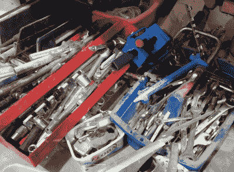
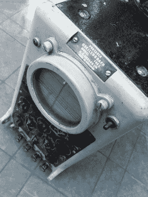

# 工具，不能带走

> 原文：<https://hackaday.com/2019/10/10/tools-you-cant-take-them-with-you/>

我死后，我希望在庆祝我一生的葬礼之后，葬在英国乡村教堂墓地，这是我作为教堂执事的责任。我既不是埃及法老，也不是维京女王，所以我的坟墓里不会有我所有的工具和设备在来世为我服务。取而代之的是，除了我的遗体之外，它将只包含一个合适的可生物降解的棺材，而我的墓碑将是一个普通的墓碑，上面可能会有一个技术难题来招待墓地的参观者。

我的工作室，我的长凳，和我的工具将是我最亲近的人的责任，我希望我会适当地装备他们分散的任务。但是对于任何一个收集了大量装备的人来说，你有没有想过如果其他人不得不把它们都清理掉会发生什么？对一些人来说是职业，对另一些人来说是爱好，我们从事的专业对门外汉来说可能是奥术魔法的工具。

## 你的车间里有多少东西？

Just some of the donated tools I’ve seen arriving in MK

这是一篇严肃的文章的开头，但也是一个严肃的问题。作为我们工作的一部分，我们都积累了大量的工具、仪器和设备，这些工具、仪器和设备往往具有重要的价值，然而我们把这些信息传递给了周围的人多少呢？我们中的一些人有像我们一样参与制造和建造东西的伙伴，但我们中的许多人没有，我们的近亲不一定知道 1000 美元的示波器和 40 美元的电钻之间的价值差异。

我在 Milton Keynes 的创客空间(T1)就在一个 T2 人工棚(T3)的楼上，这是一个经营库存充足的公共作坊的组织，通过他们我经常看到这种情况。那些去世的人的亲属留下了一个综合性的家庭工作室，他们通常不知道如何处理其中的内容。一箱又一箱漂亮的工具、设备和电动工具运到了，甚至连小屋都没有地方存放它们了。我知道你们中参与黑客空间的人在世界各地都有类似的商店。这的确很可悲，因为其中有被人爱护和爱护过的工具，我觉得应该得到一些尊重。

那么花点时间考虑一下你的库存是值得的。有什么特别值钱的东西吗？坐在这里是我从来没有真正做过的事情，因为我的长椅是几十年来作为一个被丢弃的清道夫的结果，我没有什么大件物品。我的钻床、剁锯和带锯都是买来用的，都很旧了。乐器？收集二手套件，其中一些可以追溯到 20 世纪 50 年代，还有一个 Rigol 1054z，虽然它不是便宜的新品，但作为二手物品几乎不值一大笔钱。

## …这一切该何去何从？

My Cossor ‘scope is very cool, but not worth much.

那么，事情该何去何从？我知道有些东西会被合适的人珍藏。例如，我的朋友比尔可能会用我库存的凯旋先驱备件——但有人清理我的商店怎么知道他们是什么，更不用说谁会发现他们有用了？

也许卖的时候能卖几个先令的东西应该有清楚的说明在哪里卖。在大多数情况下，这可能是易贝，但有时也有专业的出路。例如，一个质量不错的铁砧，我希望巴巴成员会感兴趣。但是想象一下，当你不得不去猜测商品是什么的时候，试着列出待售商品。

说要把它送人，听起来很容易。但即便如此，对谁呢？例如，我不会把木工工具给棚子里的工人，不是因为他们不值得，而是因为他们已经拥有太多了。相反，我会建议我的伴侣去一个我知道没有像样的木工区的地方，因为他们真的会喜欢它们。我希望各种各样的潜在收件人会收到我的东西，并为此心怀感激。

我想说的是，我们从来没有预料到不可避免的事情会发生在我们身上，因此当它发生时，我们往往没有做好准备。通过我在 hackerspace 社区的经历，我已经看到了这一点对我所爱的人的影响，我想敦促每个人对此进行一些思考。

我们花了一生的时间来积累备件和工具。值得考虑我们已经陷入的困境，甚至寻求如何让一切井井有条的建议。只要环顾四周，你就会意识到这个问题的严重性，它可能会落到你所爱的人的脚下。也许这个秋天是一个很好的时间来清理，组织，并为你的财产产生一套目的地，当你遇到你的创造者。你会知道，当你离开时，你的工具和设备会很受欢迎，如果上天不允许你不得不搬家，你会感谢自己整洁的组织。

我很想听听你对这个问题的看法。你的黑客空间如何处理整个工作室的捐赠？你有没有保存一份详细的清单，上面列有你店里的物品，如果需要的话，它们可以放在哪里？请在下面的评论中加入讨论。