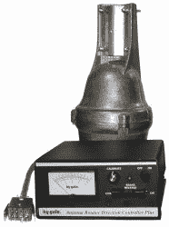
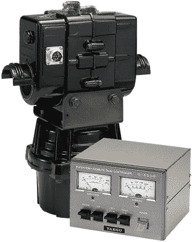

# 追踪卫星:本质细节

> 原文：<https://hackaday.com/2020/12/16/tracking-satellites-the-nitty-gritty-details/>

如果你想听卫星，你必须能够在它们飞过天空时跟踪它们。当我第一次开始跟踪业余卫星时，计算卫星在天空中的位置是挑战的一部分。如今，那是微不足道的。剩下的都是极其重要的现实世界的细节。让我们来看看一个典型的业余爱好者卫星跟踪设置，看看它是如何联系在一起的。

## 转向旋转器

机器人技术、3D 打印和 CNC 机器的普及导致了廉价电机和驱动器的泛滥。很难想象用于旋转天线的电动机会有什么特别，但事实上，天线旋转器是非常重要的工程设计。大多数挑战是机械性的，而不是电气性的——它们驱动的天线可能会很大，有很大的风力负载和旋转惯性，而且非常重。旋转器设计必须考虑轴承、天气暴露、各种负载，而不仅仅是旋转。并且通常需要一个制动器来在有风的情况下保持天线指向。

这些机械装置已经有 70 多年的历史了，可以追溯到 20 世纪 50 年代，当时康奈尔·杜比利尔电子公司，你知道的一家电容器制造商，在 20 世纪 50 年代开始为电视天线制造这些旋转器。我有点惊讶地看到，除了改进的电子控制以外，你今天可以买到的转子系统与我们在 20 世纪 80 年代使用的系统没有太大的不同。

Typical Azimuth Rotator

由于高频天线可能很大，这些旋转器系统往往很结实。幸运的是，在业余卫星通信的情况下，只需要小型八木天线。这简化了设计，因为天线的等效表面积和重量要小得多。商业制造商开发了双轴旋转器组合，例如下面的八重洲模型，它更紧凑，更容易设置。但是有些人可能会说这降低了安装的乐趣。

Example of Compact El over Az Rotator

对于这些人来说，较小的尺寸和不太严格的要求意味着家酿旋转器触手可及，并且适合这种环境。此外，现在一些卫星跟踪站是便携式的，可以在一个小时内安装在相机三脚架上，防风雨的要求几乎消失了。强风可能会损坏轴承，但如果整个三脚架在损坏发生之前就倒下了，那就没什么大不了的。

自己动手的最后一个优点是，将正常的旋转器压入仰角轴上的服务可能是棘手的。传统的旋转器被设计成垂直运行。将一个转向一边可能不起作用。在这里，旋转您自己的设计可能比修改现有的旋转器更容易。浏览互联网上的卫星跟踪设计，或只是设计自己的。使用三脚架，不要担心天气和风，享受看到你的固件在空中移动天线的满足感。

## 可以忽略一个循环

将天线旋转到指定位置代表一个控制循环。但是还有另一个传统上被忽略的控制回路:你的射频波束真的指向卫星了吗？获得反馈来结束这个循环是一个困难得多的问题，幸运的是，在业余无线电卫星通信中这是一个不必要的问题。但出于好奇，过去有几种方法可以解决这个问题，都需要来自卫星的稳定信号作为信标。

一种技术是围绕预期的指向角不断地“摆动”你的天线。假设摆动圆的直径是天线的 3 dB 波束宽度。现在，使用一个单独的接收器来监听信标信号(不要忘记它还必须跟踪多普勒)，观察信号强度与摆动，您可以获得跟踪误差。如果你完全在轨道上，信号强度不会随着摆动而变化。但是如果你偏离了轨道，那么信号就会发生变化，而指向误差就可以从这种变化中计算出来。这在机械和电气方面增加了设计的复杂性。考虑到 ham 卫星使用的天线波束宽度很大，这种摆动将会是一个疯狂的景象。这种跟踪方式更适合质量更轻、更容易抖动的波束宽度更小的天线。

或者更好的是，虚拟地抖动。无需深究血淋淋的细节，您可以通过在相控阵接收机中使用多个天线来计算离轴角度。但是如果你想应用这种技术，你至少需要四个天线而不是一个。

为什么计算的位置会是错误的？事实是，它很少出错。卫星轨道已经确定，其参数经常更新。事实上，它们通常是校准程序本身不可或缺的组成部分。如果您的基站时钟是准确的，并且它的位置是准确已知的，那么唯一真正的误差将是天线系统的误差:反馈误差、天线杆方向误差以及 RF 波束与天线机械轴的未对准。幸运的是，典型的 ham 卫星天线的宽波束宽度意味着不需要采取非常措施就能成功。

## 天线:交叉八木和极化

你经常会看到卫星通信用的八木天线排列成“X”型，叫做“交叉八木”。原因是适应不同的信号极化，或者在条件变化时通过，或者卫星与卫星之间的变化。最好的情况是发射信号到达时与接收天线具有完全相同的极化。更糟糕的情况是两种极化是正交的——比方说，你有一个水平极化天线从一个垂直极化天线接收信号。理论上，你什么也听不到——完全不匹配。这和我们都熟悉的偏振光过滤器是同一个概念。

我使用了到达极化这个术语，因为信号在穿过大气层时会被改变。当卫星天线经过头顶时，它本身也可能在移动。有几个技巧可以解决这个问题。一种是使用以 45 度角放置的单个天线。那么我们将总是接收到 H 和 V 极化信号，但两者都会有 3 dB 的损耗。另一种方法是根据需要物理旋转八木偏振，以匹配输入信号。这可以通过手动或马达来完成:从概念上来说，这是另一个需要考虑的旋转轴。

但更常见的方法是使用两个安装在公共吊杆上的八木。使用射频继电器，您可以在 H 和 V 之间切换，以获得最佳信号。或者，你可以通过添加相位延迟线和组合器来获得圆极化，一个继电器会让你在顺时针或逆时针旋转之间切换。这里的数学真的很疯狂，但底线是任何线性极化都会耦合到圆极化天线，损耗为 3 dB，无论其角度如何。

## 辅助设备

由于 VHF 和 UHF 频率下的电缆损耗，您通常需要在天线处而不是在小屋中放置额外的设备，如功率放大器、接收机前置放大器、RF 继电器和电源。这些东西需要电源、控制和状态反馈，不可避免地会增加卫星站控制器的复杂性。也许除了将主电源安全地输送到屋顶之外，这些问题在今天比在 20 世纪 80 年代更容易解决。

## 35 年过去了，让一切都可以一起玩

控制传统的旋转器并没有太大的改变。你基本上是通过将继电器与开关并联来模仿人按下按钮。如果你有一个现代控制器，这可能会更容易。上面提到的八重洲旋转器有一个 RS-232 接口来控制方位角和仰角。它甚至有一个位置与时间的内部表格，你可以预装一个卫星通行证，让智能旋转器驱动天线。但这剥夺了你自己制造追踪器的所有乐趣。

我认为没有理由再制造一个开环系统了，至少从成本角度来看是这样。今天，有许多可行的方法来关闭指向循环。一种技术是使用 MEMS 芯片，比如 Ted Yapo 去年写的 TDK 的 MotionTracking 或 ST 微电子公司的 iNEMO 系列芯片。另一个想法是使用监控摄像头和计算机视觉算法来计算指向角度(尽管您可能需要在夜间操作时在天线上放置一些策略性的 led)。或者你可以用通常的方法，在每个轴上安装一个位置传感器。通常反馈信号会通过电线发送，电线必须跨越一个旋转的关节。虽然这种反馈可以通过无线方式发送，但增加几根电线并不是什么问题——你已经需要电缆来驱动和控制旋转器，当然还需要射频同轴电缆来连接天线。

开普勒轨道力学定律没有改变。无论您是编写自己的算法，还是从开源存储库中借用一些算法，或者购买商业软件包，都有大量的软件选择来匹配您的预算或技能水平。但是用户界面的选项发生了巨大的变化，而且变得越来越好。

当我在网上和一些 C64 的人谈论我的追踪器修复项目时，我意识到我的旧追踪器程序 UI 是多么的愚蠢。但是今天，使用各种库和数据集，你的程序可以很容易地实时可视化绘制卫星数据。我甚至能在 OpenSCAD 中快速画出卫星轨道。

一个巨大的进步是从美国宇航局获取卫星跟踪数据变得容易。邮件中不再有纸质表格，也不再有与 BBS 系统的调制解调器链接——只需点击几下鼠标和互联网连接，就可以获得卫星参数。

如果你对业余无线电卫星和天线跟踪感兴趣，现在是参与其中的最佳时机。从金钱和技术上来说，进入的价格从来没有这么高过。