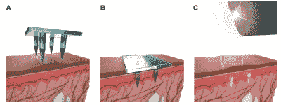
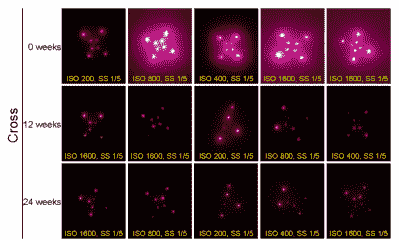

# 用隐形纹身追踪疫苗接种史

> 原文：<https://hackaday.com/2020/01/03/tracking-vaccination-history-with-invisible-tattoos/>

如今，我们仍然依靠医疗记录来判断我们最后一次接种疫苗是什么时候。对于发展中国家的社会工作者来说，这是一项极其困难的任务，尤其是如果还没有一个好的标准来跟踪疫苗接种的话。

麻省理工学院的一个团队可能会提供一个解决方案——他们开发了一种安全的墨水，可以与疫苗一起嵌入皮肤中，只有在智能手机相机应用程序提供的特殊光线下才能看到。这是一种不显眼的方式，可以将患者的疫苗接种历史直接记录在他们的皮肤上，而且风险足够低，可以大大简化疫苗医疗记录的维护过程。

纹身由微小的量子点组成，这些量子点是反射光线的半导体晶体，在红外光下会发光。使用由聚合物和糖制成的溶解微针来传递图案。虽然该解决方案仍处于概念验证阶段，但研究人员在首次注射后 9 个月成功检测到嵌入大鼠皮肤的模式。在人类尸体上，经过五年的模拟日光照射后，这些图案仍然可以辨认。

这无疑意味着分散信息传递和存储的新的可能性。除了生物可降解植入物和 T2 强力药丸，我们可能会看到一个令人兴奋的生物黑客前沿。

