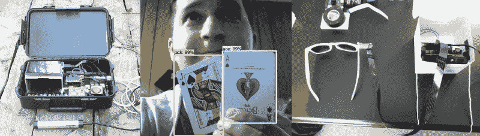

# 训练竞赛更新

> 原文：<https://hackaday.com/2020/03/03/train-all-the-things-contest-update/>

早在一月份，当我们宣布[Train All Things 竞赛](https://hackaday.io/contest/169421-train-all-the-things)时，我们不确定会看到什么样的参赛作品。毕竟，机器学习是一个巨大且快速发展的领域，计算密集型过程面临的传统障碍也在快速下降。约束正在消失，我们希望你探索这个狂野的新世界，并向我们展示你的成果。

## 你在哪里运行你的算法？

为了让您的工作有一个框架，我们提出了四大类别:

*   **边缘上的机器学习**
    *   边缘计算，即系统接触云资源但在本地运行，风靡一时。它允许你利用~~其他人的计算机~~云的力量来训练一个模型，然后在本地执行。边缘计算是将数据保存在本地的好方法。
*   **网关上的机器学习**
    *   Pi，旧路由器，诸如此类的东西——我们都有一堆设备分布在您的本地世界和云之间的桥梁空间。你能想出什么办法来利用这种独特的计算环境呢？
*   **云中的机器学习**
    *   忘记微妙——这一类别为您的应用程序释放了云的力量。无论是 Google、Azure 还是 AWS，向我们展示一下你可以用所有这些原始的马力做些什么。
*   **人工智能 Blinky**
    *   每个人的“硬件‘你好，世界’”都在闪烁一个 LED，这是那个的机器学习版本。我们希望你使用一个简单的微处理器来运行机器学习算法。让我们惊讶于你能让 Arduino 做什么。

## 这些黑客训练他们的项目，你也应该！

比赛开始一个多月了。我们已经看到了一些有趣的条目，当然我们渴望更多！以下是目前引起我们注意的几个例子:

*   智能蝙蝠探测器–【tegwyn☠twmffat】在他的……后院有蝙蝠，所以他建造了这个杰特森纳米动力装置来捕捉它们的叫声，并根据种类对它们进行分类。这是生物学和机器学习交汇处的一次迷人的冒险。
*   二十一点机器人——雨人 2.0 是【埃文·朱拉斯】对赌场格言“赌场总是赢家”的治愈。我们不会尝试把 Raspberry Pi 纸牌柜台带到维加斯，但这是 YOLO 可以做的一个很好的例子。
*   [人工智能眼镜](https://hackaday.io/project/167062-shaides)–人工智能在 shai des[Nick Bild]的太阳镜中遇到了 AR，这款太阳镜配备了摄像头和 Nano，为世界提供了一个用户界面。在灯上挥挥手，灯就熄灭了。太棒了。

您可以在太平洋时间 2020 年 4 月 7 日中午之前报名参赛，四个类别的四名获胜者将获得由我们的赞助商 Digi-Key 提供的价值 100 美元的 Tindie 礼品卡。是时候加大你的机器学习力度，加入一个项目了！我们希望看到更多直接云人工智能应用的例子，人工智能 blinky 类别在这一点上仍然是开放的。进去试试机器学习吧！