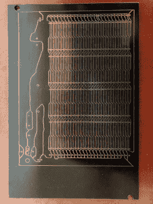

# 将 Kicad 设计转变为用于隔离布线的拼接设计

> 原文：<https://hackaday.com/2020/07/31/transform-kicad-design-to-patchwork-for-isolation-routing/>

针对隔离布线调整台式路由器和电路板设计可能有点棘手，细走线通常是第一个受害者。对于简单的原型板，通常不需要紧密封装的走线，只需隔离网络即可。为了以最少的布线量做到这一点，[ 迈克尔谢姆布里]创建了 [kicad-laser-min](https://hackaday.io/project/174017-pcb-isolation-routing-software) ，这是一个命令行实用程序，它采用 Kicad PCB 设计，并将所有走线和焊盘扩展到最大可能的宽度。

Laser scribed PCB with maximum track widths

该软件采用 PCB 布局的一层，将其转换为黑白，然后对其运行 C++ [Voronoi](https://en.wikipedia.org/wiki/Voronoi_diagram) 算法，以扩展每个轨迹和焊盘，直到它遇到另一个扩展区域。每个区域都被着色，OpenCV 边缘检测用于生成需要铣削或蚀刻的轮廓。然后使用轮廓跟踪算法创建 g 代码。标题图像显示了每个步骤的输出。 

完整的源代码可以在 GitHub 上找到。【迈克尔】在蚀刻之前用激光切割机划线制作自己的电路板，取得了良好的效果，但他欢迎其他用户的测试和反馈。他发现 OpenCV 并不总是完全封闭所有的轮廓，但是间隙通常小于他的激光雕刻宽度，因此不会产生短路。

这基本上是用 CAD 和 CNC 工具进行的[“涂鸦风格”原型制作](https://hackaday.com/2017/09/10/scribble-your-way-to-quick-printed-circuit-boards/)。如果你喜欢划线和蚀刻，你可以考虑建造一个简单的 [PCB 振动器](https://hackaday.com/2020/06/12/now-this-is-a-makers-pcb-shaker/)来加快蚀刻速度。如果你有一个路由器，但想避免灰尘，你可以使用一个[碳化物划线器来刮出轨道](https://hackaday.com/2020/07/10/making-pcbs-the-easy-way/)，而不需要蚀刻。