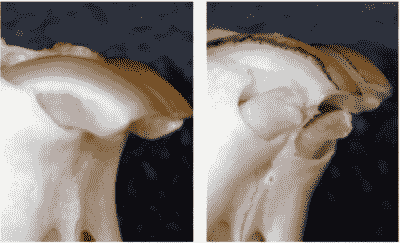

# 治疗引发牙齿茁壮成长

> 原文：<https://hackaday.com/2021/04/13/treatment-triggers-teeth-to-thrive/>

我们人类喜欢认为自己很先进，但我们不能像鲨鱼、短吻鳄和鳄鱼那样在成年后重新长出缺失的牙齿。一旦这些珍珠白消失了，它们就永远消失了，我们甚至没有办法再生保护性的珐琅质。然而，情况可能并不总是如此，因为日本京都大学和福井大学的科学家发现了一种单克隆抗体治疗方法，可以在实验室老鼠中引发牙齿再生。

Image by Katsu Takahashi/Kyoto University via [Medical Express](https://medicalxpress.com/news/2021-03-drug-regenerate-lost-teeth.html)

[单克隆抗体](https://www.mayoclinic.org/diseases-conditions/cancer/in-depth/monoclonal-antibody/art-20047808)是实验室制造的分子，作为替代抗体来增强人体对癌症和关节炎等疾病的天然防御。这些抗体也被用于开发疫苗[和治疗新冠肺炎](https://www.fda.gov/news-events/press-announcements/coronavirus-covid-19-update-fda-authorizes-monoclonal-antibodies-treatment-covid-19-0)。在癌症的情况下，单克隆抗体与癌细胞上的抗原结合，有效地标记出癌细胞以将其清除，但它们还做得更多，如提供化疗和放射免疫治疗。

通过阻断 USAG-1 基因，科学家们看到了骨形态发生蛋白(BMP) 的增加，这是一种分子，它首先决定了给定生物将拥有的牙齿数量。由于 BMP 的增加，老鼠能够再生牙齿。这是一个具有挑战性的命题——BMP 会影响发育的其他方面，早期的尝试会导致出生缺陷，弊大于利。好消息是，这种疗法对雪貂也有效，雪貂的牙齿比老鼠的牙齿更接近人类的牙列。在进行人体试验之前，科学家们将在猪和狗身上进行试验。如果给你一副牙齿的第二次机会，你会比第一次更好地对待它们，还是因为你可以再次长出新的牙齿而变得更差？

说到猪，似乎 2021 年猪对人的器官移植已经步入正轨。