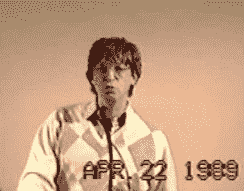

# 特伦顿计算机节首次亮相 YouTube

> 原文：<https://hackaday.com/2022/04/11/trenton-computer-festival-makes-youtube-debut/>

虽然它没有得到 DEF CON 甚至 HOPE 的认可，但特伦顿计算机节(TCF)保持着持续时间最长的计算机大会的记录，可以追溯到 1976 年。几乎从个人电脑出现之日起，TCF 就提供了供应商空间、交易会、研讨会和主题演讲。但到目前为止，所有这些知识只有那些在美国东北部愿意跟随巡回活动的人才能获得，因为它在几十年里在不同的地点之间跳跃。

或者至少，过去是这样。像许多事件一样，TCF 在新冠肺炎疫情期间被迫虚拟化，这意味着所有的谈话第一次被真正记录下来。周末，组织者宣布，2020 年和 2021 年的所有演讲和演示都已上传到 YouTube 的一个新频道，向全球观众开放。

Bill Gates at TCF in 1989

两年听起来可能不算多，尤其是考虑到还有 40 多年的时间没有计算在内。但是，由于每年的活动都有令人难以置信的大量内容，TCF YouTube 频道目前正在播放 80 多场演讲，从现场音乐表演到阿波罗导航计算机和量子计算的深度潜水。无论你感兴趣的是什么，很有可能你会在这个令人印象深刻的收藏中找到一两篇关于它的演讲。

当我们最后一次参观这个传奇的大会时，我们唯一真正的抱怨是没有一个演讲被记录下来。六个小时的活动中有超过 40 场演讲，与会者只能看到日程安排中的一小部分。虚拟化的本质显然更容易保存所有这些令人难以置信的内容供以后观看，但尚不清楚组织者是否能够在 2023 年保持这种势头，预计 TCF 将再次亲临现场。