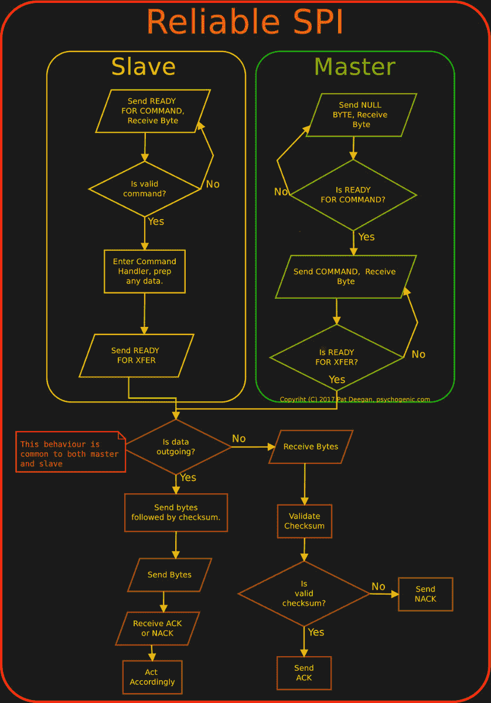

# 用电线传送数据的考验和磨难

> 原文：<https://hackaday.com/2018/09/25/trials-and-tribulations-in-sending-data-with-wires/>

当处理一个需要将数据从一个地方发送到另一个地方的项目时，所涉及的距离通常决定了发送的方法。系统的两个模块是在一个 PCB 上吗？i2c 或 SPI 等“普通”通信协议可能就可以了，除非有更特殊的要求。这两个部件是机械分离的吗？他们四处活动吗？他们需要相隔很远吗？可重构？一个时髦的答案可能是在所有东西上添加蓝牙低能耗或 WiFi，但这显然会带来一系列成本和缺点。如果只用很长的电线呢？[Pat]需要在几英尺的距离内将六块电路板连接到一个中心节点上，[在这个过程中学会了一些技巧](https://flyingcarsandstuff.com/2017/08/reliablespi-ensuring-reliable-communications-under-difficult-circumstances/)。

 当通过电线将两个节点连接在一起时，似乎只需要选择一种协议并插入所有东西，对吗？[Pat]的第一套知识是关于当你尝试这样做时会发生的问题。原来“长线”是“天线”的另一种拼写方式，如果你不幸赶上一个路过的电波，这种特殊的属性会烧坏你的微型电脑。

另外，事实证明导线的电阻与其长度成正比(谁会想到呢！)于是那些尖锐的方形时钟信号就变成了平缓起伏的山丘。即使到达两个设备之间的丘陵地带，也需要比普通微处理器更大的驱动力。解决办法？差分对。看看这篇文章，学习一种方法。

看起来[Pat]需要给这个女巫的 brew 添加 USB，并最终从 FTDI 中选择了一个非常奇怪的部分，即 [Vinculum II](http://www.ftdichip.com/Products/ICs/VNC2.htm) 。VNC2 似乎是一个很好的选择，具有丰富的外设集和两个可配置的 USB 主机/外设控制器，但它被证明是开发的噩梦。[Pat]对相关问题的记录是一本有趣且熟悉的读物。SPI 外设中难以置信的未记录的不良行为的解决方法是在物理通信层之上增加一层厚厚的可靠性相关消息。检查状态机的味道，并在原职位的详细描述。