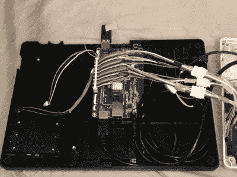

# TRS-80 型号 100 得到 64 位 CPU 和一个非常宽的 LCD

> 原文：<https://hackaday.com/2021/01/17/trs-80-model-100-gets-64-bit-cpu-and-a-very-wide-lcd/>

说 TRS-80 Model 100 领先于其时代是一种轻描淡写的说法。它有一个高质量的机械键盘，非凡的电池寿命，大量的 I/O 和扩展能力，而且实际上足够小和轻，便于随身携带。虽然在现代人看来，它的布局可能有点过时，但毫无疑问，它是历史上最成功和最有影响力的计算机之一。

所以毫不奇怪的是 [[belsamber]认为 Model 100 可能成为他的移动命令行工作的理想平台](https://fadsihave.wordpress.com/2021/01/02/final-build-of-the-pine-a64-trs-80-model-100/)。用一辆*改装几辆*，自然而然。虽然从技术上讲，近 40 岁的便携式电脑可以作为一个简单的串行终端连接到 Linux 计算机，但它过时且无背光的 LCD 在 2021 年仍有一些不足之处。但如果他仍然背负着不景气的英特尔 80C85 主板，升级显示器就没有什么意义了，所以他决定清理房间，更换所有东西。

 一旦去掉原来的硬件，Model 100 的机箱就为一台 Pine A64 LTS 单板计算机、四个 18650 电池和一个 1920×480 超宽 LCD 提供了足够的空间。虽然与原始面板的尺寸并不完全匹配，但新屏幕非常适合。键盘被原封不动地保留下来，但是[【贝尔桑伯】没有添加一个 QMK 兼容的微控制器，而是将矩阵直接连接到 A64](https://fadsihave.wordpress.com/2021/01/02/gpio-based-keyboard-on-pine-a64/) 的 GPIO。

虽然我们知道一些复古爱好者可能会看到一台标志性的电脑被掏空而流泪，但[belsamber]提到任何东西都不会浪费；他从这台机器上取下的零件将作为他收藏的第二个 100 型的备用零件。此外，考虑到这些机器的巨大受欢迎程度，它们并不罕见。

顺便说一句，我们最近在一台 [3D 打印桌面电脑上看到了这种独特的显示器，具有独特的复古未来风格](https://hackaday.com/2021/01/11/retro-terminals-bring-some-style-to-your-desktop/)。在[我们的 2021 年硬件预测列表](https://hackaday.com/2020/12/29/2020-as-the-hardware-world-turns/)中，我们没有 4:1 比例的微型显示器，但似乎它们已经表现强劲。