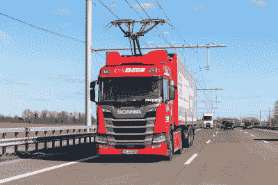
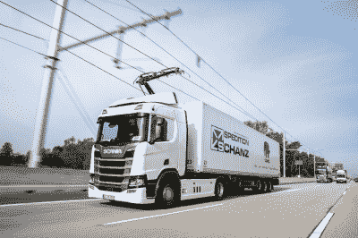
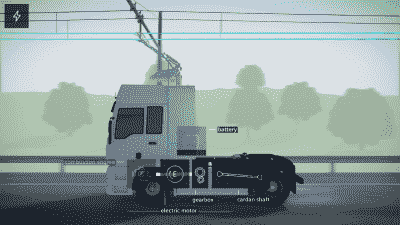

# 卡车很快就能在电气化公路上行驶

> 原文：<https://hackaday.com/2022/07/18/trucks-could-soon-run-on-electrified-highways/>

电动汽车有助于清洁交通。然而，它们受到电池可用范围的限制。充电时间长进一步加剧了这一问题。

当卡车运输重型货物时，这些问题变得更加严重。更多的有效载荷意味着更多的重量，这意味着更少的航程，或者更多的电池，这意味着更少的有效载荷。电动高速公路承诺用架空电线的魔力解决这个问题。

## 电力开销

Trucks capture energy from the overhead lines via an advanced pantograph that can deal with the rough and tumble of road conditions. Credit: Siemens

内燃机卡车的公式很简单。简单地把一个大小合适的引擎放在前面，加上几个大油箱来保持它的运转。当你耗尽燃料时，可能需要 10 分钟才能加满并再次行驶。

电动卡车没有这个奢侈。他们需要巨大、沉重的电池组来提供合适的可用范围。为了在合理的时间内给这些电池组充电，他们需要能够提供数百千瓦电力的充电器。这一切都非常昂贵，所有的电池重量都会减少有效载荷，增加轮胎和刹车等部件的磨损。

电动高速公路的概念以一种非常简单的方式解决了这个问题。它使用了与 19 世纪无轨电车相同的概念。高架电线架设在高速公路的一条车道上，从电网中提供高压电力。这种卡车通过一个受电弓接收来自高架电线的电力，就像在电动火车和电车上看到的一样。

当卡车在高速公路上行驶时，由于高架电线，它可以仅使用电网电力行驶。然后，卡车只需要一个相对较小的标称 50-100 公里范围的电池，允许它上高速公路和下高速公路。这也允许卡车在高速公路上根据需要改变车道，并在架空线不可用时无缝运行。

With their own on-board batteries, the trucks aren’t completely dependent on overhead power. This allows them to merge, overtake, and change lanes as needed. Plus, it means overhead lines don’t need to cross complicated traffic jucntions. Credit: Siemens

卡车上装有电池还带来了其他好处。这意味着高架电线不需要连续穿过复杂的交通路口。这大大简化了它们的安装并降低了成本。当卡车在高架电源下行驶时，电池也可以充电。

这个想法是电气化连接主要货运站的主要公路路线。然后，装备合适的卡车就可以在电网供电下，从一个仓库向另一个仓库运送货物。这有望减少排放，即使电网电力来自煤和天然气等肮脏的来源。这是因为在巨型发电厂发电远比在卡车上运行柴油发动机更有效率。此外，转向可再生能源进一步清洁了整个系统的排放。

这是一个允许卡车以简单明了的方式电气化的计划。它减少了对大电池组和高功率充电器的依赖。它还消除了为燃料电池卡车建造氢燃料补给基础设施的麻烦，以及以清洁方式生产氢燃料的问题。

预计架空电力甚至会比单独运行的电池电动卡车更有效率。这是因为来自电网的电力被直接发送到车轮，消除了充电过程中的效率损失。电池驱动卡车的整体效率约为 62%，燃料电池卡车的效率更低，为 29%。相比之下，根据德国环境部的建模，电动公路卡车的效率预计在 77%左右[。](https://www.cleanenergywire.org/factsheets/electric-highways-offer-most-efficient-path-decarbonise-trucks)

## 这是真的

Trucks used in Siemens eHighway concept are hybrid powered, but there’s nothing stopping the concept from going all-electric.

这可能听起来像一个高度紧张的想法，但工作原型已经在测试中。西门子移动公司正在进行一项名为“高速公路”的项目，在高速公路的小路段架设高架电线。测试正在使用混合动力斯堪尼亚卡车进行，这些卡车配备了高架电力系统。

该项目的关键是特殊的主动受电弓，它能够以高速公路行驶。传感器和受电弓的主动控制确保当卡车在车道内移动时，受电弓与电线保持良好接触。受电弓可以根据需要从电线上升和下降，允许卡车在不中断交通的情况下根据需要驶离和改变车道。

到目前为止，卡车表现良好，符合预期。自 2016 年以来，西门子已经在瑞典、德国和美国测试了高速公路卡车。这个项目也赢得了概念迷的支持。德国工业联合会建议 4000 公里的高速公路以这种方式安装高架电线。之所以选择这个数字，是因为德国卡车运输使用的燃料有三分之二以上发生在 13，000 公里的高速公路网络中的 4，000 公里。

(编者注:Hackaday 的母公司 Supplyframe 是西门子的一部分。他们都没有任何编辑意见，但是他们的名字出现在文章中，所以我们认为为了透明起见，我们应该说点什么。)