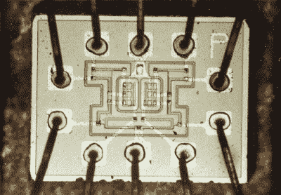
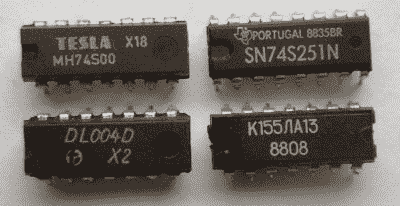
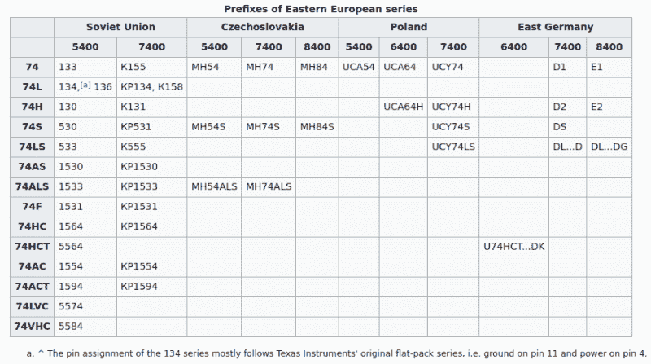

# TTL 和 CMOS 逻辑集成电路:革命的基石

> 原文：<https://hackaday.com/2021/12/06/ttl-and-cmos-logic-ics-the-building-blocks-of-a-revolution/>

当今天开始一个新的电子项目时，我们倾向于做的第一件事就是挑选构成设计核心的集成电路。这可以是任何东西，从微控制器和各种控制器 ic 到少量的 MOSFETs、运算放大器，可能还有一些 7400 或 4000 系列的逻辑 IC[来连接这些东西。然而，这种高度集成和小型化在科幻小说中牢牢占据的时间并不长，甚至连](https://en.wikipedia.org/wiki/Logic_family)[诺比特](https://en.wikipedia.org/wiki/NORBIT)模块看起来都很超前。

从 1947 年贝尔实验室制造出第一个点接触晶体管和 1948 年制造出双极结型晶体管(BJT)开始，电子世界很快就开始了最大的转变。然而，由于 20 世纪有趣的地缘政治环境，这导致了并行开发的迷人局面，公然抄袭设计，以及铁幕两侧技术史上最迷人的故事之一。

## 新技术的大杂烩

Dual 3-input NOR gate implemented in RTL as used in the Apollo Guidance Computer. (Credit: NASA)

晶体管发明后，当然不是简单地将一些晶体管放在硅芯片上制造逻辑门，然后放入塑料(或陶瓷)封装中，接管数字电子世界。

20 世纪 60 年代早期，第一个用晶体管制造逻辑门的可行方法是电阻晶体管逻辑( [RTL](https://en.wikipedia.org/wiki/Resistor%E2%80%93transistor_logic) )，它限制了所需晶体管的数量。那时，电阻更便宜，晶体管仍然很难制造。这种方法被用于[阿波罗制导计算机](https://en.wikipedia.org/wiki/Apollo_Guidance_Computer)，它是用基于 RTL 的离散 3 输入或非门建造的。

与之竞争的二极管晶体管逻辑( [DTL](https://en.wikipedia.org/wiki/Diode%E2%80%93transistor_logic) )电路技术具有以下优势:功耗更低，扇入(电路支持的输入数量)显著增加，以及通过使用额外的二极管和晶体管相对容易地增加扇出(输出数量)。DTL 的一个缺点是，由于电荷存储在晶体管的基极区，通过电路的传播延迟相对较长。

这导致了许多控制饱和问题的尝试，包括增加电容器、[贝克箝位器](https://en.wikipedia.org/wiki/Baker_clamp)和[肖特基晶体管](https://en.wikipedia.org/wiki/Schottky_transistor)。20 世纪 60 年代初，发布了基于 DTL 的逻辑芯片，包括 Signetics 的 SE100 系列，随后是 Fairchild 的 930 系列 DTμL (micrologic)系列。紧随 DTL 之后的是晶体管-晶体管逻辑( [TTL](https://en.wikipedia.org/wiki/Transistor%E2%80%93transistor_logic) )，与 DTL 非常相似，但顾名思义，只用晶体管。

第一批商业化生产的 TTL micrologic 芯片是 Sylvania 的通用高逻辑电平( [SUHL](https://archive.org/details/bitsavers_sylvaniadaiaUniversalHighLevelLogicMay66_3459527/page/n15/mode/2up) )和后继的 SUHL II 系列。德州仪器(TI)将在 1964 年推出用于军事应用的 5400 TTL 系列，两年后推出用于一般应用的 7400 系列。

与此同时，发射极耦合逻辑( [ECL](https://en.wikipedia.org/wiki/Emitter-coupled_logic) )也在 20 世纪 80 年代取得了持续的成功。与 RTL 和 DTL 以及 TTL 等方法相比，ECL 的主要优势在于，由于其发射极跟随特性，ECL 非常快，使用单个过驱动双极结型晶体管( [BJT](https://en.wikipedia.org/wiki/Bipolar_junction_transistor) )。这种设计使得所用的晶体管都不会饱和，高电平和低电平(0.8 V)之间的电压摆幅很小，因此开关时间相对较快。

虽然 ECL 的缺点是需要相对复杂的低噪声电源和恒定电流，但它的高开关速度使其成为大型机和其他速度是最重要因素的应用的明显选择。这包括 Cray-1 超级计算机，以及一系列 IBM 和 VAX 大型机。

这与 [MOSFET](https://en.wikipedia.org/wiki/MOSFET) (金属-氧化物-半导体场效应晶体管)的发展形成了鲜明的对比，后者的基本工作原理早在 1926 年就已经提出，但与 BJT 相比，它花了更长的时间才准备好商业化，尽管 MOSFET 提供了显著的尺寸和缩放优势。然而，当 MOS 技术在 20 世纪 60 年代末准备好进行大规模生产时，它引起了一场小革命，不仅使仍然常见的 [4000 系列](https://en.wikipedia.org/wiki/4000-series_integrated_circuits) CMOS 逻辑芯片(由 RCA 在 1968 年推出)成为可能，而且使推动 20 世纪 70 年代家用计算机革命的微处理器成为可能。

## 向中情局报到

对于普通读者来说，前面的历史可能很少是陌生的，但有趣的是这些技术在苏联和盟国的发展。自 20 世纪 40 年代以来，这一地区与美国及其盟友的关系一直不太友好，因此在很大程度上被排除在主要发生在美国的大规模半导体革命之外。

从本质上说，这意味着制造晶体管和 MOSFETs 的制造设备和技术受到严格的禁运，第一世界国家被禁止向苏联和盟国出口任何此类物品。当我们看一份 1976 年中情局绝密文件(1999 年解密)时，标题是*苏联试图用禁运的西方机器建立先进的半导体工业*，我们可以对当时的情况有一个很好的印象。

尽管美国、欧洲和日本都在加速发展各自的半导体产业，苏联却严重落后。尽管苏联领导层认识到现代半导体技术将会给他们带来巨大的战术优势，但这并不是他们可以轻易克服的劣势。这导致苏联大规模非法进口西方机器来制造尖端半导体，并复制他们能得到的任何技术。

## 标准的乐趣

Four TTL ICs: Czechoslovak MH74S00, Texas Instruments SN74S251N, East German DL004D (74LS04), Soviet K155LA13 (7438).

在许多与 7400 逻辑系列 TTL ic[兼容的逻辑 IC 中，可以找到这种结果的一部分。虽然欧洲制造商将遵循](https://en.wikipedia.org/wiki/7400-series_integrated_circuits#Second_sources_from_Europe_and_Eastern_Bloc)[Pro electronic](https://en.wikipedia.org/wiki/Pro_Electron)命名方案(例如，FJH101 用于 7403 8 输入与非门)，苏联和某种程度上东欧集团制造商使用[苏联 IC 命名](https://en.wikipedia.org/wiki/Soviet_integrated_circuit_designation)方案。这始于 1968 年的 NP0.034.000 标准，该标准于 1973 年首次更新为 GOST 18682—73。

为苏联市场生产的 IC 逻辑芯片值得注意的是，它们使用公制引脚间距(2.5 毫米和 1.2 毫米)，而不是英制(2.54 毫米和 1.27 毫米)。在捷克斯洛伐克、波兰和东德等东欧集团国家，使用了各种各样的集成电路设计方案，其中许多方案与西方的相当方案相匹配。例如，在东德，有三个 7400 兼容系列— 6400、7400 和 8400 —每个系列针对不同的市场，具有不同的温度范围和其他特性。

Prefixes of Eastern European 7400 series logic chips.

更令人困惑的是，指定用于出口的逻辑芯片有时会使用美国式的 7400 标记。使用西里尔字母代替拉丁字符也很容易让人混淆，尤其是当西里尔字母和拉丁字符看起来很相似的时候。1991 年苏联解体后，半导体工厂继续生产这些系列的逻辑集成电路，这些工厂可能不提供西里尔字符的印刷，而是强制使用罗马化字符，这进一步混淆了这里的命名。

## 将铁转化成硅

Stained glass with logo of the Czechoslovak company Tesla Radio in Pasáž Světozor, Vodičkova ulice, Praha. (Credit: František Hudeček)

对于生活在苏联或其任何卫星国的人们来说，20 世纪 60 年代到 80 年代的大部分技术革命都没有被注意到。由于苏联缺乏半导体制造能力，生产出来的集成电路大部分进入了军事设备和相关领域，留给普通公民的是较少和过时的集成电路，这也导致阀门技术在苏联存活了几十年，超过了西方大部分地区。

然而，随着苏联的解体，这一切都变了。随着对苏联的禁运解除，充斥着西方集成电路的消费品涌入东欧和俄罗斯市场，导致捷克斯洛伐克[特斯拉](https://en.wikipedia.org/wiki/Tesla_(Czechoslovak_company))等公司迅速消亡，这些公司一直为当地市场制造几乎所有的电子产品。

军事和其他长期合同确保了苏联 IC 命名方案和特殊 IC 存活至今，但冷战时期间谍对间谍的激动人心的日子已经过去，留下了一段奇怪的分裂历史，毫无疑问将在未来几十年困扰许多人。