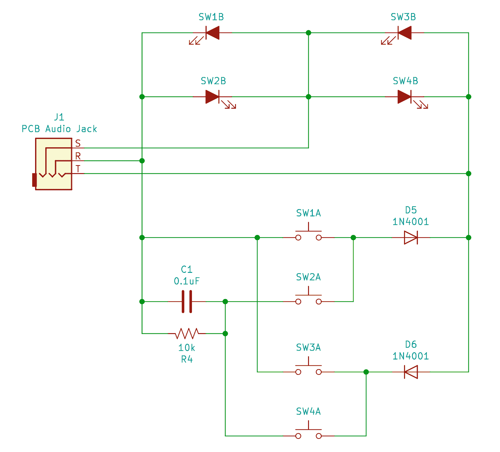

# Tucoplexing:按钮和开关的一种新的图形

> 原文：<https://hackaday.com/2019/03/23/tucoplexing-a-new-charliplex-for-buttons-and-switches/>

用最少的 io 数计算出可以检测或控制的最大外设数是一个经典的优化陷阱，有许多可行的解决方案。最简单的可能是 i2c IO 扩展器之类的东西，它可以为 4 条线(SDA、SCL、电源、地)提供 N 个输出。IO 扩展器很容易接口，也不太贵，但这破坏了乐趣。这是*黑客*日，而不是最优成本节约工程师日！因此，有无数方案可以利用高阻抗模式、二极管的方向性、模拟 RCs 等，以最大的智能和最小的器件成本完成同样的事情。 [Tucoplexing](https://twitter.com/scanlime/status/1094797120110874624) 是我们见过的最新变种，由[多产的【Micah Elizabeth Scott】(又名【scan lime】)](https://hackaday.com/?s=scanlime)证实，并不是第一个以她的猫 Tuco 命名的东西。

[【Micah 的】最初的问题](https://diode.zone/videos/watch/a6b5e7ea-3f8e-4a07-9b82-aac770799ab0?start=3m32s)是她有一个很棒的 4 端口 USB 开关和一个糟糕的单键接口。忘记替换；黑客的解决方案是逆转并重新编程微处理器，以建立一个新的界面，更容易在工作台上重新定位。鉴于有限的 IO，Tucoplex 通过以一种新的方式混合几个不同的概念，提供了 4 个单独可控的 led 和 4 个按钮。

在顶部，我们有 4 个来自标准 3 线 Charlieplex 设置的 led。取代底部 3 线丛中剩余的 2 个 led，我们在 RC 电路上有一个两个按钮的 Charlieplex 对加上两个奖励按钮。考虑到可怕的模拟电路[，扫描方法非常简单](https://github.com/scanlime/usbswitch-remote/blob/master/firmware/my-firmware.c#L160)。通过快速驱动 R 和 T 线*，微处理器可以检查是否存在短路，这表示开关被按下。一旦建立，它可以再次运行相同的扫描，这一次暂停，让电容充电后再感测。释放线路后，如果没有电荷，那么电容一定短路了，意味着*按下了*开关。否则，它必须是另一个非大写开关。查看硬件和固件资源的报告。*

 *上次我们谈到[一个类似的话题](https://hackaday.com/2018/09/30/whats-the-cheapest-way-to-scan-lots-of-buttons/)，一群读者跳出来告诉我们他们最喜欢的向有限的 IOs 添加更多设备的方法。如果你对这个问题有更聪明的解决方法，请在下面留下它们！如果你想在 Twitter 上看到旧的图表和 Tucoplexing 的命名，请在休息后查看。

> 我称之为 tucoplexing，它很有效，我现在需要做一个关于它的视频【pic.twitter.com/7YWJYXHilT】
> 
> —米卡·伊丽莎白·斯科特(@ scan lime)[2019 年 2 月 11 日](https://twitter.com/scanlime/status/1094797120110874624?ref_src=twsrc%5Etfw)*