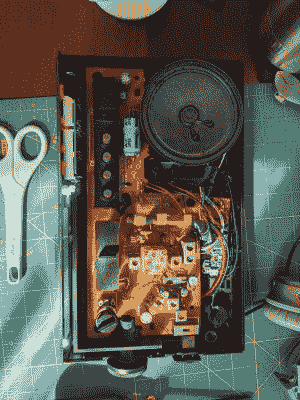

# 收听没人去的 Bonnaroo

> 原文：<https://hackaday.com/2020/08/09/tune-into-the-bonnaroo-that-no-one-gets-to-go-to/>

就像 2020 年的其他事情一样，为期四天、多阶段的音乐艺术节被取消了。这将是[盖伊·杜邦]第五年和他的朋友一起去田纳西旅行。因为他们不能去，所以[Guy]决定在一台 80 年代的闹钟收音机里做一盘互动的 Bonnaroo 混音带作为生日礼物。

 【盖伊】能够重新利用所有原始的按钮和转盘，在四天五个阶段的表演日程中导航。方便的四向功能滑块用于选择日期，无线电调谐盘选择阶段，在位置之间完成令人愉快的静态。其余的按钮在预定的设定时间内来回移动，其中一个按钮将在 16 段显示屏上滚动曲目和艺术家姓名。贪睡按钮有幸成为播放/暂停按钮。

所有的输入都由一个羽毛 M4 快递控制，音乐通过一个 DFPlayer Mini 播放。我们喜欢[Guy]能够通过将模拟调谐转盘耦合到滑动电位计来重新调整它的用途，该电位计完全适合塑料底面的插槽。敬请期待一个精彩的视频，它以解释和演示开始，然后进入构建阶段。

虽然闹钟收音机的效用可能已经被手机闹钟和末日滚动取代，但这只是意味着理论上有更多的闹钟收音机可以取出内脏并变成其他东西，比如这个受辐射影响的拖沓的皮普男孩。

 [https://www.youtube.com/embed/gpnGK9qx8AA?version=3&rel=1&showsearch=0&showinfo=1&iv_load_policy=1&fs=1&hl=en-US&autohide=2&wmode=transparent](https://www.youtube.com/embed/gpnGK9qx8AA?version=3&rel=1&showsearch=0&showinfo=1&iv_load_policy=1&fs=1&hl=en-US&autohide=2&wmode=transparent)

