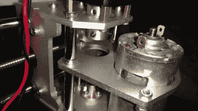

# 把一个廉价的雕刻家变成一个像样的 PCB 工厂

> 原文：<https://hackaday.com/2018/09/12/turning-a-cheap-engraver-into-a-decent-pcb-mill/>

我们知道，我们知道。让专业人员制作 PCB 变得如此便宜和容易，以至于在室内制作 PCB 越来越成为一种失传的艺术，就像冲洗自己的胶片一样。或者甚至使用有胶卷的照相机。但当你在巴西时，像(罗布森库托)这样的货物需要几个月才能到达，有时你最好坚持老办法。

 【罗布森】来信告诉我们，他是如何决定从一个进口网站购买一套价值 150 美元的数控“雕刻师”工具的，希望这能让他不用一直使用试验板就能设计出原型。套件看起来还不错，但是[经过一系列的修改和一点点的试错，他已经显著提高了性能](https://dragaosemchama.com/en/2018/09/milling-pcbs-with-the-arduino-t8-cnc/)，现在推出了一些非常漂亮的主板。

[罗布森]遇到的主要硬件问题在 Z 轴，因为一些糟糕的组件选择使股票配置有点太多。他更换了一些脆弱的支架，并更换了一些他从报废的喷墨打印机中抢救出来的衬套，运动变得更加紧密。

尽管 Grbl 的版本闪到雕刻师的克隆 Arduino Uno 上支持 Z 调平，但它实际上并不是开箱即用的。[Robson]只需要添加一些额外的布线，以便将主轴的钻头用作覆铜板上的探针。他还升级到了 Grbl 的最新版本，因为机器附带的版本已经相当旧了。

他在文章最后介绍了他在 GNU/Linux 上的软件工作流程，这是非常有用的信息[，即使你已经为你的 PCB 工厂选择了完全 DIY 的路线](https://hackaday.com/2017/07/02/home-built-pcb-mill-reportedly-doesnt-suck/)。如果你想知道更多关于铣削你自己的板的来龙去脉，[看看这篇由【阿迪尔·马利克】](https://hackaday.com/2018/01/04/guide-why-etch-when-you-can-mill/)撰写的优秀的初级读本。

 [https://www.youtube.com/embed/qYuX_IXA0aQ?version=3&rel=1&showsearch=0&showinfo=1&iv_load_policy=1&fs=1&hl=en-US&autohide=2&wmode=transparent](https://www.youtube.com/embed/qYuX_IXA0aQ?version=3&rel=1&showsearch=0&showinfo=1&iv_load_policy=1&fs=1&hl=en-US&autohide=2&wmode=transparent)

