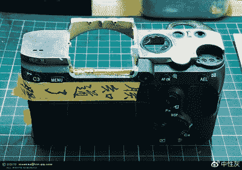

# 通过极端相机改装将索尼变成徕卡

> 原文：<https://hackaday.com/2019/08/16/turning-a-sony-into-a-leica-through-extreme-camera-modding/>

照片的质量是一个主观的衡量标准，取决于许多因素，相机的口径只是其中之一。然而，高质量的相机仍然是许多摄影师渴望的对象，因为它反映了你的一些情况，而不仅仅是你拍摄的照片。[中性灰色]没有徕卡手持相机，但有一个索尼。黑客能做什么，攒钱买更贵的牌子？相反，他选择将索尼改造成一个非常过得去的仿制品。

This is a Chinese language page but well worth reading. We can’t get [a Google Translate link](https://translate.google.com/translate?rlz=1CAASUO_enGB815&um=1&ie=UTF-8&hl=en&client=tw-ob&sl=auto&tl=en&u=https%3A%2F%2Fcard.weibo.com%2Farticle%2Fm%2Fshow%2Fid%2F2309404378906814714175) to work, but in Chrome browser, right clicking and selecting “translate” works. If you have a workaround for mobile and other browsers please leave a comment below.

 索尼 A7R 本来就不是一款便宜的相机，价格也在四位数以内，所以着手改装它以迎合徕卡人的平顶审美是一个勇敢的人。索尼首先被完全拆除，并发现电子取景器可以被删除，而不损害相机。一个大胆的举动是，它的合金外壳被磨掉了，换上了一个带有假徕卡商标的抛光板。

随后，对带有定制碳纤维部件的手柄进行了大规模改造，通过极其复杂的工艺实现了极高的质量。仔细选择漆面会让一个非专业人士很难知道这是不是真正的徕卡相机，因为它装有复古风格的镜头系统。

我们不太确定我们是否愿意在地球的这一边支持徕卡的律师，但我们忍不住钦佩这部相机。如果你想要一个数码徕卡，你当然可以尝试一下真实的东西。

谢谢你的提示。