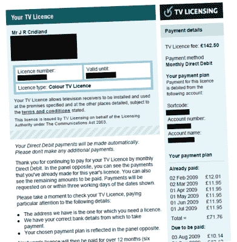
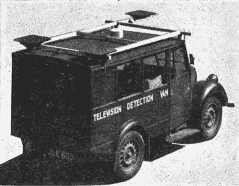
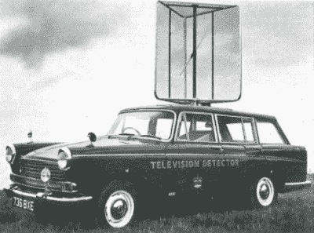
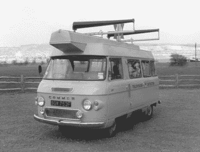
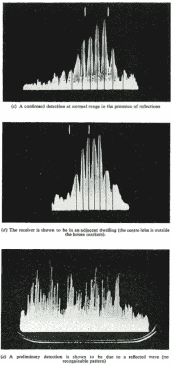

# 电视探测车曾经在英国的街道上徘徊

> 原文：<https://hackaday.com/2021/01/18/tv-detector-vans-once-prowled-the-streets-of-england/>

英国要求观看广播电视的家庭购买特许执照，这在世界上有些独特。最初随着 1923 年的《无线电报法案》而产生，在 1946 年扩展到覆盖电视之前，任何接收广播的人都需要许可证。这项努力产生的资金被用作英国广播公司的主要资金。

A typical TV licence invoice. Separate licences for black and white and color sets still exist, [with 6000 B&W licences issued in 2019](https://www.theguardian.com/tv-and-radio/2019/nov/12/6000-uk-homes-still-have-black-and-white-tv-licences).

当然，要求许可证固然很好，但如果没有某种形式的强制执行，这项措施就没有任何效力。在其他措施中，英国广播公司甚至使用特殊货车来追捕非法经营的电视并保护其宝贵的收入。

## 货车来找你了

为了确保稳定的收入，BBC 以负责管理该系统的实体*TV licensing*trade name 开展执法行动。记录了许可证及其到期日期，并对涉嫌拥有电视机但未支付必要费用的家庭进行了调查。为了鼓励遵守，电视执照定期向那些让他们的执照失效或没有购买执照的人发送措辞严厉的信件。如果失败，他们可以安排执法人员进行访问。这些官员没有权力强行进入住宅，所以如果房主拒绝配合调查，电视执照将申请搜查令。这可能是基于证据，如在住宅屋顶上发现的卫星天线或天线，或通过窗户在沙发垫上发现的遥控器。

或者，可以根据从电视侦察车收集的证据批准搜查令。配备了检测正在使用的电视机的设备，这些面包车在英国的街道上漫游，经常被派往电视许可证过期或缺失的地址。如果流动电视探测到一台电视可能正在操作和接收广播信号，电视牌照局可以向法院申请必要的搜查令，以进行进一步的调查。货车几乎完全用于支持权证申请；侦缉车的证据很少在法庭上被用来起诉逃避执照者。有了搜查令，官员们将使用直接证据，如插在天线上的电视，通过法庭将逃亡者绳之以法。

## 检测电视使用情况

An example of the original detector van design, as deployed in 1952\. Note the three loop antennas – one front, two rear.

[vans 首次部署于 1952 年](https://archive.org/details/poeej195207/page/n1/mode/2up)，其设备设计用于从显像管的水平偏转扫描中获取磁场，频率为 10.125 KHz。环形天线用于检测该信号在 20.25 KHz 的二次谐波，该二次谐波与 19.25 KHz 的本地拍频振荡器混合，以产生 1 KHz 的音调，当信号被拾取时向操作者指示。使用了三个天线，一个在货车前部，两个在后部左右两侧。当货车靠近房子里正在工作的电视时，前面和侧面天线之间的信号大致相同。然后可以比较左右天线的信号，以确定电视在街道的哪一边。

The VHF era brought with it a new detector van design, this time built on a car such as to avoid clearance issues with the tall antenna.

一旦 ITV 在 1963 年开始广播，这种检测方法就变得不切实际了。两个电视台的行扫描信号不同步，所以相邻的房子观看不同的频道会对探测器造成混淆干扰。为了解决这个问题，vans 转而检测电视机超外差甚高频接收器的本地振荡器。电台在 47 至 240 MHz 的波段上广播，当时建造一个调谐器和天线来覆盖整个范围是不切实际的。相反，该设备被设计为在 110-250MHz 范围内工作，调谐到较高频段的基频或较低频率振荡器的谐波。一个高度定向的天线被用来锁定一个装置，一个潜望镜被安装来允许操作者观察天线指向的房子。如果在黑暗中操作，潜望镜可以用来在天线面对的方向上照射一个小光点，以识别相关的目标。调查结果与一份许可证过期或缺失的房屋清单相互参照，以帮助追捕逃税者。

A pair of antennas was used to search for televisions in the UHF era, with the twin setup helping to improve directionality.

超高频传输的引入导致了进一步的重新设计。工程师们再次依靠谐波使一个单一的系统能够覆盖从低 VHF 到更高 UHF 频率的全部范围。使用了一对 6 英尺长的对数周期螺旋天线，安装在货车顶部，可以改变间距以有效地调谐不同的频率。实际上，当货车沿着街道缓慢行驶时，天线会指向一排房子。当检测到电视时，天线对的波束模式将在面包车内的 CRT 上显示七个不同的波瓣。当运货车移动时，操作员按下一个按钮，在阴极射线管上标出房子的边界，当波瓣模式集中在一个特定的房子上时，电视的位置就清楚了。这些年来，随着技术的进步，硬件得到了进一步完善，使用了各种天线装置和检测设备。

## 寻找现代的电视

In the UHF era, pinning down a detected television set took some finesse, with the operator having to interpret signals received on a CRT display.

现代检测许可证逃避的努力笼罩在神秘之中。接收数字电视信号的现代平板显示器不像旧设计那样发射那么多的射频干扰，并且检测到的任何此类信号不太容易与广播电视相关联。家庭中的液晶电视可以很容易地显示视频游戏控制台或在线流媒体服务的输出，这两种情况都不需要所有者支付许可费。[根据近年来英国广播公司提交的搜查令](https://www.whatdotheyknow.com/request/144664/response/356092/attach/3/RFI20130026%20Final%20Response.pdf?cookie_passthrough=1)，可能使用了光学方法，将观众家中电视的反射光与直播信号进行比较。英国广播公司拒绝回答信息自由的要求与他们的方法的任何细节，除了说他们在执法工作中使用了车辆和手持设备。然而，考虑到现有的众多广播、有线和卫星频道，比较工作必然会困难得多，[导致一些人怀疑探测器车的时代已经过去了。](https://arstechnica.com/tech-policy/2016/08/bbc-tv-licence-vans-wi-fi-snooping-analysis/2/)

尽管随着流媒体内容日益占据主导地位，电视牌照的日子可能屈指可数，但它仍是一项古怪的立法，催生了一种技术好奇心。如果你喜欢自己是一个电视侦探，请在评论中说出你选择的方法，在这个现代时代寻找非法观看广播内容的电视。一定要小心翼翼——你永远不知道电视执照什么时候会敲你的门！