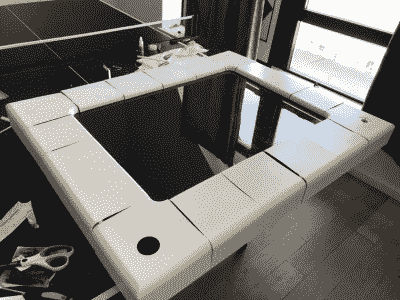

# 电视自动转到用树莓皮蚀刻素描

> 原文：<https://hackaday.com/2021/01/16/tv-turned-automatic-etch-a-sketch-with-raspberry-pi/>

考虑到原始蚀刻草图的最大吸引力之一是它是多么简单，看到人们用现代硬件重建低技术体验的不可思议的长度总是很有趣。一个完美的例子是这个由[本·伯恩斯坦] 创作的标志性艺术玩具的[巨型壁挂式再现。有了树莓派和一些定制的电子设备，它甚至可以在你坐下来观看时自己画画。](https://github.com/benb116/Etch)

从高层次来看，我们在这里看到的是一台标准的三星液晶电视，上面安装了一个 3D 打印蚀刻草图外壳。光是这一点就已经是一个相当不错的项目了，如果[本]只是把一些设计草图的视频放到显示器上，他就可以用更少的工作获得类似的最终结果。但是这有什么意思呢？

It took hundreds of hours to print the shell.

为了让他的巨型蚀刻草图发挥作用，[Ben]花了一年多的时间开发必要的硬件和软件，以读取安装在电视下的两个大型 3D 打印旋钮的用户输入。旋钮连接到步进电机，定制的 PCB 安装在它们的背面，装有 A4988 驱动芯片和 AS5600 绝对磁性旋转编码器。这种解决方案不仅允许 Raspberry Pi 在用户交互使用 Etch a Sketch 时读取旋钮的旋转，还允许它在软件接管并开始自动绘图时真实地旋转旋钮。

几个 Python 脚本将各种硬件整合在一起，生成最终的用户界面。[Ben]编写的软件可以拍摄图像并生成路径，蚀刻草图可以使用这些路径来逼真地绘制图像。线条要经过的点，以及控制旋钮旋转和指针速度的变量，都保存在一个 JSON 文件中，以便以后可以轻松地加载。在 Imgur gallery【Ben】为这个项目创建的[的末尾，你可以看到软件正在通过一些示例草图工作。](https://imgur.com/a/Nv3bHPj)

我们已经见过几个项目[将蚀刻草图机动化来绘制复杂的图像](https://hackaday.com/2019/12/18/escher-etch-a-sketch-as-a-service/)，但这可能是我们见过的第一个一切都用软件完成的例子。这个数字版本不需要遵循传统的“规则”，但我们很欣赏[本]坚持他们。顺便说一下，这不是第一次蚀刻电视转换草图来美化这些页面，尽管公平地说，[另一个项目采取了完全不同的方法](https://hackaday.com/2009/05/13/massive-etch-a-sketch-from-tv-screen/)。

> [查看 imgur.com 的帖子](https://imgur.com/6ZLA7TO)