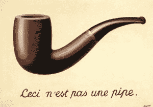

# 推特:不是算法的错。差多了。

> 原文：<https://hackaday.com/2020/09/26/twitter-its-not-the-algorithms-fault-its-much-worse/>

也许你听说过围绕 Twitter 自动裁剪图片的愤怒。当用户提交对布局来说太高或太宽的图片时，Twitter 会自动将它们裁剪成大约一个正方形。比方说，他们不是只选择最靠近图像中心的最大正方形，而是使用某种“算法”，可能是一种神经网络，经过训练可以找到人们的脸，并确保他们被裁剪掉。

问题是，当太高或太宽的图像包含两个或更多人，并且他们有不同的肤色时，裁剪会选择较亮的脸。这真的很无礼，很明显有问题，但是什么？

神经网络实际上只是一个数学方程，在这些情况下，输入变量是图像中像素的卷积，训练它们基本上包括为所有系数选择值。通过应用输入，查看输出有多错误，并更新系数以使答案更加正确，可以做到这一点。用足够大的模型和数据集做无数次，你就可以让机器识别不同品种的猫。

Twitter 出了什么问题？现在这只是猜测，但我敢打赌，这取决于训练数据集或系数更新步骤。将所有种族的人包括在训练数据集中的问题是如此明显，我们希望这不是问题；尽管获得一个有代表性的数据集是很难的，但众所周知这是很难的，他们应该在这之上。

这意味着问题可能是系数拟合，这是数学和文化的碰撞。想象一下，你的算法刚刚把一只猫误归类为“飞机”或“狮子”。你需要修改系数，让它们把答案从这个结果移开一点，更接近“猫”。你把它们从“飞机”和“狮子”中等量移动还是“飞机”在某种程度上更错？为了捕捉这种不同错误的概念，你可以使用一个损失函数，它可以用数字封装你希望网络学习的内容，然后你[根据结果的糟糕程度向正确的方向](https://en.wikipedia.org/wiki/Backpropagation)迈出更大或更小的步伐。

让那件事过去一会儿。你需要一个数学方程来概括你希望网络学习的内容。(但不是你希望它如何学习。这就是应用神经网络的革命性。)

现在想象一下，就像发生在谷歌身上的一样，[你的算法将“大猩猩”与一个黑人的形象](https://www.theverge.com/2018/1/12/16882408/google-racist-gorillas-photo-recognition-algorithm-ai)相匹配。这是错误的，但这与简单地将“飞机”安装到同一个人身上是完全不同的错误。你如何编写损失函数来包含对种族攻击性结果的惩罚？理想情况下，你会希望它们永远不会发生，所以你可以想象试图识别所有可能的侮辱，并给这些结果分配一个无限大的损失。这基本上就是谷歌所做的——他们的“变通办法”是完全停止将“大猩猩”分类，因为将一个人错误分类为大猩猩所带来的损失是如此之大。

这是神经网络的一个基本问题——它们只与数据和损失函数一样好。如今，数据已经不再是一个问题，但正如这些神经网络火车事故所证明的那样，纠正损失是一个多层次的游戏。这不像写一个不是“种族主义”的等式那么简单，不管那意味着什么。损失函数被要求封装人类的敏感性，绕过它们并量化它们，并最终权衡做出特别令人不快的错误分类的轻微风险与根本不识别某些动物。

我不确定这个问题是可以解决的，即使有非常大的数据集。(有数学证明表明，对于无限大的数据集，该模型将对所有事物进行正确分类，因此您不必担心。但是我们离无限有多近呢？渐近证明相关吗？)

不管怎么说，这个问题比算法，甚至比它们的作者是“种族主义者”还要大。这可能是机器学习的一个基本问题，随着机器分类越来越多地被要求尊重人类尊严，我们肯定会在未来看到 Twitter 惨败的进一步排列。

This article is part of the Hackaday.com newsletter, delivered every seven days for each of the last 200+ weeks. It also includes our favorite articles from the last seven days that you can see on [the web version of the newsletter](https://mailchi.mp/hackaday.com/hackaday-newsletter-649368). Want this type of article to hit your inbox every Friday morning? [You should sign up](http://eepurl.com/gTMxQf)!