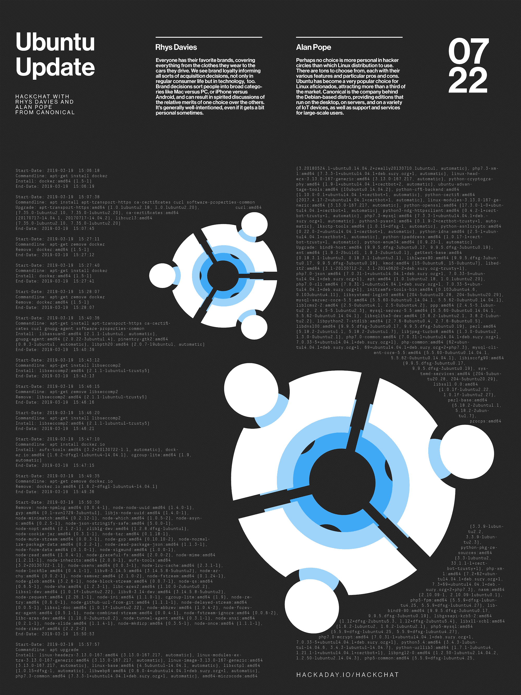

# Ubuntu 更新黑客聊天

> 原文：<https://hackaday.com/2020/07/20/ubuntu-update-hack-chat/>

加入我们太平洋时间 7 月 22 日星期三中午与[里斯·戴维斯](https://hackaday.io/tinkererbell)和[艾伦·波普](https://hackaday.io/popey)的 [Ubuntu 更新黑客聊天](https://hackaday.io/event/173277-ubuntu-update-hack-chat)！

每个人都有自己喜欢的品牌，从穿的衣服到开的车，无所不包。我们看到品牌忠诚度影响着各种收购决策，不仅在普通消费者生活中如此，在技术领域也是如此。品牌决策将人们分为几大类，如 Mac 与 PC，或 iPhone 与 Android，并可能导致一种选择相对于其他选择的相对优势的热烈讨论。它通常是善意的，即使有时有点私人化。

在黑客圈子里，也许没有比使用哪个 Linux 发行版更个人化的选择了。有成吨的选择，每一个都有其不同的特点和特定的利弊。Ubuntu 已经成为 Linux 爱好者的热门选择，吸引了超过三分之一的市场份额。 [Canonical](https://canonical.com/) 是基于 Debian 的发行版背后的公司，提供在桌面、服务器和各种物联网设备上运行的版本，以及对大规模用户的支持和服务。

为了让我们了解 Ubuntu 世界的最新动态，Canonical 产品经理 Rhys Davies 和开发者支持者 Alan Pope 将在本周拜访 Hack Chat。他们将准备好回答你所有关于 Ubuntu 的有趣问题，包括最近发布的 [Ubuntu Appliances](https://ubuntu.com/appliance) ，易于安装、低维护的 Raspberry Pis 和 PC 映像，旨在实现安全性和简洁性。我们还将讨论快照、桌面以及其他任何突然出现的东西。

 我们的黑客聊天是 [Hackaday.io 黑客聊天群发消息](https://hackaday.io/messages/room/2369)中的社区直播活动。本周我们将在太平洋时间 7 月 22 日星期三中午 12:00 坐下来讨论。如果时区让你失望，我们有[一个方便的时区转换器](https://www.timeanddate.com/countdown/generic?iso=20200722T12&p0=224&msg=Ubuntu+Update+Hack+Chat&font=cursive)。

点击右边的那个发言气泡，你会被直接带到 Hackaday.io 上的黑客聊天群，不用等到周三；随时加入，你可以看到社区在谈论什么。

