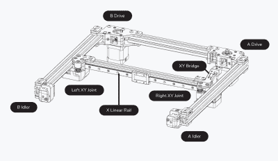

# 超轻沃龙 X 型梁由铝管轧制而成

> 原文：<https://hackaday.com/2022/05/31/ultra-light-voron-x-beam-milled-from-aluminium-tube-stock/>

Voron X/Y carriage overview.

当谈到使用熔融沉积成型(FDM)技术的 3D 打印时，有两大类打印机:笛卡尔和 CoreXY，后者是那些希望获得最快打印速度的人的领域，得益于更加灵活的工具头配置。X/Y 托架组件的质量更轻意味着它也可以移动得更快，这使得 CoreXY FDM 的爱好者们开始用碳纤维进行实验，最近由[PrimeSenator]制作的一个视频展示了一个由铝管加工而成的 X 梁，其重量甚至比一个可比的碳纤维管还要轻。

由于 CoreXY FDM 打印机[仅在 Z 方向相对于打印表面移动](https://all3dp.com/2/corexy-3d-printer-is-it-worth-buying/)，X/Y 轴由皮带和致动器直接控制。这意味着，沿着直线轨道移动挤出机头越快、越精确，打印速度(理论上)就越快。在[沃龙设计](https://vorondesign.com/) CoreXY 打印机上为这些铣削的铝结构抛弃较重的碳纤维应该意味着更少的运动惯性，最初的演示显示出积极的结果。

关于这个“快速打印”社区有趣的事情是，不仅原始打印速度，而且在理论上，CoreXY FDM 打印机在精度(分辨率)和效率(如生产量)方面都更胜一筹。所有这些都使得这些打印机值得下次购买 FDM 风格的打印机时看一看。

 [https://www.youtube.com/embed/9C3JBshHhgc?version=3&rel=1&showsearch=0&showinfo=1&iv_load_policy=1&fs=1&hl=en-US&autohide=2&wmode=transparent](https://www.youtube.com/embed/9C3JBshHhgc?version=3&rel=1&showsearch=0&showinfo=1&iv_load_policy=1&fs=1&hl=en-US&autohide=2&wmode=transparent)

