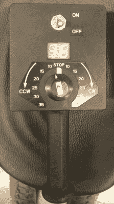

# 不寻常的巴拉尼椅子得到修复

> 原文：<https://hackaday.com/2021/01/03/uncommon-barany-chair-gets-fixed-up/>

听说过 Bárány 椅子吗？[Troy Denton]在被要求修理一个之前也没有，但这并没有阻止他卷起袖子，试图让这个不起作用的设备恢复正常工作。由于它没有用户指南、手册、示意图或任何其他信息，他不得不依靠他多年实际工作中积累的经验和敏锐度。幸运的是，他决定记录整个过程。

 虽然在航空圈之外并不为人所知，但巴拉尼椅是训练飞行员适应空间迷失方向的重要设备。该设备本质上是一个电动转椅，其想法是旋转受试者以诱导其迷失方向。旋转速度和方向可以通过手持无线远程终端来控制。

当[Troy]第一次打开电源时，遥控器上的错误代码显示“基本单元没有电源”。这被证明是一个快速解决方案——他只需将电源连接从一个已经关闭的开关插座移到另一个插座上。但是，虽然这清除了错误信息，椅子仍然不会旋转任何旋钮设置。

手动旋转椅子会在遥控器上显示转速，因此[Troy]将搜索范围缩小到与电机相关的部分。马达由伺服型信号驱动，但当他用望远镜检查时，改变遥控器上的速度和方向旋钮似乎并没有改变控制信号。打开手持遥控器立即发现了故障部分——用于设置速度和方向的旋转编码器实际上分裂成了两部分。

由于编码器中有一个清晰的裂缝，他能够暂时将它合在一起，以确认椅子可以旋转起来。原因很可能是“用户错误”——最后一个进行测试的人可能非常热情地转动了旋钮。一个新的部件正在路上，这把椅子应该很快就会让未来的飞行员头晕目眩。

我们喜欢 Hackaday 的好的维修故事。无论是[耐心地用金属丝](https://hackaday.com/2020/09/19/patience-beats-rage-quit-in-shattered-xbox-controller-repair/)重新组装折断的印刷电路板，还是拿出[可能比原件更好的替换零件](https://hackaday.com/2020/11/15/a-microwave-repair-even-mechanical-keyboard-fans-will-love/)，我们永远不会厌倦看到一个坏了的齿轮被重新组装起来。

 [https://www.youtube.com/embed/EIJ6vR1bZGI?version=3&rel=1&showsearch=0&showinfo=1&iv_load_policy=1&fs=1&hl=en-US&autohide=2&wmode=transparent](https://www.youtube.com/embed/EIJ6vR1bZGI?version=3&rel=1&showsearch=0&showinfo=1&iv_load_policy=1&fs=1&hl=en-US&autohide=2&wmode=transparent)

感谢[Tim Gremalm]的提示。