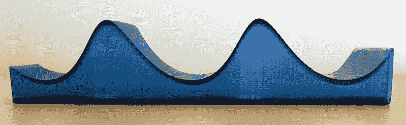
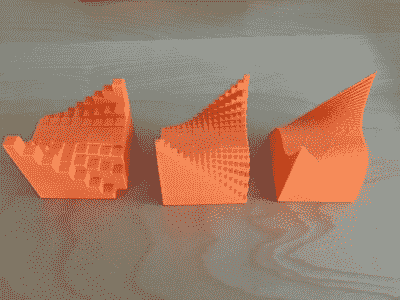

# 理解数学而不仅仅是学习它

> 原文：<https://hackaday.com/2019/02/15/understanding-math-rather-than-merely-learning-it/>

《星际迷航》原著中有一句台词，可汗说，“改进一个机械装置，你的生产率可能会提高一倍，但改进人类，你的生产率会提高一千倍。”琼·霍瓦特和里奇·卡梅隆对改善教育有着相同的想法，尤其是自学。在 Hackaday 超级大会上，他们分享了他们[所学到的对复杂数学的直观理解](https://www.youtube.com/watch?v=3d2PGTiEiqI),你可以观看下面新发布的视频。

这是两人合作出版一本关于 3D 打印科学项目的书的开始。琼接受的是麻省理工学院的传统教育，而里奇是一个自学成才的人。这给了他们从街道两边观察的独特视角。他们开始研究微积分——这是一门让很多人害怕的学科，但它确实是很多严肃的科学和工程不可或缺的一部分(没有双关语的意思)。

你可能知道牛顿和莱布尼茨几乎是同时发现了微积分的基础。然而，最初的论文是完全不同的。牛顿的方法更多的是物理的，而不是数学的。莱布尼茨使用形式逻辑和代数。虽然两者都有功劳，但莱布尼茨符号最终胜出，成为我们今天使用的符号。

## 结石伤亡

不足为奇的是，1 级大学中有四分之一的微积分学生成绩为 D 或更低。相当一部分失败的人将离开科学和工程，要么退学，要么转到一个不太技术性的学科。我们总是听到这样一个笑话:微积分是校园里最大的商科预科课程。

琼·霍瓦特和里奇·卡梅隆带着一个使用 3D 打印模型帮助教授微积分概念的计划进入了 Hackaday 奖。这个想法是生产 3D 打印物体，展示对微积分基本定理等基础知识的直观理解。这就像画出一个代数方程来更好地理解，只是这移动到三维空间，并为你的大脑理解传统困难主题的抽象概念提供了一个切实的立足点。

即使你不想 3D 打印[模型](https://github.com/whosawhatsis/Hacker-Calculus-models)，它们在 OpenSCAD 中，所以你可以在那个环境中虚拟地试验它们。这种方法非常成功，以至于即将出版的一本书将更详细地阐述这一主题。

 [https://www.youtube.com/embed/3d2PGTiEiqI?version=3&rel=1&showsearch=0&showinfo=1&iv_load_policy=1&fs=1&hl=en-US&autohide=2&wmode=transparent](https://www.youtube.com/embed/3d2PGTiEiqI?version=3&rel=1&showsearch=0&showinfo=1&iv_load_policy=1&fs=1&hl=en-US&autohide=2&wmode=transparent)

## 数学直觉

我从来不热衷于为了数学而学习数学，我上过的很多数学课都是这样组织的。从来没有人去你办公室问 4X+13=2 等于多少。他们会进来问类似这样的问题，我如何改变这个电阻，使这个电源的输出从 5V 变为 5.2V？代数是你可以用来回答这类问题的工具箱的一部分。微积分就像是变化的事物的代数，可以回答更广泛的问题。

Integrals to [measure volume under curves](https://hackaday.io/project/20621/log/58991-log-4-integrals-the-other-half-of-calculus)

我经常想，在现代，教授数学直觉可能比力学更重要。你总是可以让计算机做真正的工作并得到正确的答案。真正的技巧是用公式表达正确的问题，这通常需要结合代数、微积分和微分方程。没有它你能过吗？有时候。也许大部分时间都是如此。但是总会有某些情况下你真的需要高级数学工具。[琼]和[丰富]可以帮助。

## 拓展你的视野

很多你只是死记硬背“知道”的东西，其实都是微积分的应用。如果您通过将峰值除以 2 的平方根来获得正弦波的 [RMS](https://hackaday.com/2016/08/04/root-mean-square/) 值，那么您使用的是微积分的结果。如果你有正弦波以外的东西，你需要做数学。如果你知道 RC 电路的时间常数，那也是微积分的结果。如果你需要知道 63%这个点，你有你的答案。但是电容充到 10%或者 80%的时间呢？微积分。

Hackaday 过去曾试图揭开微积分的神秘面纱。我也喜欢现代计算机图形如何让[的直觉更容易发展](https://hackaday.com/2018/07/18/understanding-math-vs-understanding-math/)。老实说，我所知道的最好的传统微积分书籍之一是 1914 年 Thompson 的[微积分简化版](https://www.gutenberg.org/ebooks/33283)(好吧，反正是第二版)。他的方法与[Joan]和[Rich]并无太大不同，正如他所说:

> 我自己是一个非常愚蠢的家伙，我不得不放弃自己(做微积分的过度困难的方法),现在乞求给我的傻瓜伙伴们呈现不难的部分。

尽管微积分已经有一个多世纪的历史了，但它并没有太大的变化，如果你打算追求数学启蒙，你可能会喜欢阅读它——以及黑客微积分。