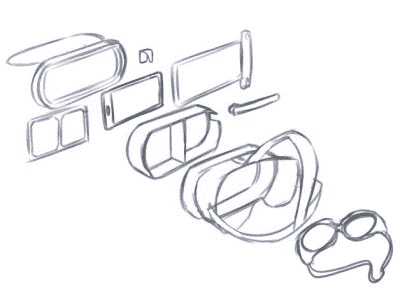

# 水下虚拟现实提供零重力预算

> 原文：<https://hackaday.com/2018/08/12/underwater-vr-offers-zero-gravity-on-a-budget/>

有一天，埃隆·马斯克(Elon Musk)可能会设法将足够多的我们这些卑微的农奴塞进他的超级火箭，这样我们就可以买得起去太空的机票，但在那之前，我们体验失重的选择相当有限。即使你满足于乘坐所谓的“呕吐彗星”失重飞机，你也不得不放弃一大笔零钱，顾名思义，可能还有你的午餐。对于那些想在没有美国宇航局预算的情况下体验宇航员体验的黑客来说，难道没有其他选择吗？

 好吧，如果你愿意淋湿，[spiritplumber]可能会给你答案。使用他设计的一些 3D 打印组件，有可能[在自己的泳池里舒适地使用谷歌 Cardboard 兼容虚拟现实软件](https://www.thingiverse.com/thing:3037781)。纸板提供视觉效果，水让你保持浮力，最终结果与在虚拟环境中失重飞行并不完全不同。

为了构建他的水下虚拟现实耳机，[spiritplumber]使用了许多现成的产品。主要的“纸板”耳机本身是常见的塑料款式，你可能会在任何大盒子零售商的清仓区找到，方便你，装手机的防水袋可以在网上便宜地获得。你还需要一副泳镜来防止水粗鲁地打断你睁大眼睛的惊叹。至于定制的打印部件，一个框架可以防止防水袋在浸没时压在屏幕上，并且需要一个大的垫片来使手机与操作者的眼睛保持适当的距离。

为了测试他的创造，[spiritplumber]加载了一个美国宇航局中性浮力实验室的虚拟现实再现，宇航员在那里体验水下近乎失重的环境。剩下来完成这一体验的就是一个 DIY 的水肺调节器，这样你就可以呆在水下了。尽管在那个时候，如果一个路人把你的 DIY 空间模拟器混淆为一个精心设计的自杀企图，我们也不会感到惊讶。

 [https://www.youtube.com/embed/6Wn6fpFUuWA?version=3&rel=1&showsearch=0&showinfo=1&iv_load_policy=1&fs=1&hl=en-US&autohide=2&wmode=transparent](https://www.youtube.com/embed/6Wn6fpFUuWA?version=3&rel=1&showsearch=0&showinfo=1&iv_load_policy=1&fs=1&hl=en-US&autohide=2&wmode=transparent)

